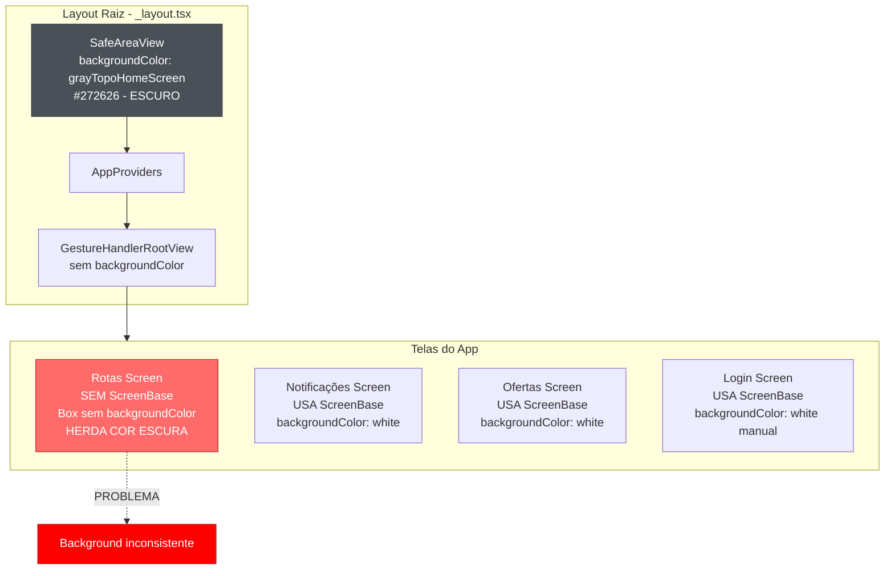

# Análise: Background Color Não Definido Globalmente no Agility-App

## Resumo Executivo

Esta análise identifica os problemas relacionados à falta de uma definição global de background color no aplicativo Agility-App. O problema principal é que cada tela/componente está definindo sua própria cor de fundo de forma inconsistente, resultando em comportamentos visuais diferentes e possível flickering durante navegação.

---

## 1. Estrutura Atual do Tema

### 1.1 Arquivo de Cores ([`src/theme/colors.ts`](src/theme/colors.ts))

O arquivo define múltiplas propriedades de cor de fundo, mas **sem padronização clara**:

```typescript
const palette = {
  // ... outras cores
  background: '#FFFFFF', // Linha 48
  backgroundColor: '#fff', // Linha 72 - duplicado com nome diferente
  grayBackground: '#282828', // Linha 51
  grayTopoHomeScreen: '#272626', // Linha 52
  grayBlue: '#F0F1F8', // Linha 49
  // ...
};
```

**Problemas identificados:**

- Existem **duas propriedades para background branco**: `background` e `backgroundColor`
- Nomes inconsistentes (alguns usam camelCase, outros não)
- Cores de fundo específicas para contextos diferentes sem documentação clara

### 1.2 Arquivo de Tema ([`src/theme/theme.ts`](src/theme/theme.ts))

O tema é criado com Shopify Restyle, mas **não define um background padrão** para componentes:

```typescript
export const theme = createTheme({
  colors,
  spacing: measure,
  borderRadii,
  // ... não há propriedade de background padrão
});
```

---

## 2. Layout Raiz - Análise do Problema Principal

### 2.1 Arquivo [`src/app/_layout.tsx`](src/app/_layout.tsx)

O layout raiz define a cor de fundo **hardcoded** no componente `SafeAreaView`:

```typescript
// Linha 95
<SafeAreaView style={{ flex: 1, backgroundColor: theme.colors.grayTopoHomeScreen }}>
```

**Problemas:**

1. A cor `grayTopoHomeScreen` (#272626) é uma cor **escura**, enquanto a maioria das telas usa fundo **branco**
2. O estilo está **inline** e não usa o sistema de temas do Restyle
3. Não há propriedade `backgroundColor` definida no `GestureHandlerRootView`

### 2.2 Estrutura de Providers

```typescript
<SafeAreaView style={{ flex: 1, backgroundColor: theme.colors.grayTopoHomeScreen }}>
  <AppProviders>
    <InitialLayout />
  </AppProviders>
</SafeAreaView>
```

O `GestureHandlerRootView` dentro de `AppProviders` **não define backgroundColor**:

```typescript
<GestureHandlerRootView style={{ flex: 1 }}>
  {/* sem backgroundColor */}
</GestureHandlerRootView>
```

---

## 3. Componentes de Container

### 3.1 ScreenContainer ([`src/components/ScreenContainer/ScreenContainer.tsx`](src/components/ScreenContainer/ScreenContainer.tsx))

Este componente **recebe backgroundColor como prop obrigatória**:

```typescript
interface ScrollViewContainerProps {
  children: ReactNode;
  backgroundColor: string;  // Obrigatório
}

export function ScrollViewContainer({ children, backgroundColor }: ScrollViewContainerProps) {
  return (
    <ScrollView style={{ backgroundColor, flex: 1 }}>
      {children}
    </ScrollView>
  );
}
```

**Problema:** Não há valor padrão - cada tela precisa passar a cor explicitamente.

### 3.2 ScreenBase ([`src/components/ScreensBase/ScreenBase.tsx`](src/components/ScreensBase/ScreenBase.tsx))

O componente `ScreenBase` usa `colors.backgroundColor` diretamente:

```typescript
// Linha 46 e 80
<Container backgroundColor={colors.backgroundColor}>
```

**Observação:** Este componente está correto em usar uma cor do tema, mas:

- Importa `colors` diretamente do arquivo
- Não usa o hook `useAppTheme()` para acessar o tema do contexto
- O código comentado (linhas 108-167) mostra uma versão anterior que usava `useAppTheme()`

---

## 4. Análise das Telas

### 4.1 Tela de Rotas ([`src/app/(auth)/(tabs)/index.tsx`](<src/app/(auth)/(tabs)/index.tsx>))

**Não usa ScreenBase nem ScreenContainer!**

```typescript
return (
  <Box flex={1} px="x16" pt="y12">
    {/* Conteúdo sem backgroundColor definido */}
  </Box>
);
```

**Problema:** O `Box` não define `backgroundColor`, então herda do pai (que pode ser o `SafeAreaView` com cor escura).

### 4.2 Tela de Notificações ([`src/app/(auth)/(tabs)/notificacoes.tsx`](<src/app/(auth)/(tabs)/notificacoes.tsx>))

Usa `ScreenBase` (correto):

```typescript
<ScreenBase title={<Text preset='textTitle'>Notificação</Text>}>
  {/* conteúdo */}
</ScreenBase>
```

### 4.3 Tela de Ofertas ([`src/app/(auth)/(tabs)/ofertas/index.tsx`](<src/app/(auth)/(tabs)/ofertas/index.tsx>))

Usa `ScreenBase` (correto):

```typescript
<ScreenBase title={<Text preset='textTitle'>Ofertas de serviços</Text>}>
  <Box flex={1} px="x16" pt="y12" pb="y24">
    {/* conteúdo */}
  </Box>
</ScreenBase>
```

### 4.4 Tela de Login ([`src/app/(public)/LoginScreen/index.tsx`](<src/app/(public)/LoginScreen/index.tsx>))

Usa `ScreenBase` mas define `backgroundColor='white'` manualmente:

```typescript
<ScreenBase scrollable mtScreenBase='t0' mbScreenBase='b0' marginHorizontalScreenBase='x0'>
  <Box backgroundColor='white' flexDirection='row'>
    {/* conteúdo */}
  </Box>
</ScreenBase>
```

### 4.5 CustomTabBar ([`src/components/CustomTabBar/CustomTabBar.tsx`](src/components/CustomTabBar/CustomTabBar.tsx))

Define `backgroundColor='white'` manualmente:

```typescript
<Box backgroundColor='white' borderTopWidth={measure.m1}>
```

---

## 5. Diagrama do Problema



---

## 6. Resumo dos Problemas Identificados

| #   | Problema                                                     | Localização                                                                 | Severidade |
| --- | ------------------------------------------------------------ | --------------------------------------------------------------------------- | ---------- |
| 1   | SafeAreaView usa cor escura (`grayTopoHomeScreen`)           | [`_layout.tsx:95`](src/app/_layout.tsx:95)                                  | **Alta**   |
| 2   | GestureHandlerRootView sem backgroundColor                   | [`_layout.tsx:128`](src/app/_layout.tsx:128)                                | **Alta**   |
| 3   | Tela de Rotas não usa ScreenBase                             | [`index.tsx:227`](<src/app/(auth)/(tabs)/index.tsx:227>)                    | **Alta**   |
| 4   | ScreenContainer não tem valor padrão de backgroundColor      | [`ScreenContainer.tsx`](src/components/ScreenContainer/ScreenContainer.tsx) | **Média**  |
| 5   | Cores duplicadas no tema (`background` vs `backgroundColor`) | [`colors.ts:48,72`](src/theme/colors.ts:48)                                 | **Baixa**  |
| 6   | ScreenBase importa `colors` diretamente em vez de usar tema  | [`ScreenBase.tsx:46`](src/components/ScreensBase/ScreenBase.tsx:46)         | **Baixa**  |

---

## 7. Plano de Correção Recomendado

### 7.1 Correção Imediata - Layout Raiz

**Arquivo:** [`src/app/_layout.tsx`](src/app/_layout.tsx)

```typescript
// ANTES
<SafeAreaView style={{ flex: 1, backgroundColor: theme.colors.grayTopoHomeScreen }}>

// DEPOIS
<SafeAreaView style={{ flex: 1, backgroundColor: theme.colors.backgroundColor }}>
```

E adicionar backgroundColor ao GestureHandlerRootView:

```typescript
<GestureHandlerRootView style={{ flex: 1, backgroundColor: theme.colors.backgroundColor }}>
```

### 7.2 Correção - Tela de Rotas

**Arquivo:** [`src/app/(auth)/(tabs)/index.tsx`](<src/app/(auth)/(tabs)/index.tsx>)

Opção A: Envolver com ScreenBase

```typescript
return (
  <ScreenBase>
    {/* conteúdo atual */}
  </ScreenBase>
);
```

Opção B: Adicionar backgroundColor ao Box

```typescript
return (
  <Box flex={1} px="x16" pt="y12" backgroundColor="backgroundColor">
    {/* conteúdo atual */}
  </Box>
);
```

### 7.3 Correção - ScreenContainer com Valor Padrão

**Arquivo:** [`src/components/ScreenContainer/ScreenContainer.tsx`](src/components/ScreenContainer/ScreenContainer.tsx)

```typescript
interface ScrollViewContainerProps {
  children: ReactNode;
  backgroundColor?: string; // Tornar opcional
}

const DEFAULT_BACKGROUND = '#FFFFFF';

export function ScrollViewContainer({
  children,
  backgroundColor = DEFAULT_BACKGROUND, // Valor padrão
}: ScrollViewContainerProps) {
  // ...
}
```

### 7.4 Correção - Padronização do Tema

**Arquivo:** [`src/theme/colors.ts`](src/theme/colors.ts)

Consolidar as propriedades de background:

```typescript
const palette = {
  // Remover duplicatas e padronizar
  backgroundPrimary: '#FFFFFF', // Fundo principal
  backgroundSecondary: '#F5F5F5', // Fundo secundário (gray50)
  backgroundDark: '#272626', // Fundo escuro (para casos especiais)
  // ...
};
```

---

## 8. Próximos Passos

1. **Validar esta análise** com o time de desenvolvimento
2. **Priorizar as correções** por severidade
3. **Implementar as correções** em ordem:
   - Layout raiz (\_layout.tsx)
   - Tela de Rotas (index.tsx)
   - ScreenContainer
   - Padronização do tema
4. **Testar** em ambas as plataformas (iOS e Android)
5. **Documentar** as convenções de uso do background color

---

## 9. Conclusão

O problema principal é que o **layout raiz define uma cor de fundo escura** (`grayTopoHomeScreen`) que é herdada pelas telas que não definem explicitamente seu próprio background. A correção mais impactante seria alterar a cor do `SafeAreaView` para `backgroundColor` (branco) e garantir que o `GestureHandlerRootView` também tenha um background definido.

Adicionalmente, a padronização do tema e a correção da tela de Rotas garantirão consistência visual em todo o aplicativo.
