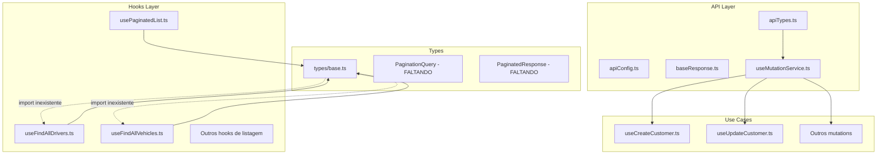

# Análise: useMutationService e usePaginatedList

## Visão Geral

Este documento analisa a implementação e os padrões de uso do `useMutationService` e `usePaginatedList` no projeto lab-app, identificando problemas e propondo correções.

---

## 1. Análise do useMutationService

### Implementação Atual

Arquivo: [`src/api/useMutationService.ts`](src/api/useMutationService.ts)

```typescript
export function useMutationService<TData = void, TRequest = void>({
  action,
  onError = undefined,
  onSuccess = undefined,
  options,
}: PropsUseMutation<TRequest, TData>) {
  // ... implementação
}
```

### Problemas Identificados

#### Problema 1.1: Inconsistência na Ordem dos Parâmetros Genéricos

**Severidade: ALTA**

Os parâmetros genéricos estão invertidos entre a interface e a função:

```typescript
// Interface define: TRequest primeiro, TData segundo
interface PropsUseMutation<TRequest = void, TData = void>

// Função define: TData primeiro, TRequest segundo
export function useMutationService<TData = void, TRequest = void>
```

Isso causa confusão e potenciais erros de tipo quando os tipos diferem significativamente.

#### Problema 1.2: Incompatibilidade de Tipo no MutationOptions

**Severidade: ALTA**

Arquivo: [`src/api/apiTypes.ts`](src/api/apiTypes.ts:3)

```typescript
export interface MutationOptions<TData> {
  onSuccess?: (data: TData) => void | Promise<void>;
  onError?: (error: BaseResponse<ErrorResponse>) => void;
  errorMessage?: string;
}
```

Quando usado nos hooks:

```typescript
// useCreateCustomer.ts
export function useCreateCustomer(
  options?: MutationOptions<BaseResponse<CustomerResponse>>
) {
  const mutation = useMutationService<CustomerResponse, CreateCustomerRequest>({
    // ...
  });
}
```

**Problema**: O callback `onSuccess` espera `BaseResponse<CustomerResponse>`, mas o `useMutationService` passa `BaseResponse<TData>` onde `TData = CustomerResponse`. Isso cria uma incompatibilidade de tipo onde o callback recebe `BaseResponse<BaseResponse<CustomerResponse>>`.

#### Problema 1.3: Ausência do Export mutateAsync

**Severidade: MÉDIA**

O hook exporta apenas `mutate` mas não `mutateAsync`. Alguns casos de uso como [`useRefreshToken.ts`](src/domain/Auth/useCases/useRefreshToken.ts:44) precisam de suporte a mutação assíncrona:

```typescript
refreshTokenAsync: (variables: RefreshTokenRequest) => mutation.mutateAsync(variables),
```

#### Problema 1.4: Assinatura Incorreta de Callback no useChatAttachmentUpload

**Severidade: ALTA**

Arquivo: [`src/domain/agility/chat/useCase/useChatAttachmentUpload.ts`](src/domain/agility/chat/useCase/useChatAttachmentUpload.ts:46)

```typescript
mutation.mutate(params, {
  onSuccess: data => {
    /* ... */
  },
  onError: error => {
    /* ... */
  },
});
```

**Problema**: A função `mutate` customizada não suporta o objeto de opções com callbacks:

```typescript
// Implementação atual aceita apenas variables
const mutate = (variables?: TRequest) => mutation.mutate(variables as TRequest);
```

#### Problema 1.5: Uso Inconsistente de useMutation Direto

**Severidade: MÉDIA**

Arquivo: [`src/domain/Auth/useCases/useRefreshToken.ts`](src/domain/Auth/useCases/useRefreshToken.ts:20)

```typescript
const mutation = useMutation({
  mutationFn: async (
    request: RefreshTokenRequest
  ): Promise<AuthCredentials> => {
    // ...
  },
  // ...
});
```

Isso ignora o tratamento centralizado de erros e o sistema de toast/modal fornecido pelo `useMutationService`.

#### Problema 1.6: Inconsistência de Tipo no onError

**Severidade: MÉDIA**

```typescript
// No PropsUseMutation
onError?: (error: BaseResponse<any>) => void;

// Na função handleError
const handleError = (response: BaseResponse<ErrorResponse>) => {
    // ...
}
```

Os tipos deveriam ser consistentes.

---

## 2. Análise do usePaginatedList

### Implementação Atual

Arquivo: [`src/domain/hooks/usePaginatedList.ts`](src/domain/hooks/usePaginatedList.ts)

### Problemas Identificados

#### Problema 2.1: Tipos Faltando em @/types/base

**Severidade: CRÍTICA**

Vários arquivos importam `PaginationQuery` e `PaginatedResponse` de `@/types/base`:

```typescript
// Exemplo: src/domain/agility/driver/dto/request/list-drivers.request.ts
import type {PaginationQuery} from '@/types/base';
```

Porém, o arquivo [`src/types/base.ts`](src/types/base.ts) **apenas exporta** `Id`:

```typescript
export type Id = string;
```

**Os tipos `PaginationQuery` e `PaginatedResponse` não existem!**

#### Problema 2.2: Hook Não Utilizado

**Severidade: MÉDIA**

O hook `usePaginatedList` está definido mas não é importado ou usado em nenhum lugar do código.

#### Problema 2.3: Potencial Problema de Memória/Performance

**Severidade: MÉDIA**

```typescript
const [list, setList] = useState<Data[]>([]);

useEffect(() => {
  if (query.data) {
    const newList = query.data.pages.reduce<Data[]>((prev, curr) => {
      return [...prev, ...(curr.items || [])];
    }, []);
    setList(newList);
  }
}, [query.data]);
```

**Problemas**:

1. Gerenciamento de estado redundante - o `useInfiniteQuery` já fornece dados acumulados
2. Cria novas referências de array a cada atualização, potencialmente causando re-renders desnecessários

---

## 3. Oportunidades de Uso do usePaginatedList

Os seguintes hooks de listagem poderiam se beneficiar do `usePaginatedList` para implementar scroll infinito:

### Hooks que Usam Paginação Manual (useQuery simples)

| Hook                      | Arquivo                                                                                                                                    | Parâmetros de Página |
| ------------------------- | ------------------------------------------------------------------------------------------------------------------------------------------ | -------------------- |
| `useFindAllDrivers`       | [`src/domain/agility/driver/useCase/useFindAllDrivers.ts`](src/domain/agility/driver/useCase/useFindAllDrivers.ts)                         | `page`, `limit`      |
| `useFindAllVehicles`      | [`src/domain/agility/vehicle/useCase/useFindAllVehicles.ts`](src/domain/agility/vehicle/useCase/useFindAllVehicles.ts)                     | `page`, `limit`      |
| `useFindAllServices`      | [`src/domain/agility/service/useCase/useFindAllServices.ts`](src/domain/agility/service/useCase/useFindAllServices.ts)                     | `page`, `limit`      |
| `useFindAllRoutes`        | [`src/domain/agility/route/useCase/useFindAllRoutes.ts`](src/domain/agility/route/useCase/useFindAllRoutes.ts)                             | `page`, `limit`      |
| `useFindAllCollaborators` | [`src/domain/agility/collaborator/useCase/useFindAllCollaborators.ts`](src/domain/agility/collaborator/useCase/useFindAllCollaborators.ts) | `page`, `limit`      |
| `useFindAllAddresses`     | [`src/domain/agility/address/useCase/useFindAllAddresses.ts`](src/domain/agility/address/useCase/useFindAllAddresses.ts)                   | `page`, `limit`      |
| `useFindAllDeliveries`    | [`src/domain/agility/delivery/useCase/useFindAllDeliveries.ts`](src/domain/agility/delivery/useCase/useFindAllDeliveries.ts)               | `page`, `limit`      |
| `useFindAllOrders`        | [`src/domain/agility/order/useCase/useFindAllOrders.ts`](src/domain/agility/order/useCase/useFindAllOrders.ts)                             | `page`, `limit`      |
| `useGetPayments`          | [`src/domain/agility/finance/useCase/useGetPayments.ts`](src/domain/agility/finance/useCase/useGetPayments.ts)                             | `page`, `limit`      |

**Nota**: Atualmente todos esses hooks usam `useQuery` simples, que retorna apenas uma página por vez. Para implementar scroll infinito, seria necessário migrar para `usePaginatedList` (que usa `useInfiniteQuery` internamente).

---

## 4. Plano de Correção

### Fase 1: Corrigir Tipos Faltando (CRÍTICO)

#### Tarefa 1.1: Adicionar Tipos PaginationQuery e PaginatedResponse

**Arquivo**: [`src/types/base.ts`](src/types/base.ts)

```typescript
/**
 * Base types used across the application
 */

export type Id = string;

/**
 * Query parameters for paginated requests
 */
export interface PaginationQuery {
  /** Page number - starts at 0 or 1 depending on API */
  page?: number;
  /** Number of items per page */
  limit?: number;
  /** Offset for pagination - alternative to page */
  offset?: number;
}

/**
 * Generic paginated response wrapper
 */
export interface PaginatedResponse<T> {
  /** Array of items in the current page */
  items: T[];
  /** Current page number */
  currentPage: number;
  /** Total number of items across all pages */
  totalItems: number;
  /** Total number of pages */
  totalPages: number;
  /** Number of items per page */
  pageSize: number;
  /** Number of elements per page - alias for pageSize */
  elementPerPage: number;
  /** Whether this is the first page */
  first: boolean;
  /** Whether this is the last page */
  last: boolean;
}
```

### Fase 2: Corrigir Problemas Centrais do useMutationService

#### Tarefa 2.1: Padronizar Ordem dos Parâmetros Genéricos

**Arquivo**: [`src/api/useMutationService.ts`](src/api/useMutationService.ts)

Alterar a assinatura da função para corresponder à interface:

```typescript
// Antes
export function useMutationService<TData = void, TRequest = void>

// Depois
export function useMutationService<TRequest = void, TData = void>
```

#### Tarefa 2.2: Corrigir Tipo do MutationOptions

**Arquivo**: [`src/api/apiTypes.ts`](src/api/apiTypes.ts)

Atualizar a interface para funcionar corretamente com BaseResponse:

```typescript
export interface MutationOptions<TData> {
  onSuccess?: (data: BaseResponse<TData>) => void | Promise<void>;
  onError?: (error: BaseResponse<ErrorResponse>) => void;
  errorMessage?: string;
}
```

#### Tarefa 2.3: Adicionar Suporte ao mutateAsync

**Arquivo**: [`src/api/useMutationService.ts`](src/api/useMutationService.ts)

Adicionar `mutateAsync` ao objeto de retorno:

```typescript
return {
  isLoading: mutation.isPending,
  isSuccess: mutation.isSuccess,
  isError: mutation.isError,
  error: mutation.error,
  mutate,
  mutateAsync: mutation.mutateAsync, // Adicionar isto
};
```

#### Tarefa 2.4: Corrigir Função mutate para Suportar Callbacks

**Arquivo**: [`src/api/useMutationService.ts`](src/api/useMutationService.ts)

Atualizar a função `mutate` para suportar callbacks:

```typescript
const mutate = (
  variables?: TRequest,
  callbacks?: {
    onSuccess?: (data: BaseResponse<TData>) => void;
    onError?: (error: BaseResponse<any>) => void;
  }
) => {
  mutation.mutate(variables as TRequest, {
    onSuccess: callbacks?.onSuccess,
    onError: callbacks?.onError,
  });
};
```

### Fase 3: Atualizar Todos os Hooks de Caso de Uso

#### Tarefa 3.1: Atualizar Ordem dos Parâmetros Genéricos em Todos os Hooks

Todos os hooks que usam `useMutationService` precisam trocar a ordem dos parâmetros genéricos:

```typescript
// Antes
useMutationService<CustomerResponse, CreateCustomerRequest>;

// Depois
useMutationService<CreateCustomerRequest, CustomerResponse>;
```

**Arquivos Afetados** (aproximadamente 50+ arquivos):

- Todos os arquivos em `src/domain/agility/*/useCase/use*.ts`
- `src/domain/Auth/useCases/*.ts`
- `src/domain/Profile/useCase/*.ts`
- `src/domain/notificationService/useCase/*.ts`

#### Tarefa 3.2: Migrar useRefreshToken para useMutationService

**Arquivo**: [`src/domain/Auth/useCases/useRefreshToken.ts`](src/domain/Auth/useCases/useRefreshToken.ts)

Refatorar para usar `useMutationService` para consistência.

### Fase 4: Corrigir usePaginatedList

#### Tarefa 4.1: Otimizar usePaginatedList

**Arquivo**: [`src/domain/hooks/usePaginatedList.ts`](src/domain/hooks/usePaginatedList.ts)

1. Remover gerenciamento de estado redundante
2. Usar memoização para a lista acumulada
3. Adicionar objeto de erro ao tipo de retorno
4. Atualizar nomes de propriedades para compatibilidade com React Query v5

```typescript
import {useMemo} from 'react';
import {useInfiniteQuery} from '@tanstack/react-query';
import {PageResponse} from '@/api';

export interface UsePaginatedListResult<TData> {
  list: TData[];
  isError: boolean | null;
  isLoading: boolean;
  isRefetching: boolean;
  refresh: () => void;
  fetchPreviousPage: () => void;
  fetchNextPage: () => void;
  hasNextPage: boolean;
  hasPreviousPage: boolean;
  error: unknown;
}

interface PaginatedListOption {
  enabled?: boolean;
  staleTime?: number;
}

export function usePaginatedList<Data>(
  queryKey: readonly unknown[],
  getList: (page: number) => Promise<PageResponse<Data>>,
  options?: PaginatedListOption
): UsePaginatedListResult<Data> {
  const query = useInfiniteQuery({
    queryKey,
    queryFn: ({pageParam}) => getList(pageParam),
    getNextPageParam: lastPage => {
      if (!lastPage.last) {
        return lastPage.currentPage + 1;
      }
      return undefined;
    },
    getPreviousPageParam: firstPage => {
      if (!firstPage.first) {
        return firstPage.currentPage - 1;
      }
      return undefined;
    },
    initialPageParam: 0,
    enabled: options?.enabled ?? true,
    staleTime: options?.staleTime ?? 0,
  });

  // Usar useMemo ao invés de useState + useEffect
  const list = useMemo(() => {
    if (!query.data) return [];
    return query.data.pages.flatMap(page => page.items || []);
  }, [query.data]);

  return {
    list,
    isError: query.isError,
    isLoading: query.isPending,
    isRefetching: query.isRefetching,
    refresh: () => query.refetch(),
    fetchPreviousPage: () => query.fetchPreviousPage(),
    fetchNextPage: () => query.fetchNextPage(),
    hasNextPage: !!query.hasNextPage,
    hasPreviousPage: !!query.hasPreviousPage,
    error: query.error,
  };
}
```

---

## 5. Ordem de Execução Recomendada

1. **Adicionar tipos faltando** (Tarefa 1.1) - **CRÍTICO**
2. **Corrigir núcleo do useMutationService** (Tarefas 2.1-2.4)
3. **Atualizar tipo MutationOptions** (Tarefa 2.2)
4. **Atualizar todos os hooks de caso de uso** (Tarefa 3.1) - Esta será a maior alteração
5. **Migrar useRefreshToken** (Tarefa 3.2)
6. **Otimizar usePaginatedList** (Tarefa 4.1)

---

## 6. Avaliação de Riscos

| Mudança                        | Nível de Risco | Mitigação                                                                     |
| ------------------------------ | -------------- | ----------------------------------------------------------------------------- |
| Adicionar tipos faltando       | BAIXO          | Mudança aditiva, pode quebrar compilação se tipos já existirem em outro lugar |
| Troca de parâmetros genéricos  | ALTO           | TypeScript detectará todos os erros de tipo em tempo de compilação            |
| Atualização do MutationOptions | MÉDIO          | Pode exigir atualização de muitas implementações de callback                  |
| Adição do mutateAsync          | BAIXO          | Mudança aditiva, sem breaking changes                                         |
| Mudanças no usePaginatedList   | BAIXO          | Não está sendo usado atualmente                                               |

---

## 7. Diagrama de Arquitetura



---

## 8. Perguntas para o Usuário

1. ✅ **Resolvido**: Manter `usePaginatedList` e corrigir - pode ser útil para scroll infinito no futuro
2. Para a ordem dos parâmetros genéricos, qual convenção você prefere: `<TRequest, TData>` ou `<TData, TRequest>`?
3. Devemos adicionar funcionalidades adicionais ao `useMutationService` como:
   - Função `reset()`
   - Estado `data` da última mutação bem-sucedida
   - Suporte para callback `onSettled`
4. Deseja que eu implemente a migração dos hooks de listagem para usar `usePaginatedList` com scroll infinito?
