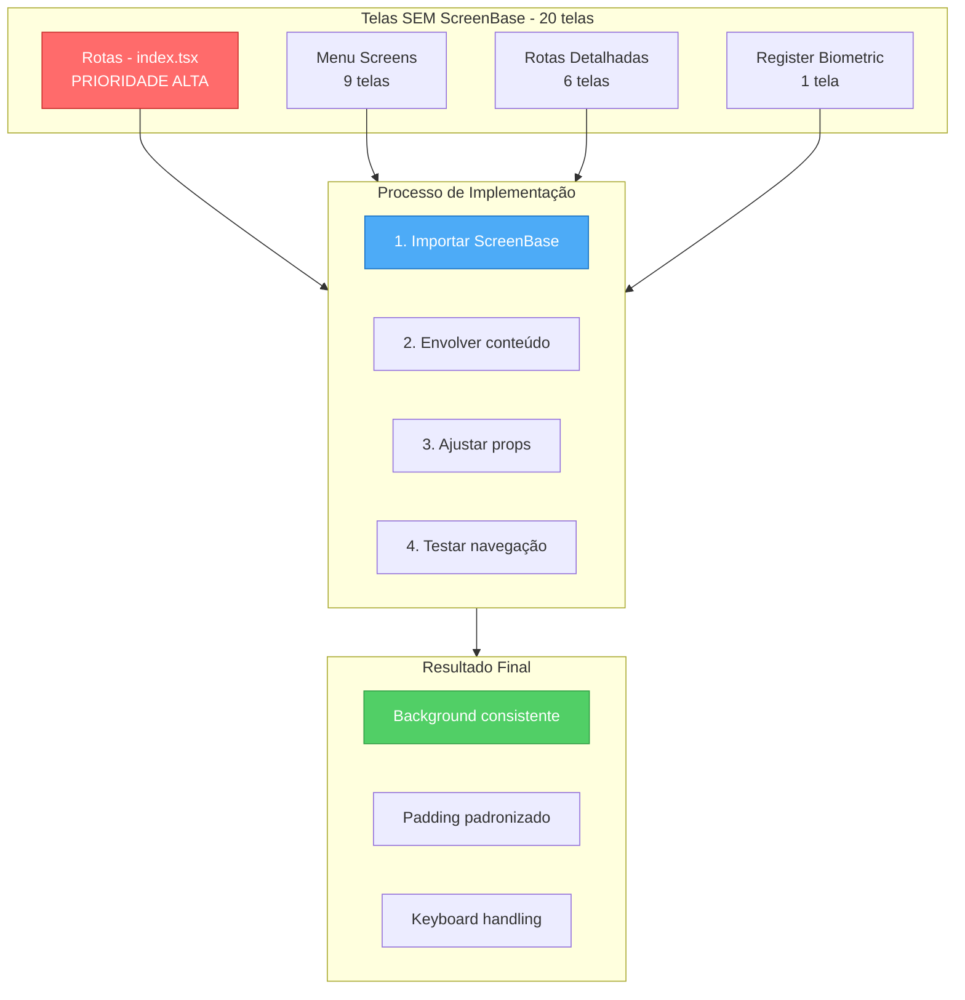

# Plano: Implementar ScreenBase nas Telas do Agility-App

## Visão Geral

Este plano detalha a implementação do componente `ScreenBase` em todas as telas que atualmente não o utilizam, garantindo consistência no background color e comportamento visual em todo o aplicativo.

---

## 1. Situação Atual

### 1.1 Telas que JÁ usam ScreenBase (6 telas)

| Tela                      | Arquivo                                                                                                                                  | Status |
| ------------------------- | ---------------------------------------------------------------------------------------------------------------------------------------- | ------ |
| Login                     | [`src/app/(public)/LoginScreen/index.tsx`](<src/app/(public)/LoginScreen/index.tsx>)                                                     | ✅     |
| Update Version            | [`src/app/(public)/UpdateVersionScreen/index.tsx`](<src/app/(public)/UpdateVersionScreen/index.tsx>)                                     | ✅     |
| Forgot Password           | [`src/app/(public)/(forgotPassword)/ForgotPasswordScreen/index.tsx`](<src/app/(public)/(forgotPassword)/ForgotPasswordScreen/index.tsx>) | ✅     |
| Change Temporary Password | [`src/app/(auth)/ChanceTemporaryPasswordScreen/index.tsx`](<src/app/(auth)/ChanceTemporaryPasswordScreen/index.tsx>)                     | ✅     |
| Ofertas                   | [`src/app/(auth)/(tabs)/ofertas/index.tsx`](<src/app/(auth)/(tabs)/ofertas/index.tsx>)                                                   | ✅     |
| Notificações              | [`src/app/(auth)/(tabs)/notificacoes.tsx`](<src/app/(auth)/(tabs)/notificacoes.tsx>)                                                     | ✅     |

### 1.2 Telas que NÃO usam ScreenBase (20 telas)

| #   | Tela               | Arquivo                                                                                                                                                                          | Prioridade |
| --- | ------------------ | -------------------------------------------------------------------------------------------------------------------------------------------------------------------------------- | ---------- |
| 1   | **Rotas (Home)**   | [`src/app/(auth)/(tabs)/index.tsx`](<src/app/(auth)/(tabs)/index.tsx>)                                                                                                           | **Alta**   |
| 2   | Menu               | [`src/app/(auth)/(tabs)/menu/index.tsx`](<src/app/(auth)/(tabs)/menu/index.tsx>)                                                                                                 | Média      |
| 3   | Chat               | [`src/app/(auth)/(tabs)/menu/chat/index.tsx`](<src/app/(auth)/(tabs)/menu/chat/index.tsx>)                                                                                       | Média      |
| 4   | Ganhos             | [`src/app/(auth)/(tabs)/menu/ganhos/index.tsx`](<src/app/(auth)/(tabs)/menu/ganhos/index.tsx>)                                                                                   | Média      |
| 5   | Histórico          | [`src/app/(auth)/(tabs)/menu/historico/index.tsx`](<src/app/(auth)/(tabs)/menu/historico/index.tsx>)                                                                             | Média      |
| 6   | Histórico Detalhes | [`src/app/(auth)/(tabs)/menu/historico/[routeId]/index.tsx`](<src/app/(auth)/(tabs)/menu/historico/[routeId]/index.tsx>)                                                         | Média      |
| 7   | Perfil             | [`src/app/(auth)/(tabs)/menu/perfil/index.tsx`](<src/app/(auth)/(tabs)/menu/perfil/index.tsx>)                                                                                   | Média      |
| 8   | Suporte            | [`src/app/(auth)/(tabs)/menu/suporte/index.tsx`](<src/app/(auth)/(tabs)/menu/suporte/index.tsx>)                                                                                 | Média      |
| 9   | Suporte Detalhes   | [`src/app/(auth)/(tabs)/menu/suporte/[id].tsx`](<src/app/(auth)/(tabs)/menu/suporte/[id].tsx>)                                                                                   | Média      |
| 10  | Protocolos         | [`src/app/(auth)/(tabs)/menu/protocolos/index.tsx`](<src/app/(auth)/(tabs)/menu/protocolos/index.tsx>)                                                                           | Média      |
| 11  | Protocolo Detalhes | [`src/app/(auth)/(tabs)/menu/protocolos/[id].tsx`](<src/app/(auth)/(tabs)/menu/protocolos/[id].tsx>)                                                                             | Média      |
| 12  | Jornada            | [`src/app/(auth)/(tabs)/menu/jornada/index.tsx`](<src/app/(auth)/(tabs)/menu/jornada/index.tsx>)                                                                                 | Média      |
| 13  | Oferta Detalhada   | [`src/app/(auth)/(tabs)/ofertas/[id]/index.tsx`](<src/app/(auth)/(tabs)/ofertas/[id]/index.tsx>)                                                                                 | Média      |
| 14  | Rota Detalhada     | [`src/app/(auth)/(tabs)/rotas-detalhadas/[id]/index.tsx`](<src/app/(auth)/(tabs)/rotas-detalhadas/[id]/index.tsx>)                                                               | Média      |
| 15  | Parada Detalhada   | [`src/app/(auth)/(tabs)/rotas-detalhadas/[id]/parada/[pid]/index.tsx`](<src/app/(auth)/(tabs)/rotas-detalhadas/[id]/parada/[pid]/index.tsx>)                                     | Média      |
| 16  | Dados Entrega      | [`src/app/(auth)/(tabs)/rotas-detalhadas/[id]/parada/[pid]/dados-entrega/index.tsx`](<src/app/(auth)/(tabs)/rotas-detalhadas/[id]/parada/[pid]/dados-entrega/index.tsx>)         | Média      |
| 17  | Dados Serviço      | [`src/app/(auth)/(tabs)/rotas-detalhadas/[id]/parada/[pid]/dados-servico/index.tsx`](<src/app/(auth)/(tabs)/rotas-detalhadas/[id]/parada/[pid]/dados-servico/index.tsx>)         | Média      |
| 18  | Falha              | [`src/app/(auth)/(tabs)/rotas-detalhadas/[id]/parada/[pid]/falha/index.tsx`](<src/app/(auth)/(tabs)/rotas-detalhadas/[id]/parada/[pid]/falha/index.tsx>)                         | Média      |
| 19  | Tentativa Entrega  | [`src/app/(auth)/(tabs)/rotas-detalhadas/[id]/parada/[pid]/tentativa-entrega/index.tsx`](<src/app/(auth)/(tabs)/rotas-detalhadas/[id]/parada/[pid]/tentativa-entrega/index.tsx>) | Média      |
| 20  | Register Biometric | [`src/app/(auth)/RegisterAllowsBiometricScreen/index.tsx`](<src/app/(auth)/RegisterAllowsBiometricScreen/index.tsx>)                                                             | Baixa      |

---

## 2. Diagrama de Implementação



---

## 3. Padrão de Implementação

### 3.1 Estrutura Básica

**ANTES:**

```tsx
export default function MinhaTela() {
  return (
    <Box flex={1} px="x16" pt="y12">
      {/* conteúdo */}
    </Box>
  );
}
```

**DEPOIS:**

```tsx
import {Box, ScreenBase, Text} from '@/components';

export default function MinhaTela() {
  return (
    <ScreenBase title={<Text preset="textTitle">Título da Tela</Text>}>
      <Box flex={1} px="x16" pt="y12">
        {/* conteúdo */}
      </Box>
    </ScreenBase>
  );
}
```

### 3.2 Props do ScreenBase

| Prop                         | Tipo       | Padrão  | Descrição                    |
| ---------------------------- | ---------- | ------- | ---------------------------- |
| `scrollable`                 | boolean    | `false` | Tela com scroll              |
| `title`                      | ReactNode  | -       | Título no header             |
| `buttonLeft`                 | ReactNode  | -       | Botão esquerdo (ex: voltar)  |
| `buttonRight`                | ReactNode  | -       | Botão direito                |
| `mtScreenBase`               | ThemeSpace | `'t20'` | Margin top                   |
| `mbScreenBase`               | ThemeSpace | `'b20'` | Margin bottom                |
| `marginHorizontalScreenBase` | ThemeSpace | `'x20'` | Margin horizontal            |
| `dismissKeyboardOnTouch`     | boolean    | `true`  | Fechar teclado ao tocar fora |

### 3.3 Casos Especiais

#### Tela com Botão Voltar

```tsx
import {ButtonBack} from '@/components/Button/ButtonBack';

<ScreenBase
  buttonLeft={<ButtonBack />}
  title={<Text preset="textTitle">Título</Text>}>
  {/* conteúdo */}
</ScreenBase>;
```

#### Tela com Scroll

```tsx
<ScreenBase scrollable>{/* conteúdo longo */}</ScreenBase>
```

#### Tela Sem Padding Padrão

```tsx
<ScreenBase mtScreenBase="t0" mbScreenBase="b0" marginHorizontalScreenBase="x0">
  {/* conteúdo customizado */}
</ScreenBase>
```

---

## 4. Plano de Execução Detalhado

### Fase 1: Tela Principal (Prioridade Alta)

#### Task 1.1: Tela de Rotas (Home)

**Arquivo:** [`src/app/(auth)/(tabs)/index.tsx`](<src/app/(auth)/(tabs)/index.tsx>)

**Mudanças necessárias:**

1. Adicionar import: `import { ScreenBase } from '@/components';`
2. Envolver todo o conteúdo com `ScreenBase`
3. Remover padding do `Box` externo (ScreenBase já fornece)

```tsx
// ANTES
return (
  <Box flex={1} px="x16" pt="y12">
    {/* Toggle e conteúdo */}
  </Box>
);

// DEPOIS
return (
  <ScreenBase>
    <Box flex={1} px="x16" pt="y12">
      {/* Toggle e conteúdo */}
    </Box>
  </ScreenBase>
);
```

---

### Fase 2: Telas do Menu

#### Task 2.1: Menu Principal

**Arquivo:** [`src/app/(auth)/(tabs)/menu/index.tsx`](<src/app/(auth)/(tabs)/menu/index.tsx>)

#### Task 2.2: Chat

**Arquivo:** [`src/app/(auth)/(tabs)/menu/chat/index.tsx`](<src/app/(auth)/(tabs)/menu/chat/index.tsx>)

- **Nota:** Tela com input de chat, verificar `dismissKeyboardOnTouch`

#### Task 2.3: Ganhos

**Arquivo:** [`src/app/(auth)/(tabs)/menu/ganhos/index.tsx`](<src/app/(auth)/(tabs)/menu/ganhos/index.tsx>)

- **Nota:** Tela com gráficos, pode precisar de `scrollable`

#### Task 2.4: Histórico de Rotas

**Arquivo:** [`src/app/(auth)/(tabs)/menu/historico/index.tsx`](<src/app/(auth)/(tabs)/menu/historico/index.tsx>)

#### Task 2.5: Detalhes do Histórico

**Arquivo:** [`src/app/(auth)/(tabs)/menu/historico/[routeId]/index.tsx`](<src/app/(auth)/(tabs)/menu/historico/[routeId]/index.tsx>)

- **Nota:** Adicionar botão voltar

#### Task 2.6: Perfil

**Arquivo:** [`src/app/(auth)/(tabs)/menu/perfil/index.tsx`](<src/app/(auth)/(tabs)/menu/perfil/index.tsx>)

#### Task 2.7: Suporte (Lista)

**Arquivo:** [`src/app/(auth)/(tabs)/menu/suporte/index.tsx`](<src/app/(auth)/(tabs)/menu/suporte/index.tsx>)

#### Task 2.8: Suporte (Detalhes)

**Arquivo:** [`src/app/(auth)/(tabs)/menu/suporte/[id].tsx`](<src/app/(auth)/(tabs)/menu/suporte/[id].tsx>)

- **Nota:** Tela de chat, verificar comportamento do teclado

#### Task 2.9: Protocolos (Lista)

**Arquivo:** [`src/app/(auth)/(tabs)/menu/protocolos/index.tsx`](<src/app/(auth)/(tabs)/menu/protocolos/index.tsx>)

#### Task 2.10: Protocolo (Detalhes)

**Arquivo:** [`src/app/(auth)/(tabs)/menu/protocolos/[id].tsx`](<src/app/(auth)/(tabs)/menu/protocolos/[id].tsx>)

#### Task 2.11: Jornada

**Arquivo:** [`src/app/(auth)/(tabs)/menu/jornada/index.tsx`](<src/app/(auth)/(tabs)/menu/jornada/index.tsx>)

---

### Fase 3: Telas de Rotas Detalhadas

#### Task 3.1: Detalhes da Rota

**Arquivo:** [`src/app/(auth)/(tabs)/rotas-detalhadas/[id]/index.tsx`](<src/app/(auth)/(tabs)/rotas-detalhadas/[id]/index.tsx>)

#### Task 3.2: Detalhes da Parada

**Arquivo:** [`src/app/(auth)/(tabs)/rotas-detalhadas/[id]/parada/[pid]/index.tsx`](<src/app/(auth)/(tabs)/rotas-detalhadas/[id]/parada/[pid]/index.tsx>)

- **Nota:** Tela complexa com mapa, verificar se `ScreenBase` não interfere

#### Task 3.3: Dados de Entrega

**Arquivo:** [`src/app/(auth)/(tabs)/rotas-detalhadas/[id]/parada/[pid]/dados-entrega/index.tsx`](<src/app/(auth)/(tabs)/rotas-detalhadas/[id]/parada/[pid]/dados-entrega/index.tsx>)

#### Task 3.4: Dados do Serviço

**Arquivo:** [`src/app/(auth)/(tabs)/rotas-detalhadas/[id]/parada/[pid]/dados-servico/index.tsx`](<src/app/(auth)/(tabs)/rotas-detalhadas/[id]/parada/[pid]/dados-servico/index.tsx>)

#### Task 3.5: Falha

**Arquivo:** [`src/app/(auth)/(tabs)/rotas-detalhadas/[id]/parada/[pid]/falha/index.tsx`](<src/app/(auth)/(tabs)/rotas-detalhadas/[id]/parada/[pid]/falha/index.tsx>)

#### Task 3.6: Tentativa de Entrega

**Arquivo:** [`src/app/(auth)/(tabs)/rotas-detalhadas/[id]/parada/[pid]/tentativa-entrega/index.tsx`](<src/app/(auth)/(tabs)/rotas-detalhadas/[id]/parada/[pid]/tentativa-entrega/index.tsx>)

---

### Fase 4: Telas Especiais

#### Task 4.1: Oferta Detalhada

**Arquivo:** [`src/app/(auth)/(tabs)/ofertas/[id]/index.tsx`](<src/app/(auth)/(tabs)/ofertas/[id]/index.tsx>)

#### Task 4.2: Register Biometric

**Arquivo:** [`src/app/(auth)/RegisterAllowsBiometricScreen/index.tsx`](<src/app/(auth)/RegisterAllowsBiometricScreen/index.tsx>)

- **Nota:** Tela com layout muito customizado, pode precisar de props especiais

---

## 5. Checklist de Implementação

### Antes de Implementar

- [ ] Verificar se a tela tem comportamento de scroll
- [ ] Verificar se a tela tem botão de voltar
- [ ] Verificar se a tela tem header customizado
- [ ] Verificar comportamento do teclado

### Durante a Implementação

- [ ] Adicionar import do `ScreenBase`
- [ ] Envolver conteúdo com `ScreenBase`
- [ ] Ajustar props conforme necessário
- [ ] Remover estilos duplicados (padding, background)

### Depois de Implementar

- [ ] Testar navegação para a tela
- [ ] Testar navegação de volta
- [ ] Testar scroll (se aplicável)
- [ ] Testar comportamento do teclado
- [ ] Verificar visual em iOS e Android

---

## 6. Ordem de Execução Recomendada

```mermaid
gantt
    title Cronograma de Implementação
    dateFormat  X
    axisFormat %s

    section Fase 1 - Alta Prioridade
    Tela de Rotas (Home)    :a1, 0, 1

    section Fase 2 - Menu
    Menu Principal          :b1, 1, 1
    Chat                    :b2, 2, 1
    Ganhos                  :b3, 3, 1
    Histórico               :b4, 4, 1
    Histórico Detalhes      :b5, 5, 1
    Perfil                  :b6, 6, 1
    Suporte                 :b7, 7, 1
    Suporte Detalhes        :b8, 8, 1
    Protocolos              :b9, 9, 1
    Protocolo Detalhes      :b10, 10, 1
    Jornada                 :b11, 11, 1

    section Fase 3 - Rotas
    Rota Detalhada          :c1, 12, 1
    Parada Detalhada        :c2, 13, 1
    Dados Entrega           :c3, 14, 1
    Dados Serviço           :c4, 15, 1
    Falha                   :c5, 16, 1
    Tentativa Entrega       :c6, 17, 1

    section Fase 4 - Especiais
    Oferta Detalhada        :d1, 18, 1
    Register Biometric      :d2, 19, 1
```



---

## 7. Resumo

| Fase      | Telas                      | Prioridade |
| --------- | -------------------------- | ---------- |
| Fase 1    | 1 tela (Rotas)             | **Alta**   |
| Fase 2    | 11 telas (Menu)            | Média      |
| Fase 3    | 6 telas (Rotas Detalhadas) | Média      |
| Fase 4    | 2 telas (Especiais)        | Baixa      |
| **Total** | **20 telas**               | -          |

A implementação deve começar pela **Tela de Rotas (Home)** pois é a tela principal do app e a que apresenta o problema mais visível de background inconsistente.
