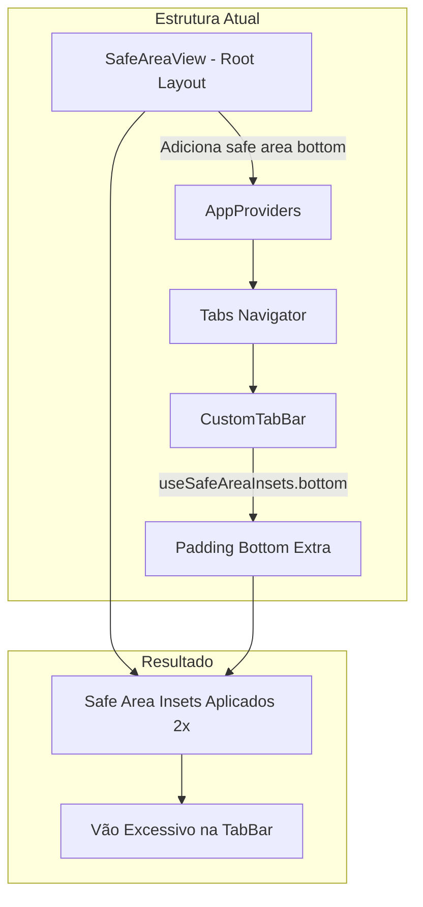

# Análise: Vão na Parte Inferior da TabBar

## Problema Identificado

A TabBar está apresentando um vão/espaçamento excessivo na parte inferior da tela.

---

## Causas Raiz Identificadas

### 1. **Duplo Safe Area Handling** ⚠️ Principal Causa

Existem dois mecanismos aplicando safe area inset na parte inferior simultaneamente:

#### A. SafeAreaView no Root Layout

Arquivo: [`src/app/_layout.tsx:95`](src/app/_layout.tsx:95)

```tsx
<SafeAreaView
  style={{flex: 1, backgroundColor: theme.colors.grayTopoHomeScreen}}>
  <AppProviders>
    <InitialLayout />
  </AppProviders>
</SafeAreaView>
```

O `SafeAreaView` adiciona automaticamente padding na parte inferior para dispositivos com gesture bar (iPhone X+, Android com navigation gestures).

#### B. useSafeAreaInsets na CustomTabBar

Arquivo: [`src/components/CustomTabBar/CustomTabBar.tsx:30`](src/components/CustomTabBar/CustomTabBar.tsx:30)

```tsx
const insets = useSafeAreaInsets();

// ...

<Box
  backgroundColor='white'
  paddingVertical="t4"
  style={{ paddingBottom: Math.max(insets.bottom, 4) }}
  flexDirection="row"
>
```

A CustomTabBar também está aplicando `paddingBottom` baseado no `insets.bottom`.

**Resultado**: O espaçamento inferior é aplicado **duas vezes**, criando o vão excessivo.

---

### 2. **Padding Vertical Duplicado**

No componente CustomTabBar:

```tsx
paddingVertical="t4"  // Aplica padding no topo E na base
style={{ paddingBottom: Math.max(insets.bottom, 4) }}  // Adiciona MAIS padding na base
```

O `paddingVertical` já adiciona padding na base, e depois o `paddingBottom` adiciona mais.

---

### 3. **Código de Debug Presente** 🐛

Arquivo: [`src/components/CustomTabBar/CustomTabBar.tsx:94`](src/components/CustomTabBar/CustomTabBar.tsx:94)

```tsx
<Box alignItems="center" justifyContent="center" backgroundColor='redError'>
```

O `backgroundColor='redError'` parece ser código de debug para visualizar o problema e deve ser removido.

---

## Diagrama do Problema



---

## Soluções Recomendadas

### Solução 1: Remover SafeAreaView do Root Layout ⭐ Recomendada

**Vantagens:**

- Solução mais limpa
- Cada tela/taba gerencia seu próprio safe area
- Evita conflitos

**Alterações:**

1. Em [`src/app/_layout.tsx`](src/app/_layout.tsx:95), substituir `SafeAreaView` por `View`:

```tsx
// Antes
<SafeAreaView style={{ flex: 1, backgroundColor: theme.colors.grayTopoHomeScreen }}>

// Depois
<View style={{ flex: 1, backgroundColor: theme.colors.grayTopoHomeScreen }}>
```

2. Adicionar safe area no topo manualmente nas telas públicas (Login, etc.) se necessário.

---

### Solução 2: Usar SafeAreaView apenas no Topo

**Vantagens:**

- Mantém proteção do status bar
- Remove duplicação na base

**Alterações:**

Usar a propriedade `edges` do SafeAreaView (requer react-native-safe-area-context):

```tsx
<SafeAreaView
  style={{ flex: 1, backgroundColor: theme.colors.grayTopoHomeScreen }}
  edges={['top']}  // Apenas topo
>
```

> Nota: Isso requer usar o `SafeAreaView` do `react-native-safe-area-context`, não o do React Native.

---

### Solução 3: Remover paddingBottom da CustomTabBar

**Vantagens:**

- Menos invasiva
- Mantém estrutura atual

**Alterações:**

Em [`src/components/CustomTabBar/CustomTabBar.tsx`](src/components/CustomTabBar/CustomTabBar.tsx:24):

```tsx
// Antes
<Box
  backgroundColor='white'
  borderTopWidth={measure.m1}
  borderTopColor='mutedElementsColor'
  paddingVertical="t4"
  style={{ paddingBottom: Math.max(insets.bottom, 4) }}
  flexDirection="row"
>

// Depois
<Box
  backgroundColor='white'
  borderTopWidth={measure.m1}
  borderTopColor='mutedElementsColor'
  paddingTop="t4"
  paddingBottom={insets.bottom > 0 ? insets.bottom : 4}
  flexDirection="row"
>
```

---

## Plano de Correção Detalhado

### Passo 1: Corrigir CustomTabBar

- [ ] Remover `paddingVertical` e usar `paddingTop` + `paddingBottom` separados
- [ ] Remover código de debug `backgroundColor='redError'`
- [ ] Ajustar lógica do paddingBottom

### Passo 2: Ajustar Root Layout

- [ ] Decidir qual solução de SafeAreaView usar
- [ ] Aplicar alteração no `_layout.tsx`
- [ ] Testar em telas públicas (login) para garantir safe area no topo

### Passo 3: Testar

- [ ] Testar em dispositivo com gesture bar (iPhone X+)
- [ ] Testar em dispositivo com botão físico (iPhone 8)
- [ ] Testar em Android com gesture navigation
- [ ] Testar em Android com navigation bar tradicional

---

## Código Corrigido Sugerido

### CustomTabBar.tsx

```tsx
<Box
  backgroundColor="white"
  borderTopWidth={measure.m1}
  borderTopColor="mutedElementsColor"
  paddingTop="t4"
  style={{paddingBottom: insets.bottom + 4}}
  flexDirection="row">
  {visibleRoutes.map((route, index) => {
    // ...
    return (
      <TouchableOpacityBox
        key={route.key}
        flex={1}
        accessibilityRole="button"
        accessibilityState={isFocused ? {selected: true} : {}}
        accessibilityLabel={options.tabBarAccessibilityLabel}
        onPress={onPress}
        onLongPress={onLongPress}>
        <Box alignItems="center" justifyContent="center">
          {' '}
          {/* ← Remover backgroundColor='redError' */}
          {/* ... resto do código */}
        </Box>
      </TouchableOpacityBox>
    );
  })}
</Box>
```

---

## Resumo

| Problema              | Causa                           | Solução                            |
| --------------------- | ------------------------------- | ---------------------------------- |
| Vão excessivo na base | Safe Area aplicado 2x           | Remover duplicação                 |
| Padding duplicado     | paddingVertical + paddingBottom | Usar apenas paddingTop             |
| Fundo vermelho        | Código de debug                 | Remover backgroundColor='redError' |

---

## ✅ Correção Aplicada

### Alterações em [`src/components/CustomTabBar/CustomTabBar.tsx`](src/components/CustomTabBar/CustomTabBar.tsx)

1. **Removido** `useSafeAreaInsets` e sua importação (não é mais necessário, o SafeAreaView do root já gerencia)
2. **Removido** `paddingVertical="t4"` e `style={{ paddingBottom: Math.max(insets.bottom, 4) }}`
3. **Adicionado** apenas `paddingTop="t4"` (padding superior apenas)
4. **Removido** `backgroundColor='redError'` (código de debug)

### Código Final

```tsx
<Box
  backgroundColor='white'
  borderTopWidth={measure.m1}
  borderTopColor='mutedElementsColor'
  paddingTop="t4"
  flexDirection="row"
>
```

O `SafeAreaView` do [`src/app/_layout.tsx`](src/app/_layout.tsx:95) agora é o único responsável por gerenciar o safe area inset na parte inferior.
