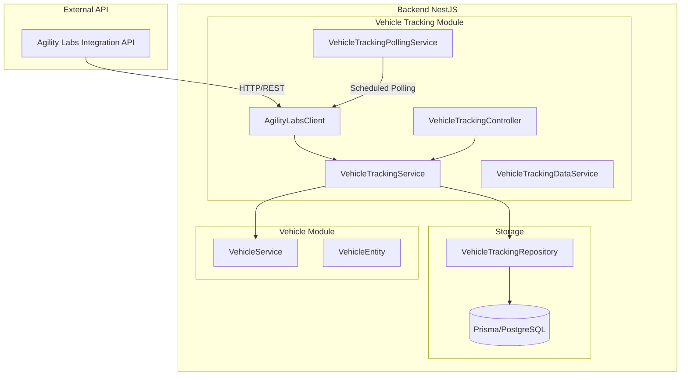
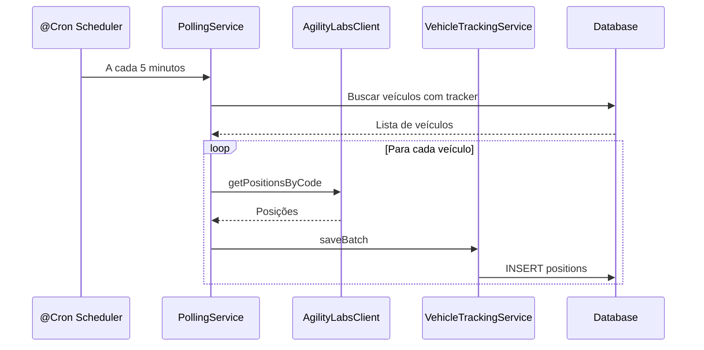
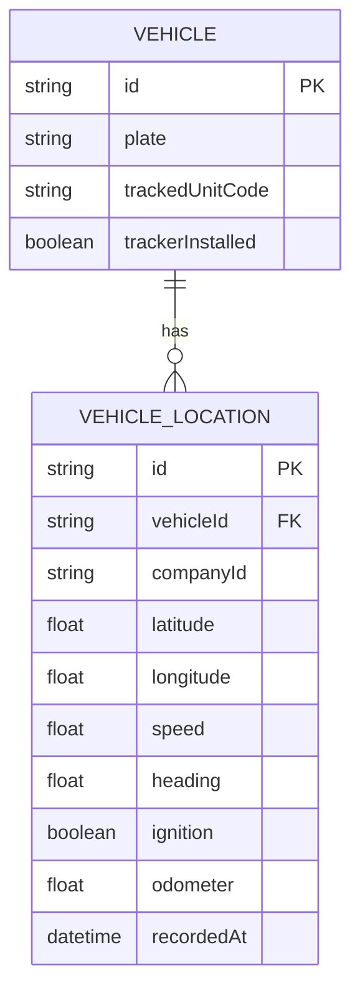

# Plano de Integração: Vehicle Tracking (API de Terceiros)

## 1. Visão Geral

### 1.1 Contexto

Atualmente o sistema possui um módulo de **tracking** que registra a localização do motorista através do app Lab App. Agora é necessário integrar uma API de terceiros (Agility Labs Integration) para capturar dados de **dispositivos físicos** instalados nos veículos.

### 1.2 Comparação: Tracking Atual vs Novo Vehicle Tracking

| Aspecto        | Tracking Atual (Driver) | Vehicle Tracking (Novo)       |
| -------------- | ----------------------- | ----------------------------- |
| Fonte de dados | App Lab App (mobile)    | Dispositivo físico no veículo |
| Entidade       | DriverLocationEntity    | VehicleLocationEntity         |
| Identificador  | driverId                | vehicleId/placa               |
| Origem         | Push (app envia dados)  | Pull (polling da API)         |
| Dados          | GPS do celular          | GPS do rastreador             |

---

## 2. Análise da API de Terceiros

### 2.1 Endpoints Disponíveis

| Endpoint                          | Método | Descrição             | Uso           |
| --------------------------------- | ------ | --------------------- | ------------- |
| `/api/license/activate`           | POST   | Ativa uma licença     | Onboarding    |
| `/api/license/status`             | GET    | Status da licença     | Verificação   |
| `/api/getPositionsByCode`         | GET    | Últimas posições      | Sincronização |
| `/api/getPositionsHistoryByCode`  | GET    | Histórico de posições | Backfill      |
| `/api/report/getTrackedUnitUsage` | GET    | Relatório de uso      | Analytics     |
| `/api/report/getAreaPassage`      | GET    | Passagens por áreas   | Relatórios    |

### 2.2 Autenticação

- **Tipo**: Bearer Token ou Login com email/senha
- **Header**: `Authorization: Bearer {token}`
- **Login**: `POST /auth/login` com `{ email, password }`
- **Auto-refresh**: O client automaticamente faz login e renova o token quando expira

### 2.3 Parâmetros Principais

- `code`: Código da empresa (enterprise_integration_code)
- `trackedUnitIntegrationCode`: Código de integração do veículo
- `startDate`/`endDate`: Período (formato ISO 8601 UTC)

### 2.4 Limitações

- Intervalo máximo de consulta: 7 dias
- Dados armazenados por: 3 meses
- Horários em UTC (fuso 0)

---

## 3. Arquitetura Proposta

### 3.1 Diagrama de Arquitetura



### 3.2 Estrutura de Diretórios

```
src/
└── vehicle-tracking/
    ├── vehicle-tracking.module.ts
    ├── controller/
    │   └── vehicle-tracking.controller.ts
    ├── dto/
    │   ├── agility-labs/
    │   │   ├── license.dto.ts
    │   │   ├── position.dto.ts
    │   │   └── report.dto.ts
    │   ├── create-vehicle-location.dto.ts
    │   └── query-vehicle-location.dto.ts
    ├── entities/
    │   └── vehicle-location.entity.ts
    ├── mapper/
    │   └── vehicle-tracking.mapper.ts
    ├── repository/
    │   ├── vehicle-tracking.repository.ts
    │   └── impl/
    │       └── prisma-vehicle-tracking.repository.ts
    ├── service/
    │   ├── vehicle-tracking.service.ts
    │   ├── vehicle-tracking-data.service.ts
    │   ├── vehicle-tracking-polling.service.ts
    │   └── agility-labs-client.service.ts
    └── types/
        └── agility-labs.types.ts
```

---

## 4. Design Detalhado

### 4.1 Entity: VehicleLocationEntity

Seguindo o padrão da [`DriverLocationEntity`](C:/Users/daniel.santos/trea/lab-curso-services/src/tracking/entities/driver-location.entity.ts):

```typescript
// vehicle-location.entity.ts
export interface VehicleLocationPersistenceData {
  id?: string;
  vehicleId: string; // ID do veículo no nosso sistema
  companyId: string;
  trackedUnitCode: string; // Código de integração na API de terceiros
  latitude: number;
  longitude: number;
  speed?: number; // Velocidade em km/h
  heading?: number; // Direção em graus
  ignition?: boolean; // Ignição ligada/desligada
  odometer?: number; // Odômetro em km
  source: string; // API, GPS, MANUAL
  recordedAt: Date; // Data/hora da leitura
  createdAt?: Date;
  updatedAt?: Date;
}

export class VehicleLocationEntity extends BaseEntity {
  // Implementação seguindo o padrão DriverLocationEntity
}
```

### 4.2 Client HTTP: AgilityLabsClientService

```typescript
// agility-labs-client.service.ts
@Injectable()
export class AgilityLabsClientService {
  private readonly baseUrl = 'https://integration-labs.agilitylabs.com.br/api';

  constructor(
    private readonly httpService: HttpService,
    private readonly configService: ConfigService
  ) {}

  async getPositions(
    enterpriseCode: string,
    trackedUnitCode?: string
  ): Promise<AgilityLabsPosition[]> {
    // GET /getPositionsByCode
  }

  async getPositionsHistory(
    enterpriseCode: string,
    trackedUnitCode: string,
    startDate: Date,
    endDate: Date
  ): Promise<AgilityLabsPosition[]> {
    // GET /getPositionsHistoryByCode
  }

  async activateLicense(hash: string): Promise<LicenseActivationResponse> {
    // POST /license/activate
  }

  async getLicenseStatus(hash: string): Promise<LicenseStatusResponse> {
    // GET /license/status
  }
}
```

### 4.3 Polling Service: VehicleTrackingPollingService

```typescript
// vehicle-tracking-polling.service.ts
@Injectable()
export class VehicleTrackingPollingService {
  constructor(
    private readonly agilityLabsClient: AgilityLabsClientService,
    private readonly vehicleTrackingService: VehicleTrackingService,
    private readonly vehicleService: VehicleService,
    private readonly configService: ConfigService
  ) {}

  @Cron('*/5 * * * *') // A cada 5 minutos
  async syncVehiclePositions(): Promise<void> {
    // 1. Buscar veículos com tracker instalado
    // 2. Para cada veículo, buscar última posição na API
    // 3. Salvar novas posições no banco
  }
}
```

### 4.4 Repository: VehicleTrackingRepository

```typescript
// vehicle-tracking.repository.ts
export abstract class VehicleTrackingRepository {
  abstract save(
    location: VehicleLocationEntity
  ): Promise<VehicleLocationEntity>;
  abstract saveBatch(locations: VehicleLocationEntity[]): Promise<number>;
  abstract findByVehicleId(
    vehicleId: string,
    limit?: number,
    offset?: number
  ): Promise<VehicleLocationEntity[]>;
  abstract findLatestByVehicleId(
    vehicleId: string
  ): Promise<VehicleLocationEntity | null>;
  abstract findByVehicleIdAndDateRange(
    vehicleId: string,
    startDate: Date,
    endDate: Date
  ): Promise<VehicleLocationEntity[]>;
  abstract deleteOlderThan(beforeDate: Date): Promise<number>;
}
```

---

## 5. DTOs e Interfaces

### 5.1 DTOs de Requisição

```typescript
// query-vehicle-location.dto.ts
export class QueryVehicleLocationDto {
  @IsOptional()
  @IsString()
  vehicleId?: string;

  @IsOptional()
  @IsDateString()
  startDate?: string;

  @IsOptional()
  @IsDateString()
  endDate?: string;

  @IsOptional()
  @IsInt()
  @Min(1)
  @Max(1000)
  limit?: number = 100;

  @IsOptional()
  @IsInt()
  @Min(0)
  offset?: number = 0;
}
```

### 5.2 Types da API Agility Labs

```typescript
// agility-labs.types.ts
export interface AgilityLabsPosition {
  trackedUnitIntegrationCode: string;
  latitude: number;
  longitude: number;
  speed: number;
  heading: number;
  ignition: boolean;
  odometer: number;
  recordedAt: string; // ISO 8601
}

export interface AgilityLabsResponse<T> {
  success: boolean;
  data: T;
  message?: string;
}

export interface LicenseStatusData {
  enterprise_integration_code: string;
  active: boolean;
  activated_at: string | null;
  integrations: Array<{
    name: string;
    slug: string;
  }>;
}
```

---

## 6. Endpoints do Controller

### 6.1 Rotas Propostas

| Método | Rota                                     | Descrição                 |
| ------ | ---------------------------------------- | ------------------------- |
| GET    | `/vehicle-tracking/positions/:vehicleId` | Última posição do veículo |
| GET    | `/vehicle-tracking/history/:vehicleId`   | Histórico de posições     |
| GET    | `/vehicle-tracking/route/:vehicleId`     | Rota por período          |
| POST   | `/vehicle-tracking/sync`                 | Sincronização manual      |
| GET    | `/vehicle-tracking/stats/:vehicleId`     | Estatísticas do veículo   |

### 6.2 Controller

```typescript
// vehicle-tracking.controller.ts
@ApiTags('Vehicle Tracking')
@Controller('vehicle-tracking')
@UseGuards(TenantRequiredGuard, JwtAuthGuard, RolesGuard)
export class VehicleTrackingController {
  @Get('positions/:vehicleId')
  @Roles('COLLABORATOR', 'COLLABORATOR_ADMIN')
  async getLatestPosition(@Param('vehicleId') vehicleId: string) {
    return this.vehicleTrackingService.getLatestPosition(vehicleId);
  }

  @Get('history/:vehicleId')
  @Roles('COLLABORATOR', 'COLLABORATOR_ADMIN')
  async getHistory(
    @Param('vehicleId') vehicleId: string,
    @Query() query: QueryVehicleLocationDto
  ) {
    return this.vehicleTrackingService.getVehicleHistory(
      vehicleId,
      query.limit,
      query.offset
    );
  }

  @Get('route/:vehicleId')
  @Roles('COLLABORATOR', 'COLLABORATOR_ADMIN')
  async getRoute(
    @Param('vehicleId') vehicleId: string,
    @Query('startDate') startDate: string,
    @Query('endDate') endDate: string
  ) {
    return this.vehicleTrackingService.getVehicleRouteByDateRange(
      vehicleId,
      new Date(startDate),
      new Date(endDate)
    );
  }

  @Post('sync')
  @Roles('COLLABORATOR_ADMIN')
  async syncPositions() {
    return this.vehicleTrackingPollingService.syncVehiclePositions();
  }
}
```

---

## 7. Estratégia de Sincronização

### 7.1 Polling Schedule



### 7.2 Configuração

#### Variáveis de Ambiente

```bash
# .env

# ===========================================
# AGILITY LABS INTEGRATION API (Vehicle Tracking)
# ===========================================
# URL base da API de terceiros
AGILITY_LABS_API_URL=https://integration-labs.agilitylabs.com.br/api

# Token estático (opcional - se não usar login)
AGILITY_LABS_API_TOKEN=

# Código da empresa (obtido após ativação da licença)
AGILITY_LABS_ENTERPRISE_CODE=

# Credenciais para login automático (alternativa ao token estático)
AGILITY_LABS_LOGIN_EMAIL=route@agility.com.br
AGILITY_LABS_LOGIN_PASSWORD=senha123123

# Polling Configuration
VEHICLE_TRACKING_POLLING_ENABLED=true
VEHICLE_TRACKING_POLLING_INTERVAL_MS=300000  # 5 minutos
```

#### Configuração em TypeScript

```typescript
// config/vehicle-tracking.config.ts
export default {
  vehicleTracking: {
    polling: {
      enabled: process.env.VEHICLE_TRACKING_POLLING_ENABLED === 'true',
      intervalMs: parseInt(
        process.env.VEHICLE_TRACKING_POLLING_INTERVAL_MS || '300000'
      ),
      batchSize: 50,
    },
    api: {
      baseUrl:
        process.env.AGILITY_LABS_API_URL ||
        'https://integration-labs.agilitylabs.com.br/api',
      token: process.env.AGILITY_LABS_API_TOKEN,
      enterpriseCode: process.env.AGILITY_LABS_ENTERPRISE_CODE,
      loginEmail: process.env.AGILITY_LABS_LOGIN_EMAIL,
      loginPassword: process.env.AGILITY_LABS_LOGIN_PASSWORD,
      timeout: 30000,
      retries: 3,
    },
    retention: {
      days: 90, // Manter dados por 90 dias
    },
  },
};
```

---

## 8. Integração com Módulo Vehicle

### 8.1 Atualização da Entity Vehicle

Adicionar campo para vincular veículo ao código de integração:

```typescript
// Adicionar em VehicleEntity
private _trackedUnitCode?: string;  // Código na API de terceiros
private _trackerInstalled?: boolean;
```

### 8.2 Relacionamento



---

## 9. Prisma Schema

### 9.1 Novo Model

```prisma
model VehicleLocation {
  id                String   @id @default(cuid())
  vehicleId         String
  companyId         String
  trackedUnitCode   String
  latitude          Float
  longitude         Float
  speed             Float?
  heading           Float?
  ignition          Boolean?
  odometer          Float?
  source            String   @default("API")
  recordedAt        DateTime
  createdAt         DateTime @default(now())
  updatedAt         DateTime @updatedAt

  vehicle           Vehicle  @relation(fields: [vehicleId], references: [id])

  @@index([vehicleId, recordedAt])
  @@index([companyId, recordedAt])
  @@index([trackedUnitCode])
}

// Adicionar em Vehicle
model Vehicle {
  // ... campos existentes
  trackedUnitCode   String?  @unique
  trackerInstalled  Boolean  @default(false)

  locations         VehicleLocation[]
}
```

---

## 10. Tratamento de Erros

### 10.1 Exceções Customizadas

```typescript
// exceptions/agility-labs.exception.ts
export class AgilityLabsApiException extends Error {
  constructor(
    message: string,
    public readonly statusCode: number,
    public readonly originalError?: any
  ) {
    super(message);
    this.name = 'AgilityLabsApiException';
  }
}

export class LicenseNotActiveException extends Error {
  constructor(public readonly licenseHash: string) {
    super(`License ${licenseHash} is not active`);
    this.name = 'LicenseNotActiveException';
  }
}
```

### 10.2 Retry Strategy

```typescript
// agility-labs-client.service.ts
async getPositions(...): Promise<AgilityLabsPosition[]> {
  return retry(
    async () => {
      const response = await this.httpService.get(...);
      return response.data;
    },
    {
      retries: 3,
      retryDelay: (attempt) => Math.pow(2, attempt) * 1000,
      retryOn: (error) => error.response?.status >= 500,
    },
  );
}
```

---

## 11. Testes

### 11.1 Testes Unitários

- [ ] VehicleLocationEntity - criação e validações
- [ ] VehicleTrackingService - lógica de negócio
- [ ] AgilityLabsClient - chamadas HTTP
- [ ] VehicleTrackingMapper - conversão de dados

### 11.2 Testes de Integração

- [ ] VehicleTrackingRepository - operações de banco
- [ ] VehicleTrackingController - endpoints
- [ ] Polling Service - sincronização

### 11.3 Testes E2E

- [ ] Fluxo completo de sincronização
- [ ] Consulta de histórico
- [ ] Tratamento de erros da API

---

## 12. Checklist de Implementação

### Fase 1: Infraestrutura

- [ ] Criar módulo `vehicle-tracking`
- [ ] Definir Prisma schema para `VehicleLocation`
- [ ] Atualizar schema de `Vehicle`
- [ ] Criar migrações

### Fase 2: Core

- [ ] Implementar `VehicleLocationEntity`
- [ ] Implementar `VehicleTrackingRepository`
- [ ] Implementar `VehicleTrackingMapper`
- [ ] Implementar DTOs

### Fase 3: Integração

- [ ] Implementar `AgilityLabsClientService`
- [ ] Implementar tratamento de erros
- [ ] Configurar variáveis de ambiente

### Fase 4: Serviços

- [ ] Implementar `VehicleTrackingService`
- [ ] Implementar `VehicleTrackingDataService`
- [ ] Implementar `VehicleTrackingPollingService`

### Fase 5: API

- [ ] Implementar `VehicleTrackingController`
- [ ] Documentar com Swagger
- [ ] Testes de integração

### Fase 6: Finalização

- [ ] Testes unitários
- [ ] Testes E2E
- [ ] Code review
- [ ] Deploy

---

## 13. Variáveis de Ambiente

### 13.1 Configuração para Kubernetes Secrets

Todas as credenciais sensíveis devem ser configuradas via **Kubernetes Secrets** e injetadas como variáveis de ambiente no container.

```env
# ===========================================
# Agility Labs Integration - CREDENCIAIS
# ===========================================
# Estas variáveis devem ser configuradas como Kubernetes Secrets
AGILITY_LABS_API_URL=https://integration-labs.agilitylabs.com.br/api
AGILITY_LABS_API_TOKEN=your-api-token          # Secret: agility-labs-credentials
AGILITY_LABS_ENTERPRISE_CODE=your-enterprise-code  # Secret: agility-labs-credentials

# ===========================================
# Polling Configuration
# ===========================================
VEHICLE_TRACKING_POLLING_ENABLED=true
VEHICLE_TRACKING_POLLING_INTERVAL=*/5 * * * *
VEHICLE_TRACKING_POLLING_BATCH_SIZE=50
```

### 13.2 Kubernetes Secret Example

```yaml
# k8s/secrets/agility-labs-secret.yaml
apiVersion: v1
kind: Secret
metadata:
  name: agility-labs-credentials
  namespace: lab-curso
type: Opaque
stringData:
  AGILITY_LABS_API_TOKEN: 'your-api-token-here'
  AGILITY_LABS_ENTERPRISE_CODE: 'your-enterprise-code-here'
```

### 13.3 Kubernetes Deployment Example

```yaml
# k8s/deployments/backend-deployment.yaml
apiVersion: apps/v1
kind: Deployment
metadata:
  name: lab-curso-backend
  namespace: lab-curso
spec:
  template:
    spec:
      containers:
        - name: backend
          env:
            - name: AGILITY_LABS_API_URL
              value: 'https://integration-labs.agilitylabs.com.br/api'
            - name: AGILITY_LABS_API_TOKEN
              valueFrom:
                secretKeyRef:
                  name: agility-labs-credentials
                  key: AGILITY_LABS_API_TOKEN
            - name: AGILITY_LABS_ENTERPRISE_CODE
              valueFrom:
                secretKeyRef:
                  name: agility-labs-credentials
                  key: AGILITY_LABS_ENTERPRISE_CODE
            - name: VEHICLE_TRACKING_POLLING_ENABLED
              value: 'true'
            - name: VEHICLE_TRACKING_POLLING_INTERVAL
              value: '*/5 * * * *'
```

### 13.4 Config Service Integration

```typescript
// config/agility-labs.config.ts
import {registerAs} from '@nestjs/config';

export default registerAs('agilityLabs', () => ({
  apiUrl:
    process.env.AGILITY_LABS_API_URL ||
    'https://integration-labs.agilitylabs.com.br/api',
  apiToken: process.env.AGILITY_LABS_API_TOKEN, // Obrigatório - via Secret
  enterpriseCode: process.env.AGILITY_LABS_ENTERPRISE_CODE, // Obrigatório - via Secret
  polling: {
    enabled: process.env.VEHICLE_TRACKING_POLLING_ENABLED === 'true',
    interval: process.env.VEHICLE_TRACKING_POLLING_INTERVAL || '*/5 * * * *',
    batchSize: parseInt(
      process.env.VEHICLE_TRACKING_POLLING_BATCH_SIZE || '50',
      10
    ),
  },
}));
```

### 13.5 Validação de Configuração

```typescript
// config/config.validation.ts
import * as Joi from 'joi';

export const configValidationSchema = Joi.object({
  // Agility Labs - Obrigatórios
  AGILITY_LABS_API_URL: Joi.string().uri().required(),
  AGILITY_LABS_API_TOKEN: Joi.string().required(), // Via Secret
  AGILITY_LABS_ENTERPRISE_CODE: Joi.string().required(), // Via Secret

  // Polling - Opcionais com defaults
  VEHICLE_TRACKING_POLLING_ENABLED: Joi.string()
    .valid('true', 'false')
    .default('true'),
  VEHICLE_TRACKING_POLLING_INTERVAL: Joi.string().default('*/5 * * * *'),
  VEHICLE_TRACKING_POLLING_BATCH_SIZE: Joi.string().default('50'),
});
```

---

## 14. Considerações Finais

### 14.1 Princípios Aplicados

- **SOLID**:
  - Single Responsibility: Cada service com uma responsabilidade
  - Open/Closed: Repository abstrato para extensão
  - Dependency Inversion: Injeção de dependências

- **Clean Code**:
  - Nomes descritivos
  - Funções pequenas e focadas
  - Separação de responsabilidades

- **Design Patterns**:
  - Repository Pattern
  - Adapter Pattern (AgilityLabsClient)
  - Strategy Pattern (sincronização)

### 14.2 Diferenças Chave: Driver Tracking vs Vehicle Tracking

| Aspecto           | Driver Tracking            | Vehicle Tracking    |
| ----------------- | -------------------------- | ------------------- |
| Direção dos dados | Push (app → server)        | Pull (server → API) |
| Frequência        | Tempo real                 | Polling (5 min)     |
| Fonte             | SDK Background Geolocation | API REST terceiros  |
| Dados extras      | Bateria, atividade         | Ignição, odômetro   |

### 14.3 Próximos Passos

1. **Configurar Prisma Schema** - Adicionar modelo `VehicleLocation` ao schema.prisma
2. **Executar Migração** - Rodar `npx prisma migrate dev` para criar a tabela
3. **Configurar Variáveis de Ambiente** - Adicionar as variáveis no Kubernetes Secrets
4. **Importar Módulo** - Adicionar `VehicleTrackingModule` ao `app.module.ts`
5. **Testar Integração** - Testar os endpoints e sincronização

### 14.4 Dependências Necessárias

O código já foi implementado usando dependências existentes no projeto:

- `axios` - Para chamadas HTTP (já instalado)
- `class-validator` e `class-transformer` - Para validação de DTOs (já instalado)

### 14.5 Arquivos Criados/Modificados

#### Novos Arquivos (módulo vehicle-tracking):

```
src/vehicle-tracking/
├── vehicle-tracking.module.ts
├── controller/
│   └── vehicle-tracking.controller.ts
├── dto/
│   └── query-vehicle-location.dto.ts
├── entities/
│   └── vehicle-location.entity.ts
├── mapper/
│   └── vehicle-tracking.mapper.ts
├── repository/
│   ├── vehicle-tracking.repository.ts
│   └── impl/
│       └── prisma-vehicle-tracking.repository.ts
├── service/
│   ├── agility-labs-client.service.ts
│   ├── vehicle-tracking.service.ts
│   └── vehicle-tracking-polling.service.ts
└── types/
    └── agility-labs.types.ts
```

#### Arquivos Modificados:

- `src/vehicle/entities/vehicle.entity.ts` - Adicionado campo `trackedUnitCode`

### 14.6 Schema Prisma Necessário

Adicionar ao arquivo `prisma/schema.prisma`:

```prisma
model VehicleLocation {
  id                String   @id @default(cuid())
  vehicleId         String
  companyId         String
  trackedUnitCode   String
  latitude          Float
  longitude         Float
  speed             Float?
  heading           Float?
  ignition          Boolean?
  odometer          Float?
  address           String?
  event             String?
  source            String   @default("API")
  recordedAt        DateTime
  createdAt         DateTime @default(now())
  updatedAt         DateTime @updatedAt

  vehicle           Vehicle  @relation(fields: [vehicleId], references: [id])

  @@index([vehicleId, recordedAt])
  @@index([companyId, recordedAt])
  @@index([trackedUnitCode])
}

// Adicionar em Vehicle
model Vehicle {
  // ... campos existentes
  trackedUnitCode   String?  @unique

  locations         VehicleLocation[]
}
```

### 14.7 Checklist de Deploy

- [ ] Adicionar schema Prisma e rodar migração
- [ ] Configurar secrets no Kubernetes
- [ ] Importar VehicleTrackingModule no app.module.ts
- [ ] Testar endpoints com Postman/Insomnia
- [ ] Verificar logs de sincronização
- [ ] Monitorar performance do polling
