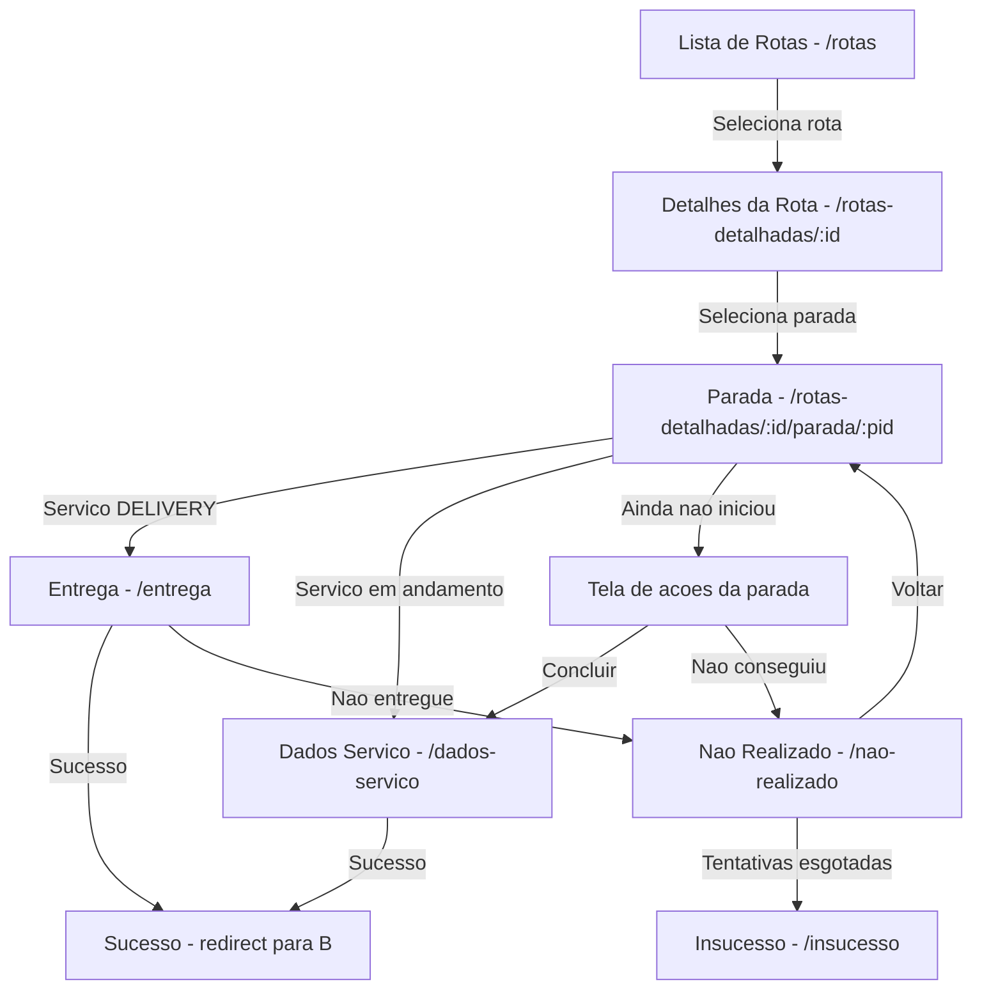

# Análise Completa da Estrutura de Roteamento

## 1. Resumo da Estrutura de Roteamento Encontrada

### Hierarquia de Layouts

```mermaid
graph TD
    A[_layout.tsx - Raiz] -->|Slot| B[(auth)/_layout.tsx]
    A -->|Slot| C[(public)/_layout.tsx]
    B -->|Stack| D[(tabs)/_layout.tsx]
    B -->|Stack| E[ChanceTemporaryPasswordScreen]
    B -->|Stack| F[RegisterAllowsBiometricScreen]
    D -->|Tabs| G[index - Rotas]
    D -->|Tabs| H[ofertas]
    D -->|Tabs| I[notificacoes]
    D -->|Tabs| J[menu]
    D -->|Tabs - href:null| K[rotas-detalhadas]
    K -->|Stack| L[[id]/index]
    K -->|Stack| M[[id]/parada/[pid]/index]
    K -->|Stack| N[[id]/parada/[pid]/dados-servico]
```

### Estrutura de Navegadores por Nível

| Nível            | Arquivo                                                                                | Tipo  | Função                                    |
| ---------------- | -------------------------------------------------------------------------------------- | ----- | ----------------------------------------- |
| Raiz             | [`_layout.tsx`](src/app/_layout.tsx)                                                   | Slot  | Renderiza rotas filhas com providers      |
| Auth             | [`(auth)/_layout.tsx`](<src/app/(auth)/_layout.tsx>)                                   | Stack | Navegação em pilha para área autenticada  |
| Tabs             | [`(tabs)/_layout.tsx`](<src/app/(auth)/(tabs)/_layout.tsx>)                            | Tabs  | Navegação por abas inferiores             |
| Rotas Detalhadas | [`rotas-detalhadas/_layout.tsx`](<src/app/(auth)/(tabs)/rotas-detalhadas/_layout.tsx>) | Stack | Navegação em pilha para detalhes de rotas |

### Rotas Dinâmicas em rotas-detalhadas

```
rotas-detalhadas/
├── [id]/
│   ├── index.tsx                    → /rotas-detalhadas/:id
│   └── parada/
│       └── [pid]/
│           ├── index.tsx            → /rotas-detalhadas/:id/parada/:pid
│           ├── dados-entrega/       → /rotas-detalhadas/:id/parada/:pid/dados-entrega
│           ├── dados-servico/       → /rotas-detalhadas/:id/parada/:pid/dados-servico
│           ├── entrega/             → /rotas-detalhadas/:id/parada/:pid/entrega
│           ├── insucesso/           → /rotas-detalhadas/:id/parada/:pid/insucesso
│           └── nao-realizado/       → /rotas-detalhadas/:id/parada/:pid/nao-realizado
```

---

## 2. Problemas Identificados

### 🔴 CRÍTICO: Rotas Não Registradas no Layout

**Arquivo:** [`src/app/(auth)/(tabs)/rotas-detalhadas/_layout.tsx`](<src/app/(auth)/(tabs)/rotas-detalhadas/_layout.tsx:5>)

**Problema:** O layout registra apenas3 rotas no Stack, mas existem6 rotas sendo utilizadas:

```tsx
// ATUAL - Incompleto
<Stack screenOptions={{headerShown: false}}>
  <Stack.Screen name="[id]/index" />
  <Stack.Screen name="[id]/parada/[pid]/index" />
  <Stack.Screen name="[id]/parada/[pid]/dados-servico" />
</Stack>
```

**Rotas Faltantes:**

- `[id]/parada/[pid]/entrega`
- `[id]/parada/[pid]/dados-entrega`
- `[id]/parada/[pid]/insucesso`
- `[id]/parada/[pid]/nao-realizado`

**Sugestão de Correção:**

```tsx
<Stack screenOptions={{headerShown: false}}>
  <Stack.Screen name="[id]/index" />
  <Stack.Screen name="[id]/parada/[pid]/index" />
  <Stack.Screen name="[id]/parada/[pid]/dados-servico" />
  <Stack.Screen name="[id]/parada/[pid]/entrega" />
  <Stack.Screen name="[id]/parada/[pid]/dados-entrega" />
  <Stack.Screen name="[id]/parada/[pid]/insucesso" />
  <Stack.Screen name="[id]/parada/[pid]/nao-realizado" />
</Stack>
```

---

### 🔴 CRÍTICO: Navegação para Rota Inexistente - falha

**Arquivo:** [`src/app/(auth)/(tabs)/rotas-detalhadas/[id]/parada/[pid]/nao-realizado/index.tsx`](<src/app/(auth)/(tabs)/rotas-detalhadas/[id]/parada/[pid]/nao-realizado/index.tsx:112>)

**Problema:** O código navega para uma rota `falha` que não existe na estrutura de pastas:

```tsx
router.push({
  pathname: '/rotas-detalhadas/[id]/parada/[pid]/falha',
  params: {id: rotaId, pid: serviceId},
});
```

**Análise:** A pasta `falha/` não existe. Existe `insucesso/` que parece ter a mesma funcionalidade.

**Sugestão de Correção:**

```tsx
router.push({
  pathname: '/rotas-detalhadas/[id]/parada/[pid]/insucesso',
  params: {id: rotaId, pid: serviceId},
});
```

---

### 🔴 CRÍTICO: Navegação para Rota Inexistente - tentativa-entrega

**Arquivo:** [`src/app/(auth)/(tabs)/rotas-detalhadas/[id]/parada/[pid]/dados-entrega/index.tsx`](<src/app/(auth)/(tabs)/rotas-detalhadas/[id]/parada/[pid]/dados-entrega/index.tsx:666>)

**Problema:** O código navega para uma rota `tentativa-entrega` que não existe:

```tsx
router.push({
  pathname: '/rotas-detalhadas/[id]/parada/[pid]/tentativa-entrega',
  params: {id: rotaId, pid: serviceId},
});
```

**Análise:** A pasta `tentativa-entrega/` não existe. Provavelmente deveria ser `nao-realizado/`.

**Sugestão de Correção:**

```tsx
router.push({
  pathname: '/rotas-detalhadas/[id]/parada/[pid]/nao-realizado',
  params: {id: rotaId, pid: serviceId},
});
```

---

### 🟡 MÉDIO: Inconsistência nos Paths de Navegação

**Arquivos Afetados:** Múltiplos arquivos em `rotas-detalhadas/`

**Problema:** Alguns paths usam caminho absoluto com grupos, outros usam caminho relativo:

| Arquivo                                                                                                       | Path Usado                                          | Tipo     |
| ------------------------------------------------------------------------------------------------------------- | --------------------------------------------------- | -------- |
| [`entrega/index.tsx:34`](<src/app/(auth)/(tabs)/rotas-detalhadas/[id]/parada/[pid]/entrega/index.tsx:34>)     | `/(auth)/(tabs)/rotas-detalhadas/${rotaId}`         | Absoluto |
| [`insucesso/index.tsx:50`](<src/app/(auth)/(tabs)/rotas-detalhadas/[id]/parada/[pid]/insucesso/index.tsx:50>) | `/(auth)/(tabs)/rotas-detalhadas/${rotaId}`         | Absoluto |
| [`[pid]/index.tsx:99`](<src/app/(auth)/(tabs)/rotas-detalhadas/[id]/parada/[pid]/index.tsx:99>)               | `/rotas-detalhadas/[id]/parada/[pid]/entrega`       | Relativo |
| `[pid]/index.tsx:107`                                                                                         | `/rotas-detalhadas/[id]/parada/[pid]/dados-servico` | Relativo |

**Risco:** Inconsistência pode causar problemas de navegação e dificulta manutenção.

**Sugestão:** Padronizar para usar paths relativos dentro do mesmo grupo de rotas, ou usar o hook `useRouter` com paths nomeados.

---

### 🟡 MÉDIO: Redirecionamento Automático no [pid]/index.tsx

**Arquivo:** [`src/app/(auth)/(tabs)/rotas-detalhadas/[id]/parada/[pid]/index.tsx`](<src/app/(auth)/(tabs)/rotas-detalhadas/[id]/parada/[pid]/index.tsx:97-110>)

**Problema:** O componente tem redirecionamentos automáticos que podem causar loops ou comportamento inesperado:

```tsx
useEffect(() => {
  if (isLoading || isError || !service) return;

  const isDelivery = service.serviceType === ServiceType.DELIVERY;

  if (isDelivery) {
    router.replace({
      pathname: '/rotas-detalhadas/[id]/parada/[pid]/entrega',
      params: {id: routeId, pid: serviceId},
    });
    return;
  }

  if (service.status === 'IN_PROGRESS' || service.startDate) {
    router.replace({
      pathname: '/rotas-detalhadas/[id]/parada/[pid]/dados-servico',
      params: {id: routeId, pid: serviceId},
    });
  }
}, [service, isLoading, isError, router, routeId, serviceId]);
```

**Risco:**

1. Se a rota de destino não estiver registrada no layout, a navegação falhará
2. Pode causar flickering na UI enquanto carrega dados antes do redirect

**Sugestão:** Garantir que todas as rotas de destino estejam registradas no `_layout.tsx`.

---

### 🟢 BAIXO: Arquivo de Workspace na Pasta dados-servico

**Arquivo:** [`src/app/(auth)/(tabs)/rotas-detalhadas/[id]/parada/[pid]/dados-servico/agility-frontend-app.code-workspace`](<src/app/(auth)/(tabs)/rotas-detalhadas/[id]/parada/[pid]/dados-servico/agility-frontend-app.code-workspace>)

**Problema:** Arquivo de workspace do VS Code na pasta de rotas. Não afeta o roteamento, mas é um arquivo fora do lugar.

**Sugestão:** Remover ou mover para a raiz do projeto.

---

## 3. Resumo de Correções Necessárias

### Prioridade Alta - Correções Críticas

| #   | Problema                             | Arquivo                       | Ação                                           |
| --- | ------------------------------------ | ----------------------------- | ---------------------------------------------- |
| 1   | Rotas não registradas no layout      | `_layout.tsx`                 | Adicionar4 Stack.Screen faltantes              |
| 2   | Rota inexistente - falha             | `nao-realizado/index.tsx:112` | Trocar `falha` por `insucesso`                 |
| 3   | Rota inexistente - tentativa-entrega | `dados-entrega/index.tsx:666` | Trocar `tentativa-entrega` por `nao-realizado` |

### Prioridade Média - Melhorias

| #   | Problema             | Arquivos  | Ação                            |
| --- | -------------------- | --------- | ------------------------------- |
| 4   | Paths inconsistentes | Múltiplos | Padronizar formato de navegação |

### Prioridade Baixa - Limpeza

| #   | Problema              | Arquivo                          | Ação    |
| --- | --------------------- | -------------------------------- | ------- |
| 5   | Arquivo fora do lugar | `dados-servico/*.code-workspace` | Remover |

---

## 4. Diagrama de Fluxo de Navegação Esperado



---

## 5. Conclusão

A estrutura de roteamento está parcialmente implementada. Os principais problemas são:

1. **Rotas não registradas no Stack layout** - As rotas `entrega`, `dados-entrega`, `insucesso` e `nao-realizado` não estão declaradas no `_layout.tsx`, o que impede a navegação para elas.

2. **Referências a rotas inexistentes** - Os paths `falha` e `tentativa-entrega` são usados no código mas não existem como pastas/arquivos.

3. **Inconsistência de paths** - Mistura de caminhos absolutos e relativos pode causar confusão e erros.

A correção desses problemas deve resolver os erros de navegação que o usuário está enfrentando.
