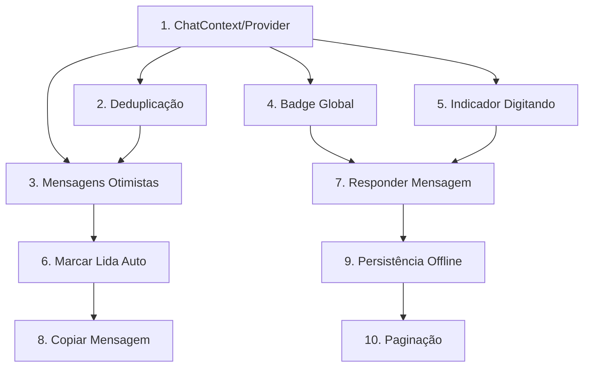

# Plano de Implementação do Chat - Análise Comparativa

## 1. Resumo Executivo

### Status Atual

O projeto **lab-app** possui uma implementação funcional de chat com as seguintes características:

| Aspecto                | Status                               |
| ---------------------- | ------------------------------------ |
| WebSocket              | ✅ Implementado com Socket.io-client |
| React Query            | ✅ Cache e mutations funcionais      |
| Tipagem                | ✅ Enums e interfaces completos      |
| Upload de anexos       | ✅ Funcional                         |
| Tela de lista de chats | ✅ Implementada                      |
| Tela de conversa       | ✅ Implementada                      |

### Gaps Identificados

| Gap                                  | Impacto                                     |
| ------------------------------------ | ------------------------------------------- |
| **Ausência de ChatContext/Provider** | Alto - Estado fragmentado entre componentes |
| **Sem mensagens otimistas**          | Médio - UX prejudicada em conexões lentas   |
| **Sem deduplicação robusta**         | Médio - Risco de mensagens duplicadas       |
| **Sem indicador de digitação**       | Baixo - UX incompleta                       |
| **Sem badge global de não lidas**    | Médio - Usuário não vê notificações         |
| **Sem persistência offline**         | Baixo - Depende totalmente de conexão       |

---

## 2. Análise Comparativa Detalhada

### 2.1 Arquitetura de Estado

| Característica   | lab-curso-frontend-app                               | lab-app                                   |
| ---------------- | ---------------------------------------------------- | ----------------------------------------- |
| Context Provider | [`UserContext.tsx`](src/services/) com estado global | ❌ Não possui                             |
| Store Global     | Context API + hooks customizados                     | Zustand disponível mas não usado no chat  |
| Escopo do Estado | Global - compartilhado entre telas                   | Local - cada tela gerencia próprio estado |

### 2.2 WebSocket e Tempo Real

| Característica  | lab-curso-frontend-app    | lab-app                                                                      |
| --------------- | ------------------------- | ---------------------------------------------------------------------------- |
| Biblioteca      | Socket.io-client          | Socket.io-client                                                             |
| Hook            | Custom hook com Context   | [`useChatWebSocket.ts`](src/domain/agility/chat/useCase/useChatWebSocket.ts) |
| Eventos         | new_message, typing, read | new_message, chat_closed, notification                                       |
| Reconexão       | Automática                | ✅ Automática                                                                |
| Join/Leave Chat | ✅ Implementado           | ✅ Implementado                                                              |

### 2.3 Gerenciamento de Mensagens

| Característica      | lab-curso-frontend-app | lab-app                 |
| ------------------- | ---------------------- | ----------------------- |
| Cache               | React Query            | React Query             |
| Mensagens Otimistas | ✅ Implementado        | ❌ Não implementado     |
| Deduplicação        | ✅ Por ID da mensagem  | ⚠️ Básica no componente |
| Paginação           | ❌ Não implementado    | ❌ Não implementado     |
| Ordenação           | Por createdAt          | Por createdAt           |

### 2.4 Funcionalidades de UX

| Característica       | lab-curso-frontend-app | lab-app             |
| -------------------- | ---------------------- | ------------------- |
| Indicador Digitando  | ❌ Não implementado    | ❌ Não implementado |
| Badge Não Lidas      | ⚠️ Parcial no header   | ❌ Não implementado |
| Responder Mensagem   | ❌ Não implementado    | ❌ Não implementado |
| Copiar Mensagem      | ❌ Não implementado    | ❌ Não implementado |
| Persistência Offline | ❌ Não implementado    | ❌ Não implementado |

### 2.5 Estrutura de Arquivos

**lab-app (atual):**

```
src/domain/agility/chat/
├── chatAPI.ts           # Chamadas REST
├── chatService.ts       # Serviços expostos
├── dto/types.ts         # Tipos e enums
└── useCase/
    ├── useChatWebSocket.ts
    ├── useGetChatMessages.ts
    ├── usePostMessage.ts
    ├── useFindChatsByUser.ts
    └── useChatAttachmentUpload.ts
```

**lab-curso-frontend-app (referência):**

```
src/services/
├── UserContext.tsx      # Provider global com estado de chat
└── chat/
    └── chatService.ts   # Serviços de chat
```

---

## 3. Gap Analysis

### 3.1 Prioridade Alta

| #   | Gap                      | Descrição                                                                      | Arquivos Afetados                                       |
| --- | ------------------------ | ------------------------------------------------------------------------------ | ------------------------------------------------------- |
| 1   | **ChatContext/Provider** | Estado global para compartilhar mensagens, conexão WS e contadores entre telas | Novo: `src/domain/agility/chat/context/ChatContext.tsx` |
| 2   | **Deduplicação Robusta** | Evitar mensagens duplicadas quando WebSocket e REST retornam mesma mensagem    | `src/domain/agility/chat/useCase/useChatWebSocket.ts`   |
| 3   | **Mensagens Otimistas**  | Exibir mensagem imediatamente antes do servidor confirmar                      | `src/domain/agility/chat/useCase/usePostMessage.ts`     |

### 3.2 Prioridade Média

| #   | Gap                                  | Descrição                                               | Arquivos Afetados                                                   |
| --- | ------------------------------------ | ------------------------------------------------------- | ------------------------------------------------------------------- |
| 4   | **Badge Global Não Lidas**           | Contador no header/tabbar mostrando mensagens não lidas | Novo: `src/domain/agility/chat/store/useChatStore.ts`               |
| 5   | **Indicador Digitando**              | Mostrar quando o outro participante está digitando      | `src/domain/agility/chat/context/ChatContext.tsx`, WebSocket events |
| 6   | **Marcar como Lida Automaticamente** | Ao visualizar mensagem, marcar como lida no backend     | `src/app/(auth)/(tabs)/menu/suporte/[id].tsx`                       |

### 3.3 Prioridade Baixa

| #   | Gap                        | Descrição                                                | Arquivos Afetados                                             |
| --- | -------------------------- | -------------------------------------------------------- | ------------------------------------------------------------- |
| 7   | **Responder Mensagem**     | Permitir citar/responder uma mensagem específica         | `src/app/(auth)/(tabs)/menu/suporte/[id].tsx`, `dto/types.ts` |
| 8   | **Copiar Mensagem**        | Copiar texto da mensagem para clipboard                  | `src/app/(auth)/(tabs)/menu/suporte/[id].tsx`                 |
| 9   | **Persistência Offline**   | Armazenar mensagens localmente para visualização offline | Novo: `src/domain/agility/chat/storage/chatStorage.ts`        |
| 10  | **Paginação de Mensagens** | Carregar mensagens antigas sob demanda                   | `src/domain/agility/chat/useCase/useGetChatMessages.ts`       |

---

## 4. Plano de Implementação

### Fase 1: Correções e Melhorias Críticas

#### 4.1.1 Criar ChatContext/Provider

**Objetivo:** Centralizar estado do chat em um provider global

**Arquivos a criar:**

```
src/domain/agility/chat/
├── context/
│   ├── ChatContext.tsx
│   └── index.ts
├── store/
│   ├── useChatStore.ts
│   └── index.ts
```

**Estrutura do ChatContext:**

```typescript
// src/domain/agility/chat/context/ChatContext.tsx
interface ChatContextValue {
  // Estado de conexão
  isConnected: boolean;

  // Mensagens por chat
  messagesByChat: Record<string, ChatMessage[]>;

  // Contadores
  unreadCount: number;
  unreadByChat: Record<string, number>;

  // Estado de digitação
  typingUsers: Record<string, string[]>; // chatId -> userId[]

  // Ações
  sendMessage: (chatId: string, content: string) => Promise<void>;
  markAsRead: (chatId: string, messageId: string) => void;
  addMessage: (chatId: string, message: ChatMessage) => void;
}
```

**Integração:**

- Adicionar provider em [`src/app/_layout.tsx`](src/app/_layout.tsx) ou [`src/app/(auth)/_layout.tsx`](<src/app/(auth)/_layout.tsx>)

#### 4.1.2 Implementar Deduplicação Robusta

**Objetivo:** Garantir que mensagens duplicadas sejam filtradas

**Modificações:**

```typescript
// src/domain/agility/chat/utils/messageUtils.ts
export function deduplicateMessages(
  existing: ChatMessage[],
  incoming: ChatMessage[]
): ChatMessage[] {
  const existingIds = new Set(existing.map(m => m.id));
  return incoming.filter(msg => !existingIds.has(msg.id));
}

export function mergeAndSortMessages(
  existing: ChatMessage[],
  incoming: ChatMessage[]
): ChatMessage[] {
  const allMessages = [...existing];

  for (const msg of incoming) {
    if (!allMessages.some(m => m.id === msg.id)) {
      allMessages.push(msg);
    }
  }

  return allMessages.sort(
    (a, b) => new Date(a.createdAt).getTime() - new Date(b.createdAt).getTime()
  );
}
```

#### 4.1.3 Implementar Mensagens Otimistas

**Objetivo:** Exibir mensagem imediatamente ao enviar

**Modificações em [`usePostMessage.ts`](src/domain/agility/chat/useCase/usePostMessage.ts):**

```typescript
export function usePostMessage() {
  const queryClient = useQueryClient();
  const {addMessage, updateMessage} = useChatContext();

  return useMutation({
    mutationFn: postMessageService,
    onMutate: async payload => {
      // Cancelar queries em andamento
      await queryClient.cancelQueries({
        queryKey: [KEY_CHAT_MESSAGES, payload.chatId],
      });

      // Criar mensagem otimista
      const optimisticMessage: ChatMessage = {
        id: `temp-${Date.now()}`,
        chatId: payload.chatId,
        senderId: payload.senderId,
        content: payload.content,
        status: MessageStatus.SENT,
        createdAt: new Date().toISOString(),
        // ... outros campos
      };

      // Adicionar ao cache otimistamente
      addMessage(payload.chatId, optimisticMessage);

      return {optimisticMessage};
    },
    onSuccess: (data, variables, context) => {
      // Substituir mensagem otimista pela real
      if (context?.optimisticMessage && data.result) {
        updateMessage(
          variables.chatId,
          context.optimisticMessage.id,
          data.result
        );
      }
    },
    onError: (err, variables, context) => {
      // Remover mensagem otimista em caso de erro
      if (context?.optimisticMessage) {
        // Implementar remoção
      }
    },
  });
}
```

---

### Fase 2: Funcionalidades Importantes

#### 4.2.1 Badge Global de Não Lidas

**Objetivo:** Mostrar contador de mensagens não lidas na tabbar

**Arquivos:**

- Criar: `src/domain/agility/chat/store/useChatStore.ts`
- Modificar: `src/app/(auth)/(tabs)/_layout.tsx`

**Store com Zustand:**

```typescript
// src/domain/agility/chat/store/useChatStore.ts
import {create} from 'zustand';

interface ChatState {
  unreadCount: number;
  unreadByChat: Record<string, number>;
  incrementUnread: (chatId: string) => void;
  clearUnread: (chatId: string) => void;
  setUnreadCount: (chatId: string, count: number) => void;
}

export const useChatStore = create<ChatState>(set => ({
  unreadCount: 0,
  unreadByChat: {},

  incrementUnread: chatId =>
    set(state => ({
      unreadCount: state.unreadCount + 1,
      unreadByChat: {
        ...state.unreadByChat,
        [chatId]: (state.unreadByChat[chatId] || 0) + 1,
      },
    })),

  clearUnread: chatId =>
    set(state => ({
      unreadCount: Math.max(
        0,
        state.unreadCount - (state.unreadByChat[chatId] || 0)
      ),
      unreadByChat: {
        ...state.unreadByChat,
        [chatId]: 0,
      },
    })),

  setUnreadCount: (chatId, count) =>
    set(state => {
      const previousCount = state.unreadByChat[chatId] || 0;
      return {
        unreadCount: state.unreadCount - previousCount + count,
        unreadByChat: {
          ...state.unreadByChat,
          [chatId]: count,
        },
      };
    }),
}));
```

#### 4.2.2 Indicador de Digitando

**Objetivo:** Mostrar quando outro participante está digitando

**Modificações no WebSocket:**

```typescript
// Adicionar eventos no useChatWebSocket.ts
socket.on('typing_start', (data: {chatId: string; userId: string}) => {
  // Emitir para o contexto/store
});

socket.on('typing_stop', (data: {chatId: string; userId: string}) => {
  // Emitir para o contexto/store
});

// Função para emitir digitação
const emitTyping = useCallback(
  (chatId: string, isTyping: boolean) => {
    if (!socketRef.current || !isConnected) return;
    socketRef.current.emit(isTyping ? 'typing_start' : 'typing_stop', {chatId});
  },
  [isConnected]
);
```

**UI do indicador:**

```typescript
// Componente a adicionar na tela de chat
{typingUsers.length > 0 && (
  <Box px="x16" py="y8">
    <Text preset="text12" color="gray500">
      {typingUsers.length === 1
        ? 'Digitando...'
        : `${typingUsers.length} pessoas digitando...`}
    </Text>
  </Box>
)}
```

#### 4.2.3 Marcar como Lida Automaticamente

**Objetivo:** Marcar mensagens como lidas ao visualizar

**Implementação:**

```typescript
// No componente da tela de chat
useEffect(() => {
  if (chatId && messages.length > 0 && isVisible) {
    const lastMessage = messages[messages.length - 1];
    if (lastMessage && lastMessage.senderId !== currentUserSenderId) {
      markChatReadService(chatId, userAuth.id).catch(console.error);
      clearUnread(chatId);
    }
  }
}, [chatId, messages, isVisible, currentUserSenderId]);
```

---

### Fase 3: Melhorias de UX

#### 4.3.1 Responder Mensagem (Quote/Reply)

**Objetivo:** Permitir responder uma mensagem específica

**Modificações em tipos:**

```typescript
// Adicionar em dto/types.ts
interface ChatMessage {
  // ... campos existentes
  replyTo?: {
    id: string;
    content: string;
    senderId: string;
  };
}
```

**UI de resposta:**

```typescript
// Ao clicar em uma mensagem, mostrar barra de resposta
{replyingTo && (
  <Box
    flexDirection="row"
    alignItems="center"
    backgroundColor="gray100"
    px="x12"
    py="y8"
  >
    <Box flex={1}>
      <Text preset="text12" color="gray500">Respondendo:</Text>
      <Text preset="text14" numberOfLines={1}>{replyingTo.content}</Text>
    </Box>
    <TouchableOpacityBox onPress={() => setReplyingTo(null)}>
      <Text color="gray500">✕</Text>
    </TouchableOpacityBox>
  </Box>
)}
```

#### 4.3.2 Copiar Mensagem

**Implementação simples:**

```typescript
import * as Clipboard from 'expo-clipboard';

const handleCopyMessage = async (content: string) => {
  await Clipboard.setStringAsync(content);
  showToast({message: 'Mensagem copiada', type: 'success'});
};
```

#### 4.3.3 Menu de Contexto

**Implementação com ActionSheet:**

```typescript
const showMessageOptions = (message: ChatMessage) => {
  const options = ['Copiar', 'Responder', 'Cancelar'];

  ActionSheetIOS.showActionSheetWithOptions(
    {options, cancelButtonIndex: 2},
    buttonIndex => {
      switch (buttonIndex) {
        case 0:
          handleCopyMessage(message.content);
          break;
        case 1:
          setReplyingTo(message);
          break;
      }
    }
  );
};
```

---

### Fase 4: Features Avançadas

#### 4.4.1 Persistência Offline

**Objetivo:** Armazenar mensagens localmente

**Estratégia:**

- Usar AsyncStorage ou MMKV para mensagens recentes
- Sincronizar quando online
- Mostrar indicador de mensagem pendente

**Implementação:**

```typescript
// src/domain/agility/chat/storage/chatStorage.ts
import AsyncStorage from '@react-native-async-storage/async-storage';

const STORAGE_KEY = '@chat_messages';

export async function saveMessagesLocally(
  chatId: string,
  messages: ChatMessage[]
): Promise<void> {
  const key = `${STORAGE_KEY}_${chatId}`;
  await AsyncStorage.setItem(key, JSON.stringify(messages));
}

export async function loadMessagesLocally(
  chatId: string
): Promise<ChatMessage[]> {
  const key = `${STORAGE_KEY}_${chatId}`;
  const data = await AsyncStorage.getItem(key);
  return data ? JSON.parse(data) : [];
}
```

#### 4.4.2 Paginação de Mensagens

**Objetivo:** Carregar mensagens antigas sob demanda

**Modificações:**

```typescript
// useGetChatMessages.ts
interface UseGetChatMessagesOptions {
  chatId: string;
  pageSize?: number;
}

export function useGetChatMessages(options: UseGetChatMessagesOptions) {
  const {chatId, pageSize = 20} = options;
  const [page, setPage] = useState(1);

  return useInfiniteQuery({
    queryKey: [KEY_CHAT_MESSAGES, chatId],
    queryFn: ({pageParam = 1}) =>
      getChatMessagesService(chatId, {page: pageParam, size: pageSize}),
    getNextPageParam: (lastPage, pages) =>
      lastPage.hasMore ? pages.length + 1 : undefined,
    initialPageParam: 1,
  });
}
```

---

## 5. Dependências Entre Tarefas



### Ordem Recomendada de Execução

1. **ChatContext/Provider** - Base para todas as outras funcionalidades
2. **Deduplicação** - Necessária antes de mensagens otimistas
3. **Mensagens Otimistas** - Depende de 1 e 2
4. **Badge Global** - Pode ser feito em paralelo com 3
5. **Indicador Digitando** - Depende do Context
6. **Marcar Lida Auto** - Integração simples
7. **Responder Mensagem** - Feature nova
8. **Copiar Mensagem** - Simples e independente
9. **Persistência Offline** - Complexo, depende de 1-6
10. **Paginação** - Feature avançada

---

## 6. Riscos e Considerações

### 6.1 Riscos Técnicos

| Risco                               | Probabilidade | Impacto | Mitigação                                 |
| ----------------------------------- | ------------- | ------- | ----------------------------------------- |
| WebSocket desconecta frequentemente | Média         | Alto    | Implementar heartbeat e reconexão robusta |
| Mensagens duplicadas do backend     | Alta          | Médio   | Deduplicação no frontend por ID           |
| Performance com muitas mensagens    | Baixa         | Médio   | Virtualização de lista (FlashList)        |
| Sincronização offline               | Alta          | Alto    | Queue de mensagens pendentes              |

### 6.2 Considerações de Arquitetura

1. **Zustand vs Context API**
   - O projeto já usa Zustand em outras áreas
   - Recomendado usar Zustand para estado do chat
   - Context apenas para provider e injeção de dependências

2. **React Query Integration**
   - Manter React Query para cache de mensagens
   - Zustand para estado de UI e contadores
   - Não duplicar estado entre os dois

3. **WebSocket Management**
   - Manter conexão única global
   - Usar pattern singleton para socket
   - Implementar cleanup adequado

### 6.3 Considerações de UX

1. **Feedback Visual**
   - Indicador de envio (spinner)
   - Check de enviado/entregue/lido
   - Indicador de conexão perdida

2. **Error Handling**
   - Retry automático para falhas de envio
   - Mensagem visual de erro
   - Opção de reenviar

3. **Performance**
   - Lazy loading de imagens
   - Compressão de anexos
   - Cache de avatares

---

## 7. Checklist de Implementação

### Fase 1 - Crítico

- [ ] Criar `ChatContext.tsx` com provider
- [ ] Criar `useChatStore.ts` com Zustand
- [ ] Implementar deduplicação de mensagens
- [ ] Implementar mensagens otimistas
- [ ] Integrar provider no `_layout.tsx`
- [ ] Testar fluxo completo de envio/recebimento

### Fase 2 - Importante

- [ ] Implementar badge global de não lidas
- [ ] Adicionar eventos de typing no WebSocket
- [ ] Implementar UI de indicador de digitação
- [ ] Implementar marcação automática de lida
- [ ] Atualizar tabbar com contador

### Fase 3 - UX

- [ ] Adicionar campo `replyTo` nos tipos
- [ ] Implementar UI de resposta
- [ ] Implementar copiar mensagem
- [ ] Adicionar menu de contexto
- [ ] Testar em iOS e Android

### Fase 4 - Avançado

- [ ] Implementar storage local
- [ ] Implementar sincronização offline
- [ ] Implementar paginação de mensagens
- [ ] Adicionar virtualização de lista
- [ ] Testes de performance

---

## 8. Referências

### Arquivos do Projeto Atual

- [`src/domain/agility/chat/useCase/useChatWebSocket.ts`](src/domain/agility/chat/useCase/useChatWebSocket.ts) - Hook de WebSocket
- [`src/domain/agility/chat/dto/types.ts`](src/domain/agility/chat/dto/types.ts) - Tipos e enums
- [`src/app/(auth)/(tabs)/menu/suporte/[id].tsx`](<src/app/(auth)/(tabs)/menu/suporte/[id].tsx>) - Tela de conversa
- [`src/app/(auth)/(tabs)/menu/suporte/index.tsx`](<src/app/(auth)/(tabs)/menu/suporte/index.tsx>) - Lista de chats

### Tecnologias Utilizadas

- React Native com Expo
- TypeScript
- Socket.io-client
- React Query (TanStack Query)
- Zustand (disponível)
