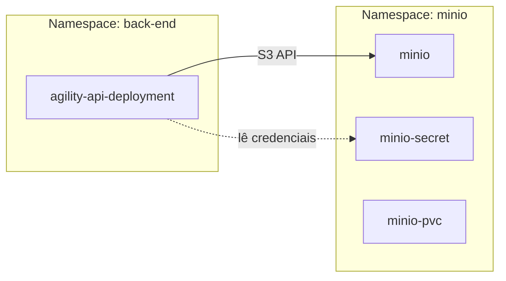
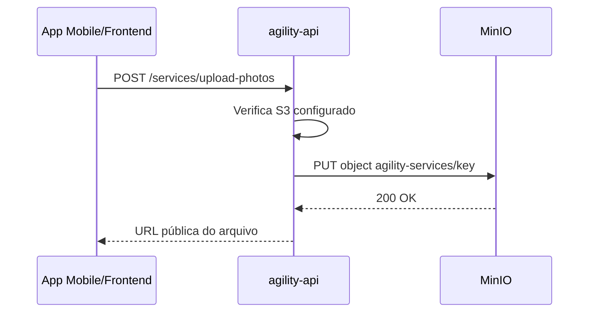

# Configuração do MinIO no Kubernetes para Agility Services

## Resumo

Este documento descreve como configurar o **agility-services** para conectar ao **MinIO** que está rodando no Kubernetes.

## Visão Geral da Infraestrutura



## Informações Coletadas

### MinIO (namespace: `minio`)

| Propriedade   | Valor                              |
| ------------- | ---------------------------------- |
| Deployment    | `minio`                            |
| Porta API     | 9000                               |
| Porta Console | 9001                               |
| Secret        | `minio-secret`                     |
| Usuário       | `admin`                            |
| Senha         | `Agility@2025`                     |
| Buckets       | `agility-chat`, `agility-services` |

### Agility Services (namespace: `back-end`)

| Propriedade | Valor                    |
| ----------- | ------------------------ |
| Deployment  | `agility-api-deployment` |
| ConfigMap   | `agility-config`         |
| Secret      | `agility-secrets`        |

## Variáveis de Ambiente Necessárias

O [`StorageService`](C:/Users/daniel/Agility/back-atual/agility-services/src/storage/storage.service.ts:12) requer as seguintes variáveis de ambiente:

### Obrigatórias (para habilitar S3)

| Variável        | Descrição       | Valor para K8s                              |
| --------------- | --------------- | ------------------------------------------- |
| `S3_ENDPOINT`   | URL do MinIO    | `http://minio.minio.svc.cluster.local:9000` |
| `S3_ACCESS_KEY` | Chave de acesso | `admin`                                     |
| `S3_SECRET_KEY` | Chave secreta   | `Agility@2025`                              |

### Buckets

| Variável             | Descrição                     | Valor              |
| -------------------- | ----------------------------- | ------------------ |
| `S3_BUCKET_CHAT`     | Bucket para anexos de chat    | `agility-chat`     |
| `S3_BUCKET_SERVICES` | Bucket para fotos de serviços | `agility-services` |

### URLs Públicas (para acesso externo)

| Variável                 | Descrição                      | Valor              |
| ------------------------ | ------------------------------ | ------------------ |
| `S3_PUBLIC_URL_CHAT`     | URL pública do bucket chat     | Depende do Ingress |
| `S3_PUBLIC_URL_SERVICES` | URL pública do bucket services | Depende do Ingress |

### Opcional

| Variável    | Descrição | Valor Padrão |
| ----------- | --------- | ------------ |
| `S3_REGION` | Região    | `us-east-1`  |

---

## Passo a Passo de Configuração

### Passo 1: Verificar/Criar Service do MinIO

O MinIO precisa de um Service para ser acessível de outros namespaces. Verifique se existe:

```bash
kubectl get svc -n minio
```

Se não existir, crie o arquivo `minio-service.yaml`:

```yaml
apiVersion: v1
kind: Service
metadata:
  name: minio
  namespace: minio
spec:
  selector:
    app: minio
  ports:
    - name: api
      port: 9000
      targetPort: 9000
    - name: console
      port: 9001
      targetPort: 9001
  type: ClusterIP
```

Aplique:

```bash
kubectl apply -f minio-service.yaml
```

### Passo 2: Atualizar ConfigMap agility-config

Adicione as variáveis de configuração não sensíveis ao ConfigMap:

```bash
kubectl patch configmap agility-config -n back-end --type merge -p '
data:
  S3_ENDPOINT: "http://minio.minio.svc.cluster.local:9000"
  S3_REGION: "us-east-1"
  S3_BUCKET_CHAT: "agility-chat"
  S3_BUCKET_SERVICES: "agility-services"
  S3_PUBLIC_URL_CHAT: "http://minio.minio.svc.cluster.local:9000/agility-chat"
  S3_PUBLIC_URL_SERVICES: "http://minio.minio.svc.cluster.local:9000/agility-services"
'
```

**Nota sobre URLs públicas**: Se você tem um Ingress para o MinIO exposto externamente, use essa URL pública nas variáveis `S3_PUBLIC_URL_*`. Por exemplo:

- `S3_PUBLIC_URL_CHAT: "https://minio.seudominio.com/agility-chat"`
- `S3_PUBLIC_URL_SERVICES: "https://minio.seudominio.com/agility-services"`

### Passo 3: Atualizar Secret agility-secrets

Adicione as credenciais ao Secret:

```bash
kubectl patch secret agility-secrets -n back-end --type merge -p '
stringData:
  S3_ACCESS_KEY: "admin"
  S3_SECRET_KEY: "Agility@2025"
'
```

### Passo 4: Atualizar Deployment para usar as variáveis S3

Você precisa editar o deployment para incluir as variáveis de ambiente do S3. O deployment atual usa `envFrom` para carregar o ConfigMap e `env` para carregar secrets individuais.

**Opção A: Adicionar as variáveis S3 ao envFrom do ConfigMap** (recomendado para variáveis não sensíveis)

As variáveis já estão no ConfigMap após o Passo 2, então elas serão carregadas automaticamente.

**Opção B: Adicionar as credenciais como env individuais do Secret**

Edite o deployment para incluir:

```yaml
env:
  # ... variáveis existentes ...
  - name: S3_ACCESS_KEY
    valueFrom:
      secretKeyRef:
        name: agility-secrets
        key: S3_ACCESS_KEY
  - name: S3_SECRET_KEY
    valueFrom:
      secretKeyRef:
        name: agility-secrets
        key: S3_SECRET_KEY
```

Ou use o comando:

```bash
kubectl set env deployment/agility-api-deployment -n back-end --from=secret/agility-secrets --prefix=S3_ S3_ACCESS_KEY S3_SECRET_KEY
```

### Passo 5: Reiniciar o Deployment

Para aplicar as mudanças:

```bash
kubectl rollout restart deployment/agility-api-deployment -n back-end
```

### Passo 6: Verificar Logs

```bash
kubectl logs -f deployment/agility-api-deployment -n back-end | grep -i storage
```

Você deve ver algo como:

```
[StorageService] Storage S3/MinIO enabled: chat=agility-chat, services=agility-services, endpoint=http://minio.minio.svc.cluster.local:9000
```

---

## Verificação da Conexão

### Teste a partir do Pod do Agility Services

```bash
# Obter um shell no pod
kubectl exec -it deployment/agility-api-deployment -n back-end -- sh

# Testar conectividade com o MinIO
curl http://minio.minio.svc.cluster.local:9000/minio/health/live
```

### Verificar se o Storage está Configurado

Faça uma requisição para o endpoint de upload do agility-services e verifique se retorna sucesso ao invés de erro de S3 não configurado.

---

## Arquitetura de Comunicação



---

## Checklist Final

- [ ] Service do MinIO criado/existente no namespace `minio`
- [ ] ConfigMap `agility-config` atualizado com `S3_ENDPOINT`, `S3_BUCKET_*`, `S3_PUBLIC_URL_*`
- [ ] Secret `agility-secrets` atualizado com `S3_ACCESS_KEY`, `S3_SECRET_KEY`
- [ ] Deployment atualizado para carregar as variáveis de ambiente
- [ ] Deployment reiniciado
- [ ] Logs verificados - Storage S3/MinIO enabled
- [ ] Teste de upload realizado com sucesso

---

## Troubleshooting

### Erro: Storage S3/MinIO not configured

**Causa**: Variáveis `S3_ENDPOINT`, `S3_ACCESS_KEY` ou `S3_SECRET_KEY` não estão definidas.

**Solução**: Verifique se o ConfigMap e Secret estão corretamente configurados e se o deployment está carregando essas variáveis.

### Erro: Connection refused to minio.minio.svc.cluster.local:9000

**Causa**: Service do MinIO não existe ou não está acessível.

**Solução**:

1. Verifique se o Service existe: `kubectl get svc -n minio`
2. Verifique se os pods do MinIO estão rodando: `kubectl get pods -n minio`
3. Teste a conectividade: `kubectl run test --rm -it --image=busybox -- wget -qO- http://minio.minio.svc.cluster.local:9000/minio/health/live`

### Erro: Access Denied

**Causa**: Credenciais incorretas ou buckets não existem.

**Solução**:

1. Verifique as credenciais no secret: `kubectl get secret minio-secret -n minio -o jsonpath='{.data}'`
2. Acesse o console do MinIO e verifique se os buckets existem
