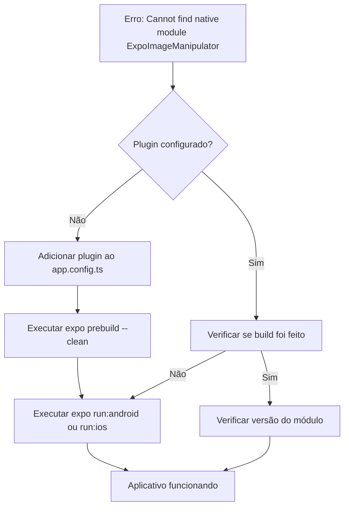

# Correção: Erro "Cannot find native module 'ExpoImageManipulator'"

## Análise do Problema

### Erro Reportado

```
ERROR  [Error: Cannot find native module 'ExpoImageManipulator']

Call Stack
  requireNativeModule (node_modules\expo-modules-core\src\requireNativeModule.ts)
  <global> (node_modules\expo-image-manipulator\src\NativeImageManipulatorModule.ts)
```

### Causa Raiz

O módulo `expo-image-manipulator` está instalado no `package.json` (versão `~14.0.8`), mas o **plugin não está configurado no `app.config.ts`**. Isso faz com que o código nativo do módulo não seja incluído no build do aplicativo.

### Onde é Usado

O módulo é usado no arquivo [`serviceUploadUtils.ts`](src/domain/agility/service/serviceUploadUtils.ts:8) para comprimir imagens antes do upload:

```typescript
import * as ImageManipulator from 'expo-image-manipulator';

// Usado na função compressImage para redimensionar e comprimir fotos
const result = await ImageManipulator.manipulateAsync(
  uri,
  [{resize: {width: maxWidth, height: maxHeight}}],
  {compress: quality, format: ImageManipulator.SaveFormat.JPEG}
);
```

---

## Plano de Correção

### Passo 1: Adicionar o plugin no app.config.ts

Adicionar `'expo-image-manipulator'` ao array de `plugins` no arquivo [`app.config.ts`](app.config.ts:64):

```typescript
plugins: [
  ['expo-router', { root: 'src/app' }],
  'expo-font',
  'expo-video',
  'expo-secure-store',
  'expo-web-browser',
  'expo-image-manipulator',  // <-- Adicionar esta linha
  // ... restante dos plugins
],
```

### Passo 2: Reconstruir o aplicativo

Como o `expo-image-manipulator` é um módulo nativo, é necessário reconstruir o aplicativo:

```bash
# Limpar cache e reconstruir
npx expo prebuild --clean

# Para Android
npx expo run:android

# Para iOS
npx expo run:ios
```

---

## Diagrama do Fluxo de Correção



---

## Arquivos a Modificar

| Arquivo                             | Alteração                                                |
| ----------------------------------- | -------------------------------------------------------- |
| [`app.config.ts`](app.config.ts:64) | Adicionar `'expo-image-manipulator'` ao array de plugins |

---

## Verificação Pós-Correção

Após implementar a correção, verificar:

1. O aplicativo inicia sem erros
2. A funcionalidade de compressão de imagens funciona corretamente
3. O upload de fotos nos serviços funciona como esperado

---

## Observações

- O `expo-image-manipulator` é um módulo que requer código nativo, por isso é essencial adicionar o plugin no `app.config.ts`
- Após adicionar o plugin, é **obrigatório** reconstruir o aplicativo (não basta apenas recarregar o JavaScript)
- Se estiver usando EAS Build, o próximo build incluirá automaticamente o módulo após a alteração no `app.config.ts`
