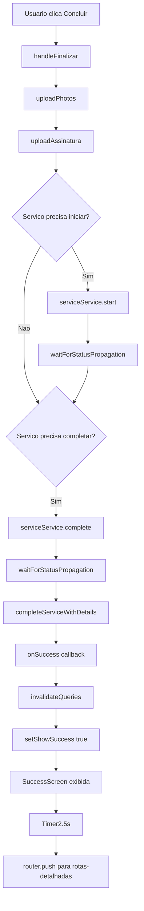

# Análise e Correção: Reinício do App ao Concluir Entrega

## Problema Reportado

Quando o usuário clica em "Concluir" na etapa de finalização de entrega, o app reinicia imediatamente sem exibir mensagem de erro.

## Análise do Log

```
WARN Route "./(public)/LoginScreen/hooks/useLoginController.ts" is missing the required default export. Ensure a React component is exported as default.
LOG Iniciando a função get() UserCredentials
LOG NotificationProvider: deviceId inicializado: 004cc320925f4d69
```

O warning indica que o Expo Router está tentando interpretar o arquivo `useLoginController.ts` como uma rota, mas ele não exporta um componente React como default.

## Causa Raiz Identificada

O arquivo [`useLoginController.ts`](<src/app/(public)/LoginScreen/hooks/useLoginController.ts>) está localizado em:

```
src/app/(public)/LoginScreen/hooks/useLoginController.ts
```

No Expo Router, **todos os arquivos dentro do diretório `app/` são automaticamente considerados rotas**, a menos que:

1. O nome do arquivo comece com `_` (underscore)
2. O arquivo esteja em uma pasta que começa com `_`

A pasta `hooks` **não** começa com `_`, então o Expo Router tenta interpretar `useLoginController.ts` como uma rota. Como não há um `export default` de um componente React, isso gera um warning e pode causar comportamento inesperado, incluindo reinício do app.

## Fluxo de Finalização Atual



## Plano de Correção

### Correcao 1: Renomear pasta hooks para \_hooks - PRIORIDADE ALTA

Mover os arquivos da pasta `hooks` para `_hooks` no LoginScreen:

**Arquivos a serem movidos/renomeados:**

- `src/app/(public)/LoginScreen/hooks/useLoginController.ts` → `src/app/(public)/LoginScreen/_hooks/useLoginController.ts`
- `src/app/(public)/LoginScreen/hooks/useBiometricAuth.ts` → `src/app/(public)/LoginScreen/_hooks/useBiometricAuth.ts`

**Arquivos que precisam ter imports atualizados:**

- [`LoginBody.tsx`](<src/app/(public)/LoginScreen/components/LoginBody.tsx>) - importa `useLoginController`
- Qualquer outro arquivo que importe de `../hooks/useLoginController`

### Passos para Implementacao

1. Criar a pasta `_hooks` dentro de `src/app/(public)/LoginScreen/`
2. Mover os arquivos:
   - `hooks/useLoginController.ts` → `_hooks/useLoginController.ts`
   - `hooks/useBiometricAuth.ts` → `_hooks/useBiometricAuth.ts`
3. Atualizar o import em [`LoginBody.tsx`](<src/app/(public)/LoginScreen/components/LoginBody.tsx>):

   ```tsx
   // Antes
   import {useLoginController} from '../hooks/useLoginController';

   // Depois
   import {useLoginController} from '../_hooks/useLoginController';
   ```

4. Remover a pasta `hooks` vazia

### Verificacao da Correcao

Apos aplicar a correção:

1. O warning do Expo Router deve desaparecer
2. O app nao deve mais reiniciar ao concluir entregas
3. Testar o fluxo completo de finalizacao de entrega

## Estrutura de Pastas Corrigida

```
src/app/(public)/LoginScreen/
├── index.tsx
├── components/
│ ├── ItemAccount.tsx
│ ├── LoginBody.tsx
│ ├── LoginFooter.tsx
│ ├── LoginHeader.tsx
│ ├── MultipleAccounts.tsx
│ └── UserCard.tsx
└── _hooks/              <-- Renomeado de hooks para _hooks
    ├── useBiometricAuth.ts
    └── useLoginController.ts
```

## Observacoes Adicionais

- O prefixo `_` é uma convenção do Expo Router para ignorar arquivos/pastas que nao sao rotas
- Essa mesma padrao ja e usado em outras partes do app, como em `rotas-detalhadas/[id]/parada/[pid]/_hooks/`
- A correcao e simples e nao afeta a logica do codigo, apenas a organizacao dos arquivos
