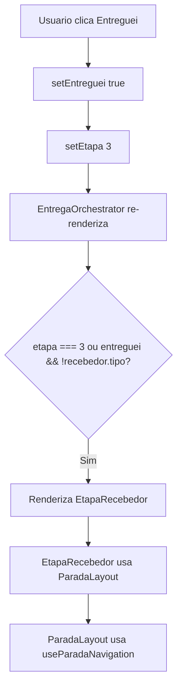

# Análise e Correção: Reinício do App ao Clicar em "Entreguei"

## Problema Reportado

Quando o usuário clica em "Entreguei" na etapa de confirmação de entrega, o app reinicia inesperadamente.

## Análise do Código

### Fluxo ao Clicar em "Entreguei"



### Código do Botão "Entreguei"

```tsx
// EtapaConfirmacao.tsx linha 50-56
<Button
  title="Entreguei"
  onPress={() => {
    setEntreguei(true);
    setEtapa(3);
  }}
/>
```

## Causa Raiz Identificada

A correção documentada em [`correcao-reinicio-app-concluir.md`](plans/correcao-reinicio-app-concluir.md) **não foi aplicada**.

O problema é que a pasta `hooks` dentro de `src/app/(public)/LoginScreen/` não foi renomeada para `_hooks`. No Expo Router, todos os arquivos dentro do diretório `app/` são automaticamente considerados rotas, a menos que:

1. O nome do arquivo comece com `_` (underscore)
2. O arquivo esteja em uma pasta que começa com `_`

### Por que isso causa reinício do app?

1. O Expo Router tenta interpretar `useLoginController.ts` como uma rota
2. Como não há um `export default` de um componente React, isso gera um warning
3. O warning pode causar comportamento inesperado durante a navegação
4. Quando o estado muda (etapa 3), o app pode reiniciar devido ao erro de roteamento

## Estrutura Atual (Incorreta)

```
src/app/(public)/LoginScreen/
├── index.tsx
├── components/
│   ├── LoginBody.tsx       <-- importa de ../hooks/useLoginController
│   └── ...
└── hooks/                   <-- DEVERIA SER _hooks/
    ├── useBiometricAuth.ts
    └── useLoginController.ts
```

## Estrutura Corrigida

```
src/app/(public)/LoginScreen/
├── index.tsx
├── components/
│   ├── LoginBody.tsx       <-- importa de ../_hooks/useLoginController
│   └── ...
└── _hooks/                  <-- Renomeado de hooks para _hooks
    ├── useBiometricAuth.ts
    └── useLoginController.ts
```

## Plano de Correção

### Passo 1: Criar a pasta \_hooks

Criar a pasta `src/app/(public)/LoginScreen/_hooks/`

### Passo 2: Mover os arquivos

Mover os arquivos da pasta `hooks` para `_hooks`:

- `hooks/useLoginController.ts` → `_hooks/useLoginController.ts`
- `hooks/useBiometricAuth.ts` → `_hooks/useBiometricAuth.ts`

### Passo 3: Atualizar o import em LoginBody.tsx

Arquivo: [`src/app/(public)/LoginScreen/components/LoginBody.tsx`](<src/app/(public)/LoginScreen/components/LoginBody.tsx>)

```tsx
// Antes (linha 14)
import {useLoginController} from '../hooks/useLoginController';

// Depois
import {useLoginController} from '../_hooks/useLoginController';
```

### Passo 4: Remover a pasta hooks vazia

Após confirmar que tudo funciona, remover a pasta `hooks` vazia.

## Verificação da Correção

Após aplicar a correção:

1. O warning do Expo Router deve desaparecer
2. O app não deve mais reiniciar ao clicar em "Entreguei"
3. Testar o fluxo completo de entrega:
   - Clicar em "Entreguei"
   - Verificar se a EtapaRecebedor é exibida corretamente
   - Selecionar um recebedor
   - Preencher os dados
   - Finalizar a entrega

## Arquivos Afetados

| Arquivo                                                    | Ação                 |
| ---------------------------------------------------------- | -------------------- |
| `src/app/(public)/LoginScreen/hooks/useLoginController.ts` | Mover para `_hooks/` |
| `src/app/(public)/LoginScreen/hooks/useBiometricAuth.ts`   | Mover para `_hooks/` |
| `src/app/(public)/LoginScreen/components/LoginBody.tsx`    | Atualizar import     |

## Observações

- O prefixo `_` é uma convenção do Expo Router para ignorar arquivos/pastas que não são rotas
- Essa mesma padronização já é usada em outras partes do app, como em `rotas-detalhadas/[id]/parada/[pid]/_hooks/`
- A correção é simples e não afeta a lógica do código, apenas a organização dos arquivos
