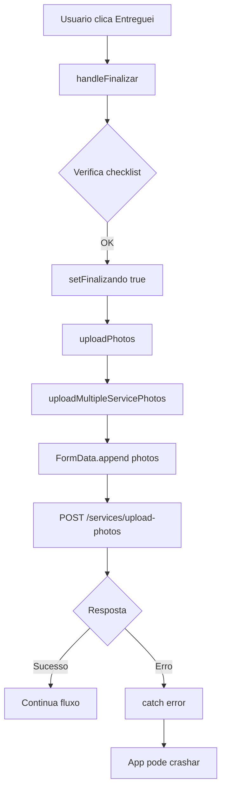

# Análise e Correção: Reinício do App ao Clicar em "Entreguei" durante Upload de Fotos

## Problema Reportado

Quando o usuário clica no botão FINAL "Entreguei" na EtapaFinalizacao, o app reinicia inesperadamente durante o upload das fotos.

## Análise do Código

### Fluxo de Finalização



### Arquivos Analisados

| Arquivo                                                                                                                       | Função                    |
| ----------------------------------------------------------------------------------------------------------------------------- | ------------------------- |
| [`EtapaFinalizacao.tsx`](<src/app/(auth)/(tabs)/rotas-detalhadas/[id]/parada/[pid]/_components/entrega/EtapaFinalizacao.tsx>) | Componente da etapa final |
| [`useServiceCompletion.ts`](<src/app/(auth)/(tabs)/rotas-detalhadas/[id]/parada/[pid]/_hooks/useServiceCompletion.ts>)        | Hook de finalização       |
| [`useServiceUpload.ts`](<src/app/(auth)/(tabs)/rotas-detalhadas/[id]/parada/[pid]/_hooks/useServiceUpload.ts>)                | Hook de upload            |
| [`serviceUploadUtils.ts`](src/domain/agility/service/serviceUploadUtils.ts)                                                   | Utilitários de upload     |
| [`apiConfig.ts`](src/api/apiConfig.ts)                                                                                        | Configuração do Axios     |

---

## Possíveis Causas Identificadas

### 1. Memory Issue (OOM) - Alta Prioridade

**Problema:** Quando muitas fotos são carregadas na memória (especialmente em dispositivos Android mais antigos), isso pode causar OutOfMemoryError e crash do app.

**Evidência:**

- [`MultiPhotoPicker.tsx`](src/components/MultiPhotoPicker/MultiPhotoPicker.tsx) carrega todas as fotos selecionadas na memória
- Fotos são mantidas no estado sem compressão
- O tamanho original é preservado durante todo o fluxo

**Solução:** Comprimir imagens antes do upload usando `expo-image-manipulator`.

---

### 2. Network Timeout - Alta Prioridade

**Problema:** A API Axios não tem timeout configurado. Uploads de fotos grandes em redes instáveis (3G/4G) podem causar hang e eventual crash.

**Evidência em [`apiConfig.ts`](src/api/apiConfig.ts):**

```typescript
const apiAgility = axios.create({
  baseURL: `${urls.agilityApi}`,
  // SEM timeout configurado!
});
```

**Solução:** Adicionar timeout e limites de tamanho.

---

### 3. Progress State Updates - Média Prioridade

**Problema:** O `setUploadProgress` cria um novo Map a cada atualização de progresso, causando:

- Re-renders excessivos
- Memory pressure durante upload

**Código em [`useServiceUpload.ts`](<src/app/(auth)/(tabs)/rotas-detalhadas/[id]/parada/[pid]/_hooks/useServiceUpload.ts:35-39>):**

```typescript
const onUploadProgress = (progress: UploadProgress | null, index: number) => {
  if (progress) {
    setUploadProgress(new Map(uploadProgress).set(index, progress)); // Novo Map a cada update!
  }
};
```

**Solução:** Usar functional update para evitar criar novos Maps.

---

### 4. Upload de Múltiplas Fotos em Paralelo - Média Prioridade

**Problema:** Todas as fotos são enviadas em uma única requisição FormData. Se uma foto for muito grande, toda a requisição falha.

**Solução:** Implementar upload sequencial com retry individual.

---

### 5. Error Handling Silencioso - Baixa Prioridade

**Problema:** Erros de upload são capturados mas o fluxo continua, o que pode deixar o app em estado inconsistente.

---

## Plano de Correção

### Passo 1: Adicionar Timeout na API Axios

**Arquivo:** [`src/api/apiConfig.ts`](src/api/apiConfig.ts)

```typescript
const apiAgility = axios.create({
  baseURL: `${urls.agilityApi}`,
  timeout: 60000, // 60 segundos
  maxContentLength: 50 * 1024 * 1024, // 50MB
  maxBodyLength: 50 * 1024 * 1024, // 50MB
});
```

### Passo 2: Comprimir Imagens Antes do Upload

**Arquivo:** [`src/domain/agility/service/serviceUploadUtils.ts`](src/domain/agility/service/serviceUploadUtils.ts)

Adicionar função de compressão:

```typescript
import * as ImageManipulator from 'expo-image-manipulator';

export async function compressImage(
  uri: string,
  maxWidth: number = 1024,
  maxHeight: number = 1024,
  quality: number = 0.7
): Promise<string> {
  const result = await ImageManipulator.manipulateAsync(
    uri,
    [{resize: {width: maxWidth, height: maxHeight}}],
    {compress: quality, format: ImageManipulator.SaveFormat.JPEG}
  );
  return result.uri;
}
```

### Passo 3: Otimizar Progress Updates

**Arquivo:** [`src/app/(auth)/(tabs)/rotas-detalhadas/[id]/parada/[pid]/_hooks/useServiceUpload.ts`](<src/app/(auth)/(tabs)/rotas-detalhadas/[id]/parada/[pid]/_hooks/useServiceUpload.ts>)

```typescript
const onUploadProgress = useCallback(
  (progress: UploadProgress | null, index: number) => {
    if (progress) {
      setUploadProgress(prev => {
        const newMap = new Map(prev);
        newMap.set(index, progress);
        return newMap;
      });
    }
  },
  []
);
```

### Passo 4: Implementar Upload Sequencial com Retry

**Arquivo:** [`src/domain/agility/service/serviceUploadUtils.ts`](src/domain/agility/service/serviceUploadUtils.ts)

```typescript
export async function uploadPhotosSequentially(
  photos: ImagePicker.ImagePickerAsset[],
  serviceId?: string,
  maxRetries: number = 3,
  onProgress?: (progress: UploadProgress, index: number) => void
): Promise<string[]> {
  const urls: string[] = [];

  for (let i = 0; i < photos.length; i++) {
    const photo = photos[i];
    let lastError: Error | null = null;

    for (let attempt = 0; attempt < maxRetries; attempt++) {
      try {
        // Comprimir antes de enviar
        const compressedUri = await compressImage(photo.uri);
        const url = await uploadSinglePhoto(
          compressedUri,
          serviceId,
          onProgress,
          i
        );
        urls.push(url);
        break;
      } catch (error) {
        lastError = error as Error;
        console.warn(
          `[uploadPhotosSequentially] Tentativa ${attempt + 1} falhou para foto ${i}`
        );
        await new Promise(resolve => setTimeout(resolve, 1000 * (attempt + 1))); // Backoff
      }
    }

    if (urls.length !== i + 1) {
      console.error(
        `[uploadPhotosSequentially] Falha ao enviar foto ${i} após ${maxRetries} tentativas`
      );
    }
  }

  return urls;
}
```

---

## Arquivos a Modificar

| Arquivo                                                                                                                                                                        | Mudança                                            |
| ------------------------------------------------------------------------------------------------------------------------------------------------------------------------------ | -------------------------------------------------- |
| [`src/api/apiConfig.ts`](src/api/apiConfig.ts)                                                                                                                                 | Adicionar timeout e maxContentLength               |
| [`src/domain/agility/service/serviceUploadUtils.ts`](src/domain/agility/service/serviceUploadUtils.ts)                                                                         | Adicionar compressImage e uploadPhotosSequentially |
| [`src/app/(auth)/(tabs)/rotas-detalhadas/[id]/parada/[pid]/_hooks/useServiceUpload.ts`](<src/app/(auth)/(tabs)/rotas-detalhadas/[id]/parada/[pid]/_hooks/useServiceUpload.ts>) | Otimizar progress updates, usar upload sequencial  |

---

## Dependências Necessárias

Verificar se `expo-image-manipulator` está instalado:

```bash
npx expo install expo-image-manipulator
```

---

## Próximos Passos

1. ✅ Análise completa
2. ⏳ Implementar correções (requer switch para Code mode)
3. ⏳ Testar em dispositivo real
4. ⏳ Validar com diferentes tamanhos de fotos
