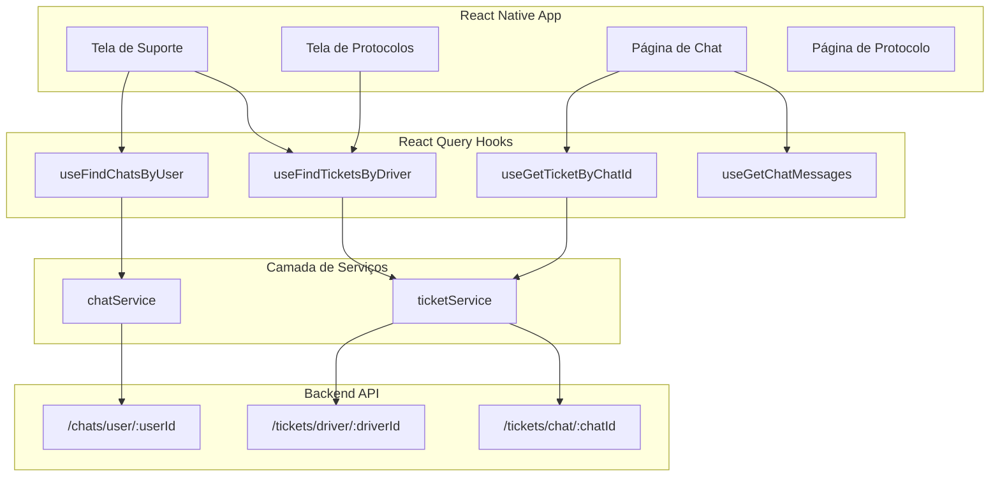
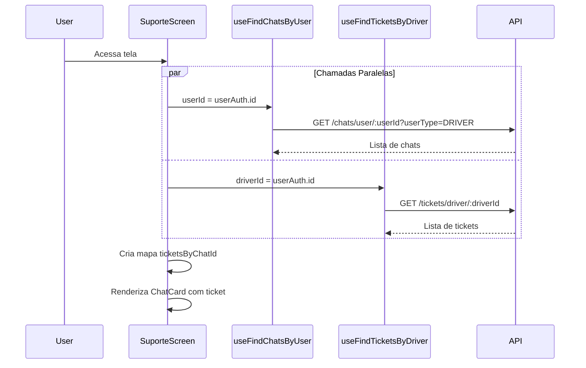
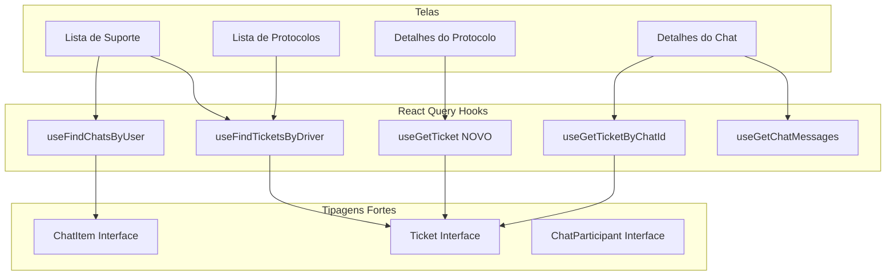

# Análise Técnica e Plano de Implementação - Correções de Suporte/Protocolos

## 1. Análise da Implementação Atual

### 1.1 Arquitetura Geral



### 1.2 Estrutura de Dados

#### UserAuth

```typescript
type UserAuth = {
  id: string; // keycloakUserId - ID do usuário no Keycloak
  driverId?: string; // ID do driver na tabela Driver - já vem do profile
  taxNumber: string;
  email?: string;
  roles: string[];
  fullname: string;
  // ... outros campos
};
```

#### Ticket

```typescript
interface Ticket {
  id: string;
  ticketNumber: string;
  subject: string;
  description?: string;
  status: TicketStatus;
  priority: TicketPriority;
  chatId?: string; // Relacionamento com chat
  driverId?: string; // ID do driver
  customerId?: string;
  openedAt: string;
  resolvedAt?: string;
  closedAt?: string;
  // ... outros campos
}
```

#### ChatItem

```typescript
type ChatItem = {id: Id} & Record<string, unknown>;
// Nota: Tipagem muito genérica, precisa ser melhorada
```

### 1.3 Fluxo de Dados Atual - Tela de Suporte



## 2. Problemas Técnicos Identificados

### 2.1 ✅ RESOLVIDO: Problema N+1 na Lista de Suporte

**Status**: O problema N+1 já foi resolvido na implementação atual.

A tela de suporte agora faz:

1. Uma única chamada para buscar todos os chats: `useFindChatsByUser(userId)`
2. Uma única chamada para buscar todos os tickets: `useFindTicketsByDriver(userId)`
3. Matching local via `Map<chatId, ticket>`

```typescript
// Código atual - CORRETO
const {chats} = useFindChatsByUser(userId);
const {tickets} = useFindTicketsByDriver(userId);

const ticketsByChatId = useMemo(() => {
  if (!tickets) return new Map();
  const map = new Map<string, any>();
  tickets.forEach((ticket: any) => {
    if (ticket.chatId) {
      map.set(ticket.chatId, ticket);
    }
  });
  return map;
}, [tickets]);
```

### 2.2 ⚠️ PROBLEMA: Conversão de keycloakUserId vs driverId

**Arquivos afetados**:

- [`src/app/(auth)/(tabs)/menu/suporte/index.tsx`](<src/app/(auth)/(tabs)/menu/suporte/index.tsx:104>)
- [`src/app/(auth)/(tabs)/menu/protocolos/index.tsx`](<src/app/(auth)/(tabs)/menu/protocolos/index.tsx:49>)

**Descrição**:
O código usa `userAuth?.id` (keycloakUserId) para buscar chats e tickets, mas existem duas situações:

1. **Backend aceita keycloakUserId e converte internamente** - Funciona corretamente
2. **Backend espera driverId interno** - Pode causar falhas

**Código atual**:

```typescript
// suporte/index.tsx:104
const userId = userAuth?.id; // keycloakUserId

// protocolos/index.tsx:49
const driverId = userAuth?.id; // keycloakUserId, não driverId!
```

**Problema na criação de chat**:

```typescript
// suporte/index.tsx:169-171
const result = await createDriverSupportChatService({
  driverId: userAuth.id, // Enviando keycloakUserId como driverId!
});
```

### 2.3 ⚠️ PROBLEMA: Tipagem Fraca de ChatItem

**Arquivo**: [`src/domain/agility/chat/chatAPI.ts:5`](src/domain/agility/chat/chatAPI.ts:5)

```typescript
// Tipagem muito genérica
export type ChatItem = {id: Id} & Record<string, unknown>;
```

Isso causa:

- Falta de autocomplete
- Uso excessivo de `any` nos componentes
- Possíveis bugs em runtime

### 2.4 ⚠️ PROBLEMA: Tela de Detalhes do Protocolo sem React Query

**Arquivo**: [`src/app/(auth)/(tabs)/menu/protocolos/[id].tsx`](<src/app/(auth)/(tabs)/menu/protocolos/[id].tsx>)

A tela faz chamada manual com `useEffect` em vez de usar React Query:

```typescript
// Código atual - NÃO IDEAL
const [ticket, setTicket] = useState<any>(null);
const [isLoading, setIsLoading] = useState(true);

useEffect(() => {
  const loadTicket = async () => {
    const result = await getTicketService(ticketId);
    if (result.success && result.result) {
      setTicket(result.result);
    }
  };
  loadTicket();
}, [ticketId]);
```

### 2.5 ⚠️ PROBLEMA: Tratamento de Erros Insuficiente

**Arquivos afetados**:

- [`src/app/(auth)/(tabs)/menu/suporte/index.tsx`](<src/app/(auth)/(tabs)/menu/suporte/index.tsx>)
- [`src/app/(auth)/(tabs)/menu/protocolos/index.tsx`](<src/app/(auth)/(tabs)/menu/protocolos/index.tsx>)

Problemas:

- `isError` é retornado pelos hooks mas não é tratado na UI
- Logs de debug excessivos em produção
- Sem feedback visual para erros de API

### 2.6 ⚠️ PROBLEMA: Logs de Debug em Produção

Múltiplos `console.log` presentes no código:

```typescript
// suporte/index.tsx:107-108
console.log('[SuporteScreen] userAuth:', userAuth ? { id: userAuth.id, driverId: userAuth.driverId } : null);
console.log('[SuporteScreen] userId usado para buscar chats e tickets:', userId);

// protocolos/index.tsx:52-60
console.log('[ProtocolosScreen] userAuth:', ...);
console.log('[ProtocolosScreen] driverId usado para buscar tickets:', driverId);
console.log('[ProtocolosScreen] tickets retornados:', ...);
```

## 3. Plano de Implementação

### 3.1 Criar Tipagem Forte para ChatItem

**Prioridade**: Alta
**Complexidade**: Média

Criar interface completa para `ChatItem`:

```typescript
// src/domain/agility/chat/dto/types.ts

export enum ChatStatus {
  ACTIVE = 'ACTIVE',
  CLOSED = 'CLOSED',
  PENDING = 'PENDING',
}

export enum ParticipantType {
  DRIVER = 'DRIVER',
  CUSTOMER = 'CUSTOMER',
  SUPPORT = 'SUPPORT',
  COLLABORATOR = 'COLLABORATOR',
  AGENT = 'AGENT',
}

export interface ChatParticipant {
  id: string;
  driverId?: string;
  customerId?: string;
  collaboratorId?: string;
  keycloakUserId?: string;
  type: ParticipantType;
  name?: string;
}

export interface ChatMessage {
  id: string;
  chatId: string;
  senderId: string;
  senderType: ParticipantType;
  content: string;
  attachmentUrl?: string;
  attachmentType?: 'IMAGE' | 'DOCUMENT';
  status: 'SENT' | 'DELIVERED' | 'READ';
  readAt?: string;
  deliveredAt?: string;
  createdAt: string;
  updatedAt?: string;
}

export interface ChatItem {
  id: string;
  subject?: string;
  status: ChatStatus;
  lastMessage?: Partial<ChatMessage>;
  lastMessageAt?: string;
  unreadCount?: number;
  participants?: ChatParticipant[];
  routeId?: string;
  serviceId?: string;
  createdAt: string;
  updatedAt?: string;
}
```

### 3.2 Criar Hook useGetTicket para Detalhes do Protocolo

**Prioridade**: Média
**Complexidade**: Baixa

```typescript
// src/domain/agility/ticket/useCase/useGetTicket.ts

import {useQuery} from '@tanstack/react-query';
import {KEY_TICKETS} from '@/domain/queryKeys';
import type {Id} from '@/types/base';
import {getTicketService} from '../ticketService';

export function useGetTicket(ticketId: Id | undefined) {
  const {data, isLoading, isError, refetch} = useQuery({
    queryKey: [KEY_TICKETS, 'detail', ticketId],
    queryFn: () => getTicketService(ticketId as Id),
    enabled: !!ticketId,
    retry: false,
  });

  return {
    ticket: data?.result,
    isLoading,
    isError,
    refetch,
  };
}
```

### 3.3 Corrigir Uso de driverId vs keycloakUserId

**Prioridade**: Alta
**Complexidade**: Média

#### Opção A: Usar driverId quando disponível

```typescript
// suporte/index.tsx
const userId = userAuth?.driverId || userAuth?.id;

// Verificar se o backend aceita keycloakUserId
// Se sim, manter userAuth?.id
// Se não, usar userAuth?.driverId
```

#### Opção B: Documentar comportamento do backend

Se o backend já converte corretamente, adicionar comentários:

```typescript
// O backend aceita keycloakUserId e converte internamente para driverId
// Verificar com o time de backend se este é o comportamento esperado
const userId = userAuth?.id;
```

### 3.4 Implementar Tratamento de Erros

**Prioridade**: Média
**Complexidade**: Baixa

```typescript
// suporte/index.tsx

const { chats, isLoading: isLoadingChats, isError: isChatsError, refetch } = useFindChatsByUser(userId);
const { tickets, isLoading: isLoadingTickets, isError: isTicketsError } = useFindTicketsByDriver(userId);

const isError = isChatsError || isTicketsError;

// Na UI:
{isError && (
    <Box py="y32" alignItems="center">
        <Text preset="text14" color="red500" textAlign="center">
            Erro ao carregar dados. Por favor, tente novamente.
        </Text>
        <Button label="Tentar novamente" onPress={() => refetch()} mt="y16" />
    </Box>
)}
```

### 3.5 Remover Logs de Debug

**Prioridade**: Baixa
**Complexidade**: Baixa

Opções:

1. Remover completamente
2. Usar uma função de log condicional:

```typescript
// src/utils/logger.ts
const isDev = __DEV__; // Variável do React Native

export const logger = {
  log: (...args: any[]) => isDev && console.log(...args),
  error: (...args: any[]) => console.error(...args),
  warn: (...args: any[]) => isDev && console.warn(...args),
};
```

### 3.6 Refatorar Tela de Detalhes do Protocolo

**Prioridade**: Média
**Complexidade**: Baixa

```typescript
// protocolos/[id].tsx

import { useGetTicket } from '@/domain/agility/ticket/useCase';

export default function ProtocoloDetalhesScreen() {
    const { id } = useLocalSearchParams();
    const ticketId = id ? String(id) : undefined;

    // Usar hook em vez de useEffect manual
    const { ticket, isLoading, isError, refetch } = useGetTicket(ticketId);

    if (isLoading) {
        return <LoadingScreen />;
    }

    if (isError || !ticket) {
        return <ErrorScreen onRetry={refetch} />;
    }

    // ... renderizar ticket
}
```

## 4. Checklist de Implementação

- [ ] **Fase 1: Tipagem**
  - [ ] Criar `src/domain/agility/chat/dto/types.ts` com interfaces completas
  - [ ] Atualizar `chatAPI.ts` para usar novas tipagens
  - [ ] Atualizar componentes para usar tipagens fortes

- [ ] **Fase 2: Hooks**
  - [ ] Criar `useGetTicket.ts` para busca individual
  - [ ] Adicionar hook ao index de exports
  - [ ] Refatorar `protocolos/[id].tsx` para usar o novo hook

- [ ] **Fase 3: Correção de IDs**
  - [ ] Verificar com backend qual ID é esperado
  - [ ] Documentar comportamento esperado
  - [ ] Corrigir uso de driverId/keycloakUserId conforme necessário

- [ ] **Fase 4: Tratamento de Erros**
  - [ ] Adicionar UI de erro na tela de Suporte
  - [ ] Adicionar UI de erro na tela de Protocolos
  - [ ] Adicionar UI de erro na tela de Detalhes do Protocolo

- [ ] **Fase 5: Limpeza**
  - [ ] Remover ou condicionar logs de debug
  - [ ] Remover código morto
  - [ ] Atualizar comentários

## 5. Diagrama de Arquitetura Proposta



## 6. Riscos e Mitigações

| Risco                                  | Probabilidade | Impacto | Mitigação                                      |
| -------------------------------------- | ------------- | ------- | ---------------------------------------------- |
| Backend não aceita keycloakUserId      | Média         | Alto    | Verificar com time de backend antes de alterar |
| Quebrar funcionalidade existente       | Baixa         | Médio   | Testes manuais em todas as telas afetadas      |
| Performance ao carregar muitos tickets | Baixa         | Baixo   | Já otimizado com chamadas em lote              |

## 7. Conclusão

A implementação atual já resolveu o principal problema de N+1 chamadas. Os problemas restantes são:

1. **Tipagem fraca** - Afeta manutenibilidade e pode causar bugs
2. **Conversão de IDs** - Precisa clarificação com o backend
3. **Tratamento de erros** - Ausente na UI atual
4. **Logs de debug** - Devem ser removidos para produção

A prioridade deve ser:

1. Verificar comportamento do backend quanto aos IDs
2. Implementar tratamento de erros
3. Criar tipagens fortes
4. Limpar código de debug
