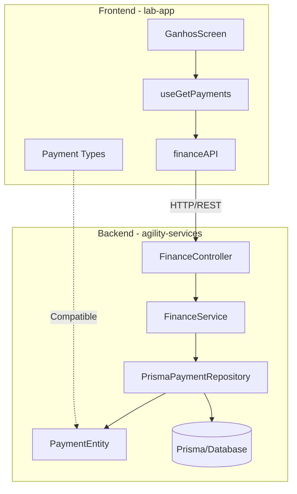
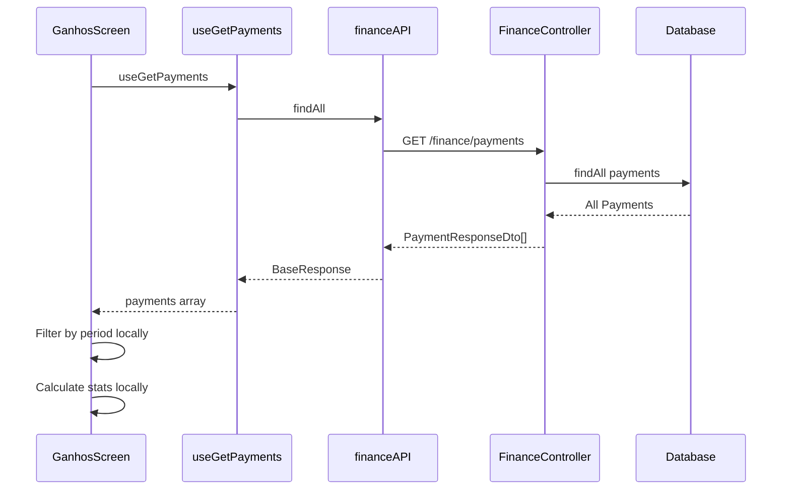

# Análise de Integração: Ganhos (Frontend) ↔ Finance (Backend)

## 1. Resumo Executivo

Esta análise documenta o estado atual da integração entre o componente de **Ganhos** do frontend (lab-app) e o módulo **Finance** do backend (agility-services). A análise revela que **a integração já está parcialmente implementada**, com o frontend consumindo endpoints do backend, mas existem gaps importantes a serem endereçados.

---

## 2. Estado Atual

### 2.1 Frontend (lab-app)

#### Componente Principal

- **Arquivo:** [`src/app/(auth)/(tabs)/menu/ganhos/index.tsx`](<src/app/(auth)/(tabs)/menu/ganhos/index.tsx>)
- **Funcionalidades:**
  - Visualização de pagamentos por período (hoje, semana, mês, ano)
  - Gráfico de evolução de ganhos
  - Cards de estatísticas (Total Recebido, Pendente, Total de Viagens)
  - Lista de pagamentos com detalhes
  - Modal de detalhes do pagamento

#### Domínio Finance

- **Localização:** [`src/domain/agility/finance/`](src/domain/agility/finance/)

##### Estrutura de Arquivos:

```
src/domain/agility/finance/
├── dto/
│   ├── types.ts                    # Enum PaymentStatus
│   ├── index.ts                    # Exports
│   ├── request/
│   │   ├── create-payment.request.ts
│   │   ├── list-payments.request.ts
│   │   └── update-payment.request.ts
│   └── response/
│       └── payment.response.ts     # PaymentResponse, DriverSummaryItem
├── useCase/
│   ├── useGetPayments.ts
│   ├── useGetPayment.ts
│   ├── useCreatePayment.ts
│   ├── useUpdatePayment.ts
│   ├── useRemovePayment.ts
│   └── useGetDriverSummary.ts
├── financeAPI.ts                   # Chamadas HTTP
├── financeService.ts               # Camada de serviço
└── index.ts
```

##### Tipos Frontend:

```typescript
// PaymentStatus
enum PaymentStatus {
  PENDING = 'PENDING',
  APPROVED = 'APPROVED',
  REJECTED = 'REJECTED',
}

// PaymentResponse / Payment
interface PaymentResponse {
  id: string;
  companyId: string;
  routingId?: string;
  serviceId?: string;
  driverId?: string;
  customerId?: string;
  customerName: string;
  expectedValue: number; // in cents
  receivedValue?: number; // in cents
  status: PaymentStatus;
  paymentDate?: string;
  notes?: string;
  createdAt: string;
  updatedAt: string;
}

// ListPaymentsRequest
interface ListPaymentsRequest {
  driverId?: string;
  routingId?: string;
  serviceId?: string;
  customerId?: string;
  status?: string;
}

// DriverSummaryItem
interface DriverSummaryItem {
  id: string;
  driver: string;
  totalTrips: number;
  totalReceived: number; // in cents
  pendingAmount: number; // in cents
}
```

##### Endpoints Consumidos:

| Endpoint                   | Método | Descrição                       |
| -------------------------- | ------ | ------------------------------- |
| `/finance/payments`        | GET    | Lista pagamentos (com filtros)  |
| `/finance/payments/:id`    | GET    | Busca pagamento por ID          |
| `/finance/payments`        | POST   | Cria pagamento                  |
| `/finance/payments/:id`    | PATCH  | Atualiza pagamento              |
| `/finance/payments/:id`    | DELETE | Remove pagamento                |
| `/finance/summary/drivers` | GET    | Resumo financeiro por motorista |

---

### 2.2 Backend (agility-services)

#### Localização

- **Caminho:** `c:/Users/daniel/Agility/back-atual/agility-services/src/finance/`

#### Estrutura do Módulo:

```
src/finance/
├── finance.module.ts
├── controller/
│   └── finance.controller.ts
├── dto/
│   ├── create-payment.dto.ts
│   ├── update-payment.dto.ts
│   └── payment-response.dto.ts
├── entities/
│   └── payment.entity.ts
├── mapper/
│   └── payment.mapper.ts
├── repository/
│   ├── payment.repository.ts
│   └── impl/
│       └── prisma-payment.repository.ts
└── service/
    └── finance.service.ts
```

##### Endpoints Disponíveis:

| Endpoint                   | Método | Roles                      | Descrição            |
| -------------------------- | ------ | -------------------------- | -------------------- |
| `/finance/payments`        | POST   | ADMIN, MANAGER, SUPERVISOR | Criar pagamento      |
| `/finance/payments`        | GET    | COLLABORATOR               | Listar pagamentos    |
| `/finance/payments/:id`    | GET    | COLLABORATOR               | Buscar por ID        |
| `/finance/payments/:id`    | PATCH  | ADMIN, MANAGER, SUPERVISOR | Atualizar pagamento  |
| `/finance/payments/:id`    | DELETE | ADMIN, MANAGER             | Remover pagamento    |
| `/finance/summary/drivers` | GET    | COLLABORATOR               | Resumo por motorista |

##### Tipos Backend:

```typescript
// PaymentStatus (igual ao frontend)
enum PaymentStatus {
  PENDING = 'PENDING',
  APPROVED = 'APPROVED',
  REJECTED = 'REJECTED',
}

// CreatePaymentDto
class CreatePaymentDto {
  routingId?: string;
  serviceId?: string;
  driverId?: string;
  customerId?: string;
  customerName: string;
  expectedValue: number; // in cents
  receivedValue?: number; // in cents
  status?: PaymentStatus;
  paymentDate?: string;
  notes?: string;
}

// UpdatePaymentDto
class UpdatePaymentDto {
  receivedValue?: number;
  status?: PaymentStatus;
  paymentDate?: string;
  notes?: string;
}

// PaymentResponseDto
class PaymentResponseDto {
  id: string;
  companyId: string;
  routingId?: string;
  serviceId?: string;
  driverId?: string;
  customerId?: string;
  customerName: string;
  expectedValue: number;
  receivedValue?: number;
  status: PaymentStatus;
  paymentDate?: string;
  notes?: string;
  createdAt: string;
  updatedAt: string;
}
```

---

## 3. Mapeamento de Tipos

### 3.1 Comparação Frontend ↔ Backend

| Campo         | Frontend        | Backend         | Status        |
| ------------- | --------------- | --------------- | ------------- |
| id            | string          | string          | ✅ Compatível |
| companyId     | string          | string          | ✅ Compatível |
| routingId     | string?         | string?         | ✅ Compatível |
| serviceId     | string?         | string?         | ✅ Compatível |
| driverId      | string?         | string?         | ✅ Compatível |
| customerId    | string?         | string?         | ✅ Compatível |
| customerName  | string          | string          | ✅ Compatível |
| expectedValue | number (cents)  | number (cents)  | ✅ Compatível |
| receivedValue | number? (cents) | number? (cents) | ✅ Compatível |
| status        | PaymentStatus   | PaymentStatus   | ✅ Compatível |
| paymentDate   | string?         | string?         | ✅ Compatível |
| notes         | string?         | string?         | ✅ Compatível |
| createdAt     | string          | string          | ✅ Compatível |
| updatedAt     | string          | string          | ✅ Compatível |

**Conclusão:** Os tipos são **100% compatíveis** entre frontend e backend.

---

## 4. Gap Analysis

### 4.1 Gaps Identificados

#### 🔴 Críticos

1. **Filtro por Data no Backend**
   - **Problema:** O backend não suporta filtros por período (startDate/endDate)
   - **Impacto:** O frontend filtra os pagamentos localmente após buscar todos
   - **Solução:** Adicionar parâmetros `startDate` e `endDate` no endpoint de listagem

2. **Paginação Não Implementada**
   - **Problema:** O endpoint `/finance/payments` retorna todos os registros sem paginação
   - **Impacto:** Performance degradada com grande volume de dados
   - **Solução:** Implementar paginação com `page`, `limit` e metadados

#### 🟡 Moderados

3. **Filtro Combinado no Backend**
   - **Problema:** O controller atual usa if/else para filtros, permitindo apenas um filtro por vez
   - **Impacto:** Não é possível combinar filtros (ex: driverId + status + período)
   - **Solução:** Refatorar para usar Prisma com múltiplos filtros

4. **Endpoint de Estatísticas**
   - **Problema:** O frontend calcula estatísticas localmente
   - **Impacto:** Cálculo duplicado e potencial inconsistência
   - **Solução:** Criar endpoint `/finance/statistics` com cálculos no backend

5. **Resumo do Driver Logado**
   - **Problema:** O endpoint `/finance/summary/drivers` retorna todos os drivers
   - **Impacto:** Motorista comum vê resumo de outros motoristas
   - **Solução:** Criar endpoint `/finance/summary/me` para o driver logado

#### 🟢 Menores

6. **Tipagem do DriverSummary**
   - **Problema:** `getDriverSummary` retorna `any[]`
   - **Impacto:** Sem validação de tipo
   - **Solução:** Criar DTO tipado para resposta

7. **Ordenação Configurável**
   - **Problema:** Ordenação fixa por `createdAt DESC`
   - **Impacto:** Flexibilidade limitada
   - **Solução:** Adicionar parâmetros `sortBy` e `sortOrder`

---

## 5. Plano de Implementação

### Fase 1: Correções Críticas

#### Tarefa 1.1: Adicionar Filtro por Período no Backend

- **Arquivo:** `finance.controller.ts`, `finance.service.ts`, `prisma-payment.repository.ts`
- **Alterações:**
  - Adicionar query params `startDate` e `endDate`
  - Atualizar service para filtrar por período
  - Atualizar repository com nova query Prisma

#### Tarefa 1.2: Implementar Paginação

- **Arquivos:** Controller, Service, Repository
- **Alterações:**
  - Adicionar query params `page` e `limit`
  - Retornar metadados de paginação
  - Atualizar frontend para usar paginação

### Fase 2: Melhorias Moderadas

#### Tarefa 2.1: Refatorar Filtros Combinados

- **Arquivo:** `prisma-payment.repository.ts`
- **Alterações:**
  - Usar objeto de filtros dinâmico
  - Combinar múltiplos filtros com AND

#### Tarefa 2.2: Criar Endpoint de Estatísticas

- **Novo Endpoint:** `GET /finance/statistics`
- **Parâmetros:** `driverId`, `startDate`, `endDate`
- **Resposta:**
  ```typescript
  {
    totalReceived: number;
    totalTrips: number;
    pendingAmount: number;
    averagePerTrip: number;
  }
  ```

#### Tarefa 2.3: Endpoint de Resumo do Driver Logado

- **Novo Endpoint:** `GET /finance/summary/me`
- **Descrição:** Retorna resumo financeiro do driver autenticado

### Fase 3: Melhorias Menores

#### Tarefa 3.1: Tipagem do DriverSummary

- Criar `DriverSummaryDto` no backend

#### Tarefa 3.2: Ordenação Configurável

- Adicionar parâmetros `sortBy` e `sortOrder`

---

## 6. Diagrama de Arquitetura



---

## 7. Fluxo de Dados Atual



---

## 8. Recomendações

### Curto Prazo

1. ✅ **Manter integração atual** - Os tipos já são compatíveis
2. 🔧 **Adicionar filtros de data** - Reduzir volume de dados transferidos
3. 🔧 **Implementar paginação** - Preparar para escala

### Médio Prazo

4. 📊 **Mover cálculos para backend** - Endpoint de estatísticas
5. 🔒 **Endpoint `/summary/me`** - Privacidade do motorista

### Longo Prazo

6. 📈 **Cache com Redis** - Performance
7. 📊 **Dashboard analytics** - Relatórios avançados

---

## 9. Conclusão

A integração entre o componente de Ganhos (frontend) e o módulo Finance (backend) **já está funcional** com tipos 100% compatíveis. No entanto, existem melhorias necessárias para garantir escalabilidade e performance:

| Aspecto                  | Status      | Ação           |
| ------------------------ | ----------- | -------------- |
| Compatibilidade de Tipos | ✅ OK       | Nenhuma        |
| Filtros por Período      | ❌ Faltando | Implementar    |
| Paginação                | ❌ Faltando | Implementar    |
| Estatísticas no Backend  | ⚠️ Parcial  | Criar endpoint |
| Filtros Combinados       | ⚠️ Parcial  | Refatorar      |

---

## 10. Próximos Passos

1. Validar este plano com a equipe
2. Priorizar tarefas por impacto
3. Implementar Fase 1 (críticos)
4. Testar integração
5. Prosseguir com Fases 2 e 3

---

_Documento gerado em: 2026-03-08_
_Autor: Análise automatizada Kilo Code_
