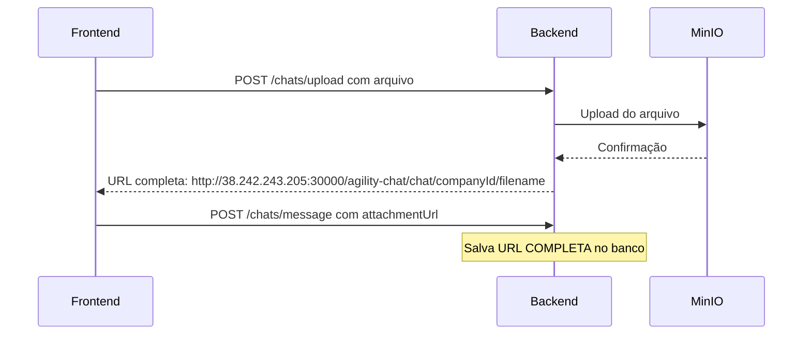
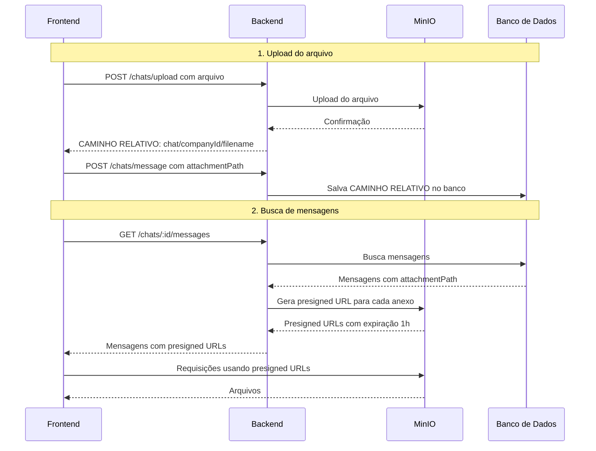
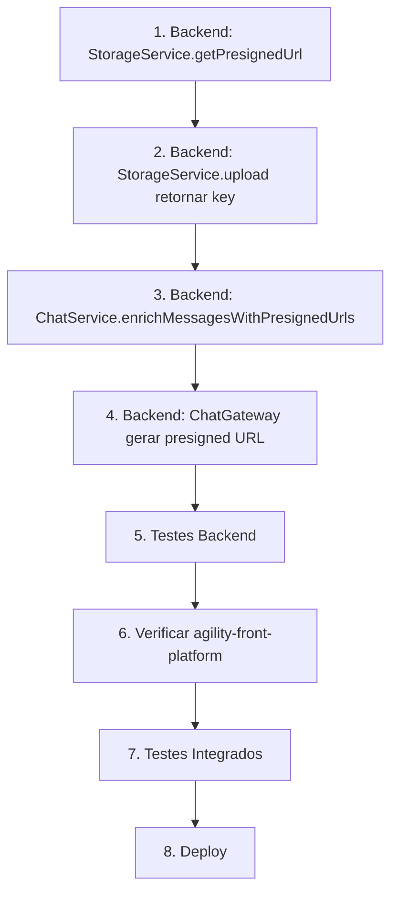

# Plano de Implementação: Presigned URLs para Anexos do Chat

## 📋 Visão Geral

Este plano descreve a implementação de presigned URLs para os anexos do chat, substituindo o modelo atual de URLs públicas/permanentes por URLs temporárias com expiração de 1 hora.

## 🔍 Análise da Situação Atual

### Backend (agility-services)

**StorageService** ([`storage.service.ts`](c:/Users/daniel/Agility/back-atual/agility-services/src/storage/storage.service.ts)):

- ✅ Já possui `S3Client` configurado
- ✅ Já possui métodos `upload()` e `delete()`
- ❌ **NÃO possui método `getPresignedUrl()`**
- ❌ Retorna URLs públicas completas após upload

**ChatController** ([`chat.controller.ts`](c:/Users/daniel/Agility/back-atual/agility-services/src/chat/controller/chat.controller.ts)):

- Endpoint `POST /chats/upload` retorna URLs completas:
  ```typescript
  // Linha 413: Retorna URL completa
  const url = await this.storageService.upload(
    key,
    buffer,
    file.mimetype,
    'chat'
  );
  urls.push(url);
  ```

**Fluxo Atual:**



### Frontend (lab-app)

**chatAPI** ([`chatAPI.ts`](src/domain/agility/chat/chatAPI.ts)):

- `uploadChatAttachment()`: Recebe array de URLs do backend
- `sendMessage()`: Envia `attachmentUrl` para o backend

**Componente de Mensagem** ([`suporte/[id].tsx`](<src/app/(auth)/(tabs)/menu/suporte/[id].tsx>)):

- Linha 150: Usa `msg.attachmentUrl` diretamente no componente `<Image>`

---

## 🎯 Solução Proposta

### Nova Arquitetura com Presigned URLs



---

## 📝 Mudanças Necessárias

### 1. Backend - StorageService

**Arquivo:** `src/storage/storage.service.ts`

#### 1.1 Adicionar import do presigner

```typescript
import {GetObjectCommand} from '@aws-sdk/client-s3';
import {getSignedUrl} from '@aws-sdk/s3-request-presigner';
```

#### 1.2 Adicionar método getPresignedUrl

```typescript
/**
 * Gera uma presigned URL para download temporário do objeto.
 * @param key Caminho relativo do objeto no bucket
 * @param bucketType Tipo do bucket: chat ou services
 * @param expiresInSeconds Tempo de expiração em segundos (padrão: 3600 = 1 hora)
 * @returns URL assinada temporária
 */
async getPresignedUrl(
    key: string,
    bucketType: StorageBucketType,
    expiresInSeconds: number = 3600
): Promise<string> {
    if (!this.client) {
        throw new Error('S3 not configured. Set S3_ENDPOINT, S3_ACCESS_KEY, S3_SECRET_KEY.');
    }

    const bucket = this.getBucket(bucketType);

    const command = new GetObjectCommand({
        Bucket: bucket,
        Key: key,
    });

    const signedUrl = await getSignedUrl(this.client, command, {
        expiresIn: expiresInSeconds,
    });

    this.logger.debug(`[Storage] Generated presigned URL for ${bucket}/${key}, expires in ${expiresInSeconds}s`);

    return signedUrl;
}
```

#### 1.3 Modificar método upload para retornar apenas o key

```typescript
/**
 * Upload para o bucket indicado. Retorna o caminho relativo do objeto.
 */
async upload(key: string, body: Buffer, contentType: string | undefined, bucketType: StorageBucketType): Promise<string> {
    if (!this.client) throw new Error('S3 not configured. Set S3_ENDPOINT, S3_ACCESS_KEY, S3_SECRET_KEY.');
    const bucket = this.getBucket(bucketType);
    await this.client.send(
        new PutObjectCommand({
            Bucket: bucket,
            Key: key,
            Body: body,
            ContentType: contentType || 'application/octet-stream',
        }),
    );
    // Retorna apenas o key (caminho relativo), não a URL completa
    return key;
}
```

---

### 2. Backend - ChatController

**Arquivo:** `src/chat/controller/chat.controller.ts`

#### 2.1 Modificar endpoint de upload (manter compatibilidade)

O endpoint de upload continua retornando URLs, mas agora são os caminhos relativos:

```typescript
// O retorno continua sendo { urls: string[] }, mas agora são paths relativos
// Ex: ['chat/companyId/chat-1234567890.jpg']
```

**Nenhuma mudança necessária no código** - apenas o comportamento do `storageService.upload()` muda.

---

### 3. Backend - ChatService

**Arquivo:** `src/chat/service/chat.service.ts`

#### 3.1 Injetar StorageService no ChatService

```typescript
constructor(
    // ... dependências existentes
    private readonly storageService: StorageService,
) {}
```

#### 3.2 Criar método para gerar presigned URLs

```typescript
/**
 * Gera presigned URLs para anexos de mensagens.
 * Substitui o caminho relativo pela URL temporária.
 */
private async enrichMessagesWithPresignedUrls(messages: ChatMessage[]): Promise<ChatMessageJson[]> {
    const enrichedMessages: ChatMessageJson[] = [];

    for (const message of messages) {
        const json = message.toJson();

        if (json.attachmentUrl && json.attachmentUrl.trim()) {
            try {
                // Verifica se é um caminho relativo (não é URL completa)
                const isRelativePath = !json.attachmentUrl.startsWith('http');

                if (isRelativePath) {
                    // Gera presigned URL
                    json.attachmentUrl = await this.storageService.getPresignedUrl(
                        json.attachmentUrl,
                        'chat',
                        3600 // 1 hora
                    );
                }
                // Se já é URL completa, mantém (compatibilidade com dados antigos)
            } catch (error) {
                this.logger.warn(`Failed to generate presigned URL for ${json.attachmentUrl}: ${error}`);
                // Mantém o valor original em caso de erro
            }
        }

        enrichedMessages.push(json);
    }

    return enrichedMessages;
}
```

#### 3.3 Modificar método getMessages

```typescript
async getMessages(chatId: string, limit: number = 50, offset: number = 0): Promise<ChatMessageJson[]> {
    const messages = await this.chatRepository.findMessagesByChatId(chatId, limit, offset);
    return this.enrichMessagesWithPresignedUrls(messages);
}
```

---

### 4. Backend - ChatGateway (WebSocket)

**Arquivo:** `src/chat/gateway/chat.gateway.ts`

#### 4.1 Modificar emissão de novas mensagens

Quando uma nova mensagem é enviada via WebSocket, gerar presigned URL antes de emitir:

```typescript
// No método que processa new_message
if (savedMessage.attachmentUrl()) {
  const attachmentPath = savedMessage.attachmentUrl();
  const isRelativePath = !attachmentPath.startsWith('http');

  if (isRelativePath) {
    const presignedUrl = await this.storageService.getPresignedUrl(
      attachmentPath,
      'chat',
      3600
    );
    messageJson.attachmentUrl = presignedUrl;
  }
}
```

---

### 5. Frontend - lab-app

**Impacto:** ✅ **MÍNIMO** - O frontend continua recebendo URLs no campo `attachmentUrl`

#### 5.1 Nenhuma mudança estrutural necessária

O frontend já está preparado:

- [`chatAPI.ts`](src/domain/agility/chat/chatAPI.ts) - Recebe URLs do backend
- [`suporte/[id].tsx`](<src/app/(auth)/(tabs)/menu/suporte/[id].tsx>) - Usa `msg.attachmentUrl` no `<Image>`

#### 5.2 Possível otimização (opcional)

Se necessário, adicionar cache das presigned URLs para evitar regeneração em re-renders:

```typescript
// Hook opcional para cache de URLs
const usePresignedUrlCache = () => {
  const cache = useRef<Map<string, {url: string; expiresAt: number}>>(
    new Map()
  );

  const getValidUrl = useCallback((url: string) => {
    const cached = cache.current.get(url);
    if (cached && cached.expiresAt > Date.now()) {
      return cached.url;
    }
    return url; // Retorna a URL nova
  }, []);

  return {getValidUrl};
};
```

---

### 6. Frontend - agility-front-platform

**Ação necessária:** Verificar estrutura do projeto

Não consegui acessar o diretório do `agility-front-platform`. Supõe-se que:

- Se usa a mesma API de chat, **nenhuma mudança é necessária**
- O backend continua retornando URLs no mesmo formato
- Apenas a origem da URL muda (presigned vs pública)

---

## 📊 Resumo de Mudanças

| Componente | Arquivo                | Mudança                                       | Complexidade |
| ---------- | ---------------------- | --------------------------------------------- | ------------ |
| Backend    | `storage.service.ts`   | Adicionar `getPresignedUrl()`                 | Baixa        |
| Backend    | `storage.service.ts`   | Modificar `upload()` para retornar key        | Baixa        |
| Backend    | `chat.service.ts`      | Adicionar `enrichMessagesWithPresignedUrls()` | Média        |
| Backend    | `chat.gateway.ts`      | Gerar presigned URL em new_message            | Média        |
| Frontend   | lab-app                | Nenhuma mudança obrigatória                   | -            |
| Frontend   | agility-front-platform | Verificar                                     | -            |

---

## ⚠️ Considerações Importantes

### Compatibilidade com Dados Existentes

1. **Mensagens antigas com URLs completas**: O código deve detectar se `attachmentUrl` é URL completa ou caminho relativo
2. **Migração de dados**: OPCIONAL - Pode-se migrar URLs antigas para caminhos relativos, mas não é obrigatório

### Segurança

1. **Presigned URLs expiram em 1 hora**: Mensagens carregadas há mais de 1h terão URLs expiradas
2. **Solução**: Frontend pode recarregar mensagens ou implementar endpoint de refresh de URL

### Performance

1. **Geração de presigned URLs**: Adiciona latência na busca de mensagens
2. **Mitigação**: Processamento em paralelo com `Promise.all()`

---

## 🔄 Fluxo de Implementação Recomendado



---

## 🧪 Plano de Testes

### Backend

1. **Teste unitário - getPresignedUrl**:
   - Verificar se retorna URL válida
   - Verificar se URL contém parâmetros de assinatura
   - Verificar expiração

2. **Teste unitário - upload**:
   - Verificar se retorna apenas o key
   - Verificar se arquivo foi salvo no MinIO

3. **Teste de integração - GET /chats/:id/messages**:
   - Enviar mensagem com anexo
   - Buscar mensagens
   - Verificar se attachmentUrl é presigned URL válida

### Frontend

1. **Teste manual**:
   - Enviar mensagem com imagem
   - Verificar se imagem carrega
   - Aguardar 1h e verificar se URL expira
   - Recarregar tela e verificar nova URL

---

## ❓ Dúvidas para Alinhar

1. **Deseja migrar os dados existentes** (URLs completas → caminhos relativos) ou manter compatibilidade híbrida?
2. **Qual o impacto de URLs que expiram em 1h** na experiência do usuário?
3. **Precisa de endpoint para refresh de presigned URL** sem recarregar mensagens?
4. **O agility-front-platform está acessível?** Preciso verificar para confirmar impacto.
