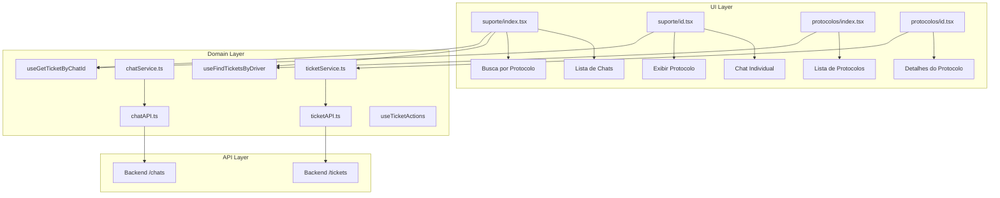
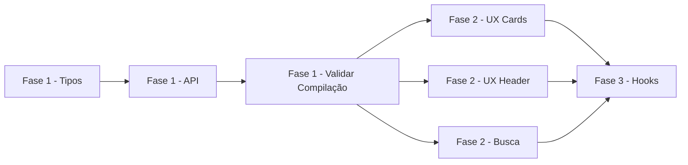

# Plano de Implementação de Protocolo

## 1. Resumo Executivo

### Status Atual

O projeto **lab-app** possui uma base parcialmente implementada para o sistema de protocolos/tickets de suporte. A funcionalidade de **Chat** está bem estruturada e funcional, enquanto a de **Tickets/Protocolos** apresenta problemas críticos de compilação devido a funções ausentes na API.

#### ✅ Implementado e Funcional

| Componente                | Arquivo                                                                                                                    | Status                    |
| ------------------------- | -------------------------------------------------------------------------------------------------------------------------- | ------------------------- |
| Chat - Tipos              | [`src/domain/agility/chat/dto/types.ts`](src/domain/agility/chat/dto/types.ts)                                             | ✅ Completo               |
| Chat - API REST           | [`src/domain/agility/chat/chatAPI.ts`](src/domain/agility/chat/chatAPI.ts)                                                 | ✅ Completo               |
| Chat - WebSocket          | [`src/domain/agility/chat/useCase/useChatWebSocket.ts`](src/domain/agility/chat/useCase/useChatWebSocket.ts)               | ✅ Completo               |
| Chat - Store Zustand      | [`src/domain/agility/chat/store/useChatStore.ts`](src/domain/agility/chat/store/useChatStore.ts)                           | ✅ Completo               |
| Chat - Upload Anexos      | [`src/domain/agility/chat/useCase/useChatAttachmentUpload.ts`](src/domain/agility/chat/useCase/useChatAttachmentUpload.ts) | ✅ Completo               |
| Página Lista Suporte      | [`src/app/(auth)/(tabs)/menu/suporte/index.tsx`](<src/app/(auth)/(tabs)/menu/suporte/index.tsx>)                           | ✅ Funcional              |
| Página Chat Individual    | [`src/app/(auth)/(tabs)/menu/suporte/[id].tsx`](<src/app/(auth)/(tabs)/menu/suporte/[id].tsx>)                             | ✅ Funcional              |
| Página Lista Protocolos   | [`src/app/(auth)/(tabs)/menu/protocolos/index.tsx`](<src/app/(auth)/(tabs)/menu/protocolos/index.tsx>)                     | ⚠️ Compila, mas sem dados |
| Página Detalhes Protocolo | [`src/app/(auth)/(tabs)/menu/protocolos/[id].tsx`](<src/app/(auth)/(tabs)/menu/protocolos/[id].tsx>)                       | ⚠️ Compila, mas sem dados |
| TicketStatus Enum         | [`src/domain/agility/ticket/dto/types.ts`](src/domain/agility/ticket/dto/types.ts)                                         | ✅ Existe                 |

#### ❌ Problemas Críticos

| Componente                                                       | Problema                                | Impacto                |
| ---------------------------------------------------------------- | --------------------------------------- | ---------------------- |
| [`ticketAPI.ts`](src/domain/agility/ticket/ticketAPI.ts)         | Faltam 10 funções exportadas            | **Erro de compilação** |
| [`ticketService.ts`](src/domain/agility/ticket/ticketService.ts) | Importa funções inexistentes            | **Erro de compilação** |
| Tipo `TicketItem`                                                | Definido como `Record<string, unknown>` | Sem tipagem            |
| `TicketPriority`                                                 | Enum não existe                         | Falta funcionalidade   |

---

## 2. Problemas Críticos

### 2.1 Funções Ausentes em `ticketAPI.ts`

O arquivo [`ticketAPI.ts`](src/domain/agility/ticket/ticketAPI.ts) exporta apenas estas funções:

- `create`, `findAll`, `findOne`, `update`, `addMessage`, `close`, `remove`

Porém, o [`ticketService.ts`](src/domain/agility/ticket/ticketService.ts) importa **funções que não existem**:

```typescript
// ticketService.ts - Linhas 4-21
import {
  create,
  findOne,
  findByNumber, // ❌ NÃO EXISTE
  findByChatId, // ❌ NÃO EXISTE
  findByDriver, // ❌ NÃO EXISTE
  findByCustomer, // ❌ NÃO EXISTE
  findOpen, // ❌ NÃO EXISTE
  findMyAssigned, // ❌ NÃO EXISTE
  findAll,
  assign, // ❌ NÃO EXISTE
  start, // ❌ NÃO EXISTE
  resolve, // ❌ NÃO EXISTE
  close,
  reopen, // ❌ NÃO EXISTE
  update,
  type TicketItem,
} from './ticketAPI';
```

### 2.2 Tipo TicketItem Genérico

```typescript
// ticketAPI.ts - Linha 5
export type TicketItem = {id: Id} & Record<string, unknown>;
```

O tipo é muito genérico, não fornecendo IntelliSense ou validação de tipos.

### 2.3 Falta Enum TicketPriority

O sistema não possui níveis de prioridade para tickets (LOW, MEDIUM, HIGH, URGENT).

---

## 3. Plano de Implementação

### Fase 1: Correções Urgentes 🔴

#### 3.1.1 Completar `ticketAPI.ts`

Adicionar as funções ausentes:

```typescript
// src/domain/agility/ticket/ticketAPI.ts

// Buscar por número do protocolo
export async function findByNumber(
  ticketNumber: string
): Promise<BaseResponse<TicketItem>> {
  const {data} = await apiAgility.get<BaseResponse<TicketItem>>(
    `/tickets/number/${ticketNumber}`
  );
  return data;
}

// Buscar por chatId
export async function findByChatId(
  chatId: Id
): Promise<BaseResponse<TicketItem>> {
  const {data} = await apiAgility.get<BaseResponse<TicketItem>>(
    `/tickets/chat/${chatId}`
  );
  return data;
}

// Buscar por driverId
export async function findByDriver(
  driverId: Id
): Promise<BaseResponse<TicketItem[]>> {
  const {data} = await apiAgility.get<BaseResponse<TicketItem[]>>(
    `/tickets/driver/${driverId}`
  );
  return data;
}

// Buscar por customerId
export async function findByCustomer(
  customerId: Id
): Promise<BaseResponse<TicketItem[]>> {
  const {data} = await apiAgility.get<BaseResponse<TicketItem[]>>(
    `/tickets/customer/${customerId}`
  );
  return data;
}

// Buscar tickets abertos
export async function findOpen(): Promise<BaseResponse<TicketItem[]>> {
  const {data} =
    await apiAgility.get<BaseResponse<TicketItem[]>>('/tickets/open');
  return data;
}

// Buscar tickets atribuídos ao usuário atual
export async function findMyAssigned(): Promise<BaseResponse<TicketItem[]>> {
  const {data} = await apiAgility.get<BaseResponse<TicketItem[]>>(
    '/tickets/my-assigned'
  );
  return data;
}

// Atribuir ticket a um agente
export async function assign(
  id: Id,
  assignedToId?: string
): Promise<BaseResponse<TicketItem>> {
  const {data} = await apiAgility.patch<BaseResponse<TicketItem>>(
    `/tickets/${id}/assign`,
    {assignedToId}
  );
  return data;
}

// Iniciar atendimento
export async function start(id: Id): Promise<BaseResponse<TicketItem>> {
  const {data} = await apiAgility.patch<BaseResponse<TicketItem>>(
    `/tickets/${id}/start`
  );
  return data;
}

// Resolver ticket
export async function resolve(
  id: Id,
  resolution?: string
): Promise<BaseResponse<TicketItem>> {
  const {data} = await apiAgility.patch<BaseResponse<TicketItem>>(
    `/tickets/${id}/resolve`,
    {resolution}
  );
  return data;
}

// Reabrir ticket
export async function reopen(id: Id): Promise<BaseResponse<TicketItem>> {
  const {data} = await apiAgility.patch<BaseResponse<TicketItem>>(
    `/tickets/${id}/reopen`
  );
  return data;
}
```

#### 3.1.2 Criar Interface Ticket Completa

Criar/atualizar [`src/domain/agility/ticket/dto/types.ts`](src/domain/agility/ticket/dto/types.ts):

```typescript
// src/domain/agility/ticket/dto/types.ts

export enum TicketStatus {
  OPEN = 'OPEN',
  ASSIGNED = 'ASSIGNED',
  IN_PROGRESS = 'IN_PROGRESS',
  RESOLVED = 'RESOLVED',
  TRANSFERRED = 'TRANSFERRED',
  CLOSED = 'CLOSED',
}

export enum TicketPriority {
  LOW = 'LOW',
  MEDIUM = 'MEDIUM',
  HIGH = 'HIGH',
  URGENT = 'URGENT',
}

export interface Ticket {
  id: string;
  ticketNumber: string;
  subject: string;
  description?: string;
  status: TicketStatus;
  priority: TicketPriority;

  // Relacionamentos
  chatId?: string;
  driverId?: string;
  customerId?: string;
  assignedToId?: string;

  // Datas
  openedAt: string;
  resolvedAt?: string;
  closedAt?: string;
  createdAt: string;
  updatedAt?: string;

  // Campos adicionais
  transferDescription?: string;
  resolutionDescription?: string;

  // Metadata
  createdBy?: string;
  updatedBy?: string;
}

// Tipo para criação de ticket
export interface CreateTicketPayload {
  subject: string;
  description?: string;
  priority?: TicketPriority;
  driverId?: string;
  customerId?: string;
  chatId?: string;
}

// Tipo para atualização de ticket
export interface UpdateTicketPayload {
  subject?: string;
  description?: string;
  status?: TicketStatus;
  priority?: TicketPriority;
  assignedToId?: string;
}
```

#### 3.1.3 Atualizar Tipo TicketItem no ticketAPI.ts

```typescript
// src/domain/agility/ticket/ticketAPI.ts
import type {Ticket} from './dto/types';

// Reexportar o tipo completo
export type TicketItem = Ticket;
```

---

### Fase 2: Melhorias de UX 🟡

#### 3.2.1 Exibir Protocolo nos Cards de Chat

Modificar [`src/app/(auth)/(tabs)/menu/suporte/index.tsx`](<src/app/(auth)/(tabs)/menu/suporte/index.tsx>) para buscar e exibir o ticketNumber:

```typescript
// Adicionar hook para buscar ticket por chatId
import { useGetTicketByChatId } from '@/domain/agility/ticket/useCase'

// Componente de card individual
function ChatCard({ chat }: { chat: Chat }) {
  const chatId = chat.id
  const { ticket } = useGetTicketByChatId(chatId)

  return (
    <TouchableOpacityBox>
      {/* Exibir número do protocolo se existir */}
      {ticket?.ticketNumber && (
        <Text preset="text12" color="primary100" mb="y4">
          Protocolo: {ticket.ticketNumber}
        </Text>
      )}
      <Text preset="text15" fontWeightPreset='semibold'>
        {chat.subject || 'Conversa de suporte'}
      </Text>
      {/* ... resto do card */}
    </TouchableOpacityBox>
  )
}
```

#### 3.2.2 Exibir Protocolo no Header do Chat

Modificar [`src/app/(auth)/(tabs)/menu/suporte/[id].tsx`](<src/app/(auth)/(tabs)/menu/suporte/[id].tsx>):

```typescript
// Adicionar hook para buscar ticket
import { useGetTicketByChatId } from '@/domain/agility/ticket/useCase'

// No componente
const { ticket } = useGetTicketByChatId(chatId)

// No header
<Box flexDirection="row" alignItems="center">
  <Text preset="text18" fontWeightPreset='bold'>
    {ticket?.ticketNumber
      ? `Protocolo: ${ticket.ticketNumber}`
      : 'Suporte'}
  </Text>
  {ticket && (
    <Box
      backgroundColor={getStatusColor(ticket.status)}
      px="x8"
      py="y2"
      borderRadius="s4"
      ml="x8"
    >
      <Text preset="text12" color="white">
        {mapStatus(ticket.status)}
      </Text>
    </Box>
  )}
</Box>
```

#### 3.2.3 Busca por Protocolo na Tela de Suporte

Modificar a função de filtro em [`suporte/index.tsx`](<src/app/(auth)/(tabs)/menu/suporte/index.tsx>):

```typescript
// Filtrar chats pela busca (incluindo ticketNumber)
const filtrados = useMemo(() => {
  if (!busca.trim()) return chats;

  const buscaLower = busca.toLowerCase();
  return chats.filter((chat: any) => {
    const lastMessage = chat.lastMessage?.content || '';
    const subject = chat.subject || '';
    const chatId = chat.id || '';
    const ticketNumber = chat.ticketNumber || '';

    return (
      lastMessage.toLowerCase().includes(buscaLower) ||
      subject.toLowerCase().includes(buscaLower) ||
      chatId.toLowerCase().includes(buscaLower) ||
      ticketNumber.toLowerCase().includes(buscaLower)
    );
  });
}, [chats, busca]);
```

---

### Fase 3: Funcionalidades Adicionais 🟢

#### 3.3.1 Criar Hook useTicketActions

Criar [`src/domain/agility/ticket/useCase/useTicketActions.ts`](src/domain/agility/ticket/useCase/useTicketActions.ts):

```typescript
import {useMutation, useQueryClient} from '@tanstack/react-query';
import {KEY_TICKETS} from '@/domain/queryKeys';
import {
  assignTicketService,
  startTicketService,
  resolveTicketService,
  closeTicketService,
  reopenTicketService,
} from '../ticketService';

export function useTicketActions() {
  const queryClient = useQueryClient();

  const assignMutation = useMutation({
    mutationFn: ({id, assignedToId}: {id: string; assignedToId?: string}) =>
      assignTicketService(id, assignedToId),
    onSuccess: () => {
      queryClient.invalidateQueries({queryKey: [KEY_TICKETS]});
    },
  });

  const startMutation = useMutation({
    mutationFn: (id: string) => startTicketService(id),
    onSuccess: () => {
      queryClient.invalidateQueries({queryKey: [KEY_TICKETS]});
    },
  });

  const resolveMutation = useMutation({
    mutationFn: (id: string) => resolveTicketService(id),
    onSuccess: () => {
      queryClient.invalidateQueries({queryKey: [KEY_TICKETS]});
    },
  });

  const closeMutation = useMutation({
    mutationFn: (id: string) => closeTicketService(id),
    onSuccess: () => {
      queryClient.invalidateQueries({queryKey: [KEY_TICKETS]});
    },
  });

  const reopenMutation = useMutation({
    mutationFn: (id: string) => reopenTicketService(id),
    onSuccess: () => {
      queryClient.invalidateQueries({queryKey: [KEY_TICKETS]});
    },
  });

  return {
    assign: assignMutation.mutate,
    start: startMutation.mutate,
    resolve: resolveMutation.mutate,
    close: closeMutation.mutate,
    reopen: reopenMutation.mutate,
    isAssigning: assignMutation.isPending,
    isStarting: startMutation.isPending,
    isResolving: resolveMutation.isPending,
    isClosing: closeMutation.isPending,
    isReopening: reopenMutation.isPending,
  };
}
```

#### 3.3.2 Criar Hook useFindTickets

Criar [`src/domain/agility/ticket/useCase/useFindTickets.ts`](src/domain/agility/ticket/useCase/useFindTickets.ts):

```typescript
import {useQuery} from '@tanstack/react-query';
import {KEY_TICKETS} from '@/domain/queryKeys';
import {getAllTicketsService, getOpenTicketsService} from '../ticketService';

interface UseFindTicketsParams {
  status?: string;
  priority?: string;
  limit?: number;
  offset?: number;
  enabled?: boolean;
}

export function useFindTickets(params: UseFindTicketsParams = {}) {
  const {status, priority, limit, offset, enabled = true} = params;

  const {data, isLoading, isError, refetch, isRefetching} = useQuery({
    queryKey: [KEY_TICKETS, 'all', {status, priority, limit, offset}],
    queryFn: () => getAllTicketsService({limit, offset}),
    enabled,
    retry: false,
  });

  return {
    tickets: data?.result ?? [],
    isLoading,
    isError,
    refetch,
    isRefetching,
    response: data,
  };
}

export function useOpenTickets(enabled = true) {
  const {data, isLoading, isError, refetch, isRefetching} = useQuery({
    queryKey: [KEY_TICKETS, 'open'],
    queryFn: () => getOpenTicketsService(),
    enabled,
    retry: false,
  });

  return {
    tickets: data?.result ?? [],
    isLoading,
    isError,
    refetch,
    isRefetching,
    response: data,
  };
}
```

#### 3.3.3 Criar Index para Exportações

Criar [`src/domain/agility/ticket/index.ts`](src/domain/agility/ticket/index.ts):

```typescript
// Types
export * from './dto/types';

// Services
export * from './ticketService';

// Hooks
export * from './useCase/useFindTicketsByDriver';
export * from './useCase/useGetTicketByChatId';
export * from './useCase/useFindTickets';
export * from './useCase/useTicketActions';
```

---

## 4. Diagrama de Arquitetura



---

## 5. Checklist de Tarefas

### Fase 1: Correções Urgentes 🔴

- [ ] **ticketAPI.ts** - Adicionar função `findByNumber(ticketNumber: string)`
- [ ] **ticketAPI.ts** - Adicionar função `findByChatId(chatId: Id)`
- [ ] **ticketAPI.ts** - Adicionar função `findByDriver(driverId: Id)`
- [ ] **ticketAPI.ts** - Adicionar função `findByCustomer(customerId: Id)`
- [ ] **ticketAPI.ts** - Adicionar função `findOpen()`
- [ ] **ticketAPI.ts** - Adicionar função `findMyAssigned()`
- [ ] **ticketAPI.ts** - Adicionar função `assign(id: Id, assignedToId?: string)`
- [ ] **ticketAPI.ts** - Adicionar função `start(id: Id)`
- [ ] **ticketAPI.ts** - Adicionar função `resolve(id: Id, resolution?: string)`
- [ ] **ticketAPI.ts** - Adicionar função `reopen(id: Id)`
- [ ] **dto/types.ts** - Criar interface `Ticket` completa
- [ ] **dto/types.ts** - Criar enum `TicketPriority`
- [ ] **dto/types.ts** - Criar interface `CreateTicketPayload`
- [ ] **dto/types.ts** - Criar interface `UpdateTicketPayload`
- [ ] **ticketAPI.ts** - Atualizar `TicketItem` para usar tipo `Ticket`
- [ ] **Validar** - Executar `npx tsc --check` sem erros

### Fase 2: Melhorias de UX 🟡

- [ ] **suporte/index.tsx** - Criar componente `ChatCard` com ticketNumber
- [ ] **suporte/index.tsx** - Usar `useGetTicketByChatId` nos cards
- [ ] **suporte/index.tsx** - Exibir protocolo no card de chat
- [ ] **suporte/index.tsx** - Adicionar ticketNumber ao filtro de busca
- [ ] **suporte/[id].tsx** - Buscar ticket via `useGetTicketByChatId`
- [ ] **suporte/[id].tsx** - Exibir ticketNumber no header
- [ ] **suporte/[id].tsx** - Exibir status do ticket no header
- [ ] **Testar** - Verificar exibição do protocolo em todas as telas

### Fase 3: Funcionalidades Adicionais 🟢

- [ ] **useCase/useTicketActions.ts** - Criar hook com mutations
- [ ] **useCase/useFindTickets.ts** - Criar hook para listagem geral
- [ ] **useCase/useFindTickets.ts** - Criar hook `useOpenTickets`
- [ ] **index.ts** - Criar arquivo de exportações do domínio ticket
- [ ] **Documentar** - Atualizar README se necessário

---

## 6. Dependências entre Tarefas



---

## 7. Notas Técnicas

### Convenções de Nomenclatura

- **Services**: Funções que chamam a API (ex: `getTicketService`, `createTicketService`)
- **Hooks**: Prefixo `use` (ex: `useFindTicketsByDriver`, `useTicketActions`)
- **Types**: Interfaces sem prefixo, Enums com PascalCase
- **API Functions**: Nome do endpoint/ação (ex: `findByNumber`, `assign`, `resolve`)

### Estrutura de Arquivos

```
src/domain/agility/ticket/
├── dto/
│   └── types.ts          # Interfaces e Enums
├── useCase/
│   ├── index.ts          # Exportações dos hooks
│   ├── useFindTicketsByDriver.ts
│   ├── useGetTicketByChatId.ts
│   ├── useFindTickets.ts     # Novo
│   └── useTicketActions.ts   # Novo
├── ticketAPI.ts          # Chamadas HTTP
├── ticketService.ts      # Lógica de negócio
└── index.ts              # Exportações do domínio
```

### Query Keys

```typescript
// Já existente em src/domain/queryKeys.ts
export const KEY_TICKETS = // Padrão de uso
  'tickets'[KEY_TICKETS][(KEY_TICKETS, 'driver', driverId)][ // Lista geral // Por motorista
    (KEY_TICKETS, 'chat', chatId)
  ][(KEY_TICKETS, 'open')]; // Por chat // Tickets abertos
```

---

## 8. Referências

- [Plano de Implementação de Chat](plans/chat-implementation-plan.md)
- [Tipos de Chat](src/domain/agility/chat/dto/types.ts)
- [Página de Suporte](<src/app/(auth)/(tabs)/menu/suporte/index.tsx>)
- [Página de Protocolos](<src/app/(auth)/(tabs)/menu/protocolos/index.tsx>)
