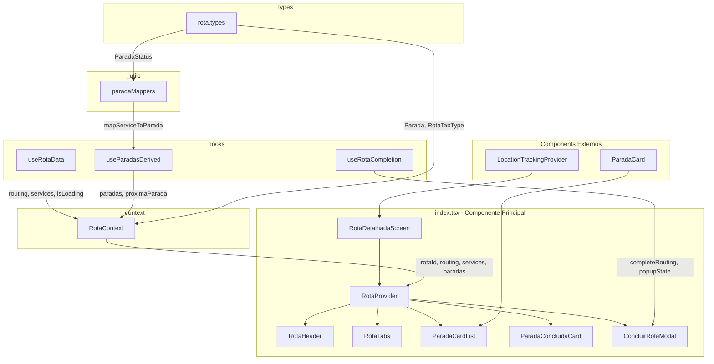

# Plano de Refatoração: Tela de Detalhes da Rota

## 1. Análise do Arquivo Atual

### Arquivo: [`src/app/(auth)/(tabs)/rotas-detalhadas/[id]/index.tsx`](<src/app/(auth)/(tabs)/rotas-detalhadas/[id]/index.tsx>)

#### Métricas Atuais

- **Linhas de código:** 452
- **Componentes no mesmo arquivo:** 1 (principal) + função auxiliar `mapServiceToParada`
- **Interfaces definidas:** 1 (`Parada`)
- **Hooks utilizados:** 5 hooks do React + 3 hooks customizados
- **Estados locais:** 2 (`aba`, `popupConcluirRota`)

### Problemas Identificados

#### 1. **Alta Complexidade Ciclomática**

- O componente principal `RotaDetalhadaScreen` tem muitas responsabilidades:
  - Busca de dados (routing e services)
  - Transformação de dados (mapServiceToParada)
  - Cálculos derivados (paradas, próximaParada, outrasParadas)
  - Renderização de múltiplas seções condicionais
  - Gerenciamento de estados de UI (tabs, popup)

#### 2. **Lógica de Negócio Acoplada à UI**

```typescript
// Linhas 28-74: Função de mapeamento inline
function mapServiceToParada(service: any, index: number): Parada { ... }

// Linhas 111-146: Cálculos derivados no componente
const sortedServices = useMemo(() => { ... }, [services]);
const paradas = useMemo(() => { ... }, [sortedServices]);
const proximaParada = paradas.find(...) ?? paradas.find(...) ?? null;
```

#### 3. **Código Duplicado**

- Cards de parada repetidos com estrutura similar:
  - Próxima parada (linhas 241-280)
  - Outras paradas (linhas 289-327)
  - Paradas concluídas com sucesso (linhas 355-375)
  - Paradas concluídas com insucesso (linhas 388-407)

#### 4. **Componente Existente Não Utilizado**

- Já existe [`ParadaCard`](src/components/ParadaCard/ParadaCard.tsx) em `src/components/` mas não está sendo usado

#### 5. **Modal Inline**

- Popup de confirmação de conclusão de rota (linhas 414-448) está inline
- Poderia ser um componente separado reutilizável

#### 6. **Logs de Debug Excessivos**

- Múltiplos `console.log` e `console.warn` (linhas 85-94, 121-124, 139-142, 151-157)
- Deveriam estar em um hook ou ser removidos

#### 7. **Falta de Tipagem Adequada**

- Interface `Parada` duplica informações que já existem em `ServiceResponse`
- Função `mapServiceToParada` usa `any` como tipo de entrada

---

## 2. Estrutura de Pastas Proposta

Seguindo o padrão já estabelecido em [`parada/[pid]/`](<src/app/(auth)/(tabs)/rotas-detalhadas/[id]/parada/[pid]/>):

```
src/app/(auth)/(tabs)/rotas-detalhadas/[id]/
├── index.tsx                          # Componente principal refatorado (~80 linhas)
├── _components/
│   ├── index.ts                       # Barrel export
│   ├── RotaHeader.tsx                 # Header com título e badge de progresso
│   ├── RotaTabs.tsx                   # Tabs de navegação (Em andamento/Concluído)
│   ├── ParadaCardList.tsx             # Lista de cards de parada
│   ├── ParadaConcluidaCard.tsx        # Card para paradas concluídas
│   └── ConcluirRotaModal.tsx          # Modal de confirmação de conclusão
├── _hooks/
│   ├── index.ts                       # Barrel export
│   ├── useRotaData.ts                 # Hook para busca e transformação de dados
│   ├── useParadasDerived.ts           # Hook para cálculos derivados de paradas
│   └── useRotaCompletion.ts           # Hook para lógica de conclusão de rota
├── _context/
│   ├── RotaContext.tsx                # Context compartilhado da rota
│   └── index.ts                       # Barrel export
├── _types/
│   ├── index.ts                       # Barrel export
│   └── rota.types.ts                  # Tipos TypeScript
└── _utils/
    ├── index.ts                       # Barrel export
    └── paradaMappers.ts               # Funções de mapeamento
```

---

## 3. Arquivos a Serem Criados

### 3.1 Tipos (`_types/rota.types.ts`)

| Tipo               | Descrição                                        |
| ------------------ | ------------------------------------------------ |
| `Parada`           | Interface para parada formatada                  |
| `RotaTabType`      | Union type para tabs: 'andamento' \| 'concluido' |
| `ParadaStatus`     | Union type para status de parada                 |
| `RotaScreenParams` | Parâmetros da rota                               |

### 3.2 Utilitários (`_utils/paradaMappers.ts`)

| Função                  | Descrição                          |
| ----------------------- | ---------------------------------- |
| `mapServiceToParada()`  | Mapeia ServiceResponse para Parada |
| `sortServicesByOrder()` | Ordena serviços por sequenceOrder  |
| `getServiceTypeLabel()` | Retorna label do tipo de serviço   |

### 3.3 Hooks (`_hooks/`)

| Hook                | Responsabilidade                                                 |
| ------------------- | ---------------------------------------------------------------- |
| `useRotaData`       | Busca routing e services, retorna dados brutos                   |
| `useParadasDerived` | Calcula paradas, próximaParada, outrasParadas, paradasConcluidas |
| `useRotaCompletion` | Gerencia estado e lógica de conclusão de rota                    |

### 3.4 Componentes (`_components/`)

| Componente            | Linhas Estimadas | Responsabilidade                                     |
| --------------------- | ---------------- | ---------------------------------------------------- |
| `RotaHeader`          | ~40              | Header com botão voltar, título e badge de progresso |
| `RotaTabs`            | ~50              | Tabs de navegação entre "Em andamento" e "Concluído" |
| `ParadaCardList`      | ~60              | Lista de paradas usando ParadaCard existente         |
| `ParadaConcluidaCard` | ~35              | Card simplificado para paradas concluídas            |
| `ConcluirRotaModal`   | ~50              | Modal de confirmação de conclusão                    |

### 3.5 Context (`_context/RotaContext.tsx`)

| Propriedade | Tipo                    | Descrição                   |
| ----------- | ----------------------- | --------------------------- |
| `rotaId`    | string                  | ID da rota atual            |
| `routing`   | RoutingResponse \| null | Dados da rota               |
| `services`  | ServiceResponse[]       | Lista de serviços           |
| `paradas`   | Parada[]                | Lista de paradas formatadas |
| `isLoading` | boolean                 | Estado de carregamento      |
| `aba`       | RotaTabType             | Tab ativa                   |
| `setAba`    | function                | Setter da tab ativa         |

---

## 4. Plano de Execução

### Fase 1: Preparação (Baixa Complexidade)

#### Passo 1.1: Criar estrutura de pastas

- [ ] Criar diretórios: `_components`, `_hooks`, `_context`, `_types`, `_utils`
- [ ] Criar arquivos `index.ts` de barrel export

#### Passo 1.2: Extrair tipos

- [ ] Criar [`_types/rota.types.ts`](<src/app/(auth)/(tabs)/rotas-detalhadas/[id]/_types/rota.types.ts>)
  - Mover interface `Parada` do arquivo principal
  - Criar tipos `RotaTabType` e `ParadaStatus`
  - Adicionar tipos de props dos componentes

### Fase 2: Utilitários (Baixa Complexidade)

#### Passo 2.1: Extrair mapeadores

- [ ] Criar [`_utils/paradaMappers.ts`](<src/app/(auth)/(tabs)/rotas-detalhadas/[id]/_utils/paradaMappers.ts>)
  - Mover `mapServiceToParada` com tipagem correta
  - Criar `sortServicesByOrder`
  - Criar `getServiceTypeLabel`

### Fase 3: Hooks (Média Complexidade)

#### Passo 3.1: Extrair hook de dados

- [ ] Criar [`_hooks/useRotaData.ts`](<src/app/(auth)/(tabs)/rotas-detalhadas/[id]/_hooks/useRotaData.ts>)
  - Encapsular `useFindOneRouting` e `useFindServicesByRoutingId`
  - Gerenciar estados de loading e error
  - Remover logs de debug ou mover para desenvolvimento

#### Passo 3.2: Extrair hook de paradas derivadas

- [ ] Criar [`_hooks/useParadasDerived.ts`](<src/app/(auth)/(tabs)/rotas-detalhadas/[id]/_hooks/useParadasDerived.ts>)
  - Mover lógica de `sortedServices`
  - Mover lógica de `paradas`
  - Mover cálculos de `proximaParada`, `outrasParadas`, `paradasConcluidas`
  - Mover validação de múltiplas paradas em andamento

#### Passo 3.3: Extrair hook de conclusão

- [ ] Criar [`_hooks/useRotaCompletion.ts`](<src/app/(auth)/(tabs)/rotas-detalhadas/[id]/_hooks/useRotaCompletion.ts>)
  - Encapsular `useCompleteRouting`
  - Gerenciar estado `popupConcluirRota`
  - Gerenciar callbacks de sucesso e erro

### Fase 4: Context (Média Complexidade)

#### Passo 4.1: Criar contexto da rota

- [ ] Criar [`_context/RotaContext.tsx`](<src/app/(auth)/(tabs)/rotas-detalhadas/[id]/_context/RotaContext.tsx>)
  - Provider com rotaId, routing, services, paradas
  - Estado de loading centralizado
  - Estado de tab ativa

### Fase 5: Componentes (Média Complexidade)

#### Passo 5.1: Extrair componentes de UI

- [ ] Criar [`_components/RotaHeader.tsx`](<src/app/(auth)/(tabs)/rotas-detalhadas/[id]/_components/RotaHeader.tsx>)
  - Botão voltar
  - Título da rota
  - Badge de progresso

- [ ] Criar [`_components/RotaTabs.tsx`](<src/app/(auth)/(tabs)/rotas-detalhadas/[id]/_components/RotaTabs.tsx>)
  - Tabs "Em andamento" e "Concluído"
  - Estado controlado via props ou context

#### Passo 5.2: Extrair componentes de lista

- [ ] Criar [`_components/ParadaCardList.tsx`](<src/app/(auth)/(tabs)/rotas-detalhadas/[id]/_components/ParadaCardList.tsx>)
  - Usar componente [`ParadaCard`](src/components/ParadaCard/ParadaCard.tsx) existente
  - Seções: "Próxima parada" e "Outras paradas"
  - Navegação para tela de parada

- [ ] Criar [`_components/ParadaConcluidaCard.tsx`](<src/app/(auth)/(tabs)/rotas-detalhadas/[id]/_components/ParadaConcluidaCard.tsx>)
  - Card para paradas concluídas com sucesso
  - Card para paradas concluídas com insucesso

#### Passo 5.3: Extrair modal

- [ ] Criar [`_components/ConcluirRotaModal.tsx`](<src/app/(auth)/(tabs)/rotas-detalhadas/[id]/_components/ConcluirRotaModal.tsx>)
  - Modal de confirmação
  - Botões de cancelar e confirmar
  - Estado de loading durante conclusão

### Fase 6: Refatoração do Componente Principal (Alta Complexidade)

#### Passo 6.1: Refatorar index.tsx

- [ ] Substituir lógica inline por hooks extraídos
- [ ] Substituir JSX inline por componentes extraídos
- [ ] Envolver com `RotaProvider`
- [ ] Testar funcionalidades existentes

---

## 5. Diagrama de Arquitetura



---

## 6. Componente Principal Refatorado - Exemplo

```typescript
// index.tsx refatorado (~80 linhas)
export default function RotaDetalhadaScreen() {
  const { id } = useLocalSearchParams<{ id: string }>();
  const router = useRouter();

  return (
    <RotaProvider rotaId={id}>
      <RotaScreenContent />
    </RotaProvider>
  );
}

function RotaScreenContent() {
  const { routing, isLoading, aba, setAba } = useRota();
  const { showPopup, openPopup, closePopup } = useRotaCompletion();

  if (isLoading) return <LoadingState />;
  if (!routing) return <ErrorState />;

  return (
    <LocationTrackingProvider>
      <Box flex={1} px="x16" pt="y12" pb="y24">
        <RotaHeader />
        <RotaTabs aba={aba} setAba={setAba} />

        {aba === 'andamento' && (
          <AndamentoTab onConcluirRota={openPopup} />
        )}

        {aba === 'concluido' && (
          <ConcluidoTab />
        )}

        <ConcluirRotaModal
          visible={showPopup}
          onClose={closePopup}
        />
      </Box>
    </LocationTrackingProvider>
  );
}
```

---

## 7. Estimativa de Complexidade por Fase

| Fase                      | Complexidade | Risco | Dependências     |
| ------------------------- | ------------ | ----- | ---------------- |
| Fase 1: Preparação        | Baixa        | Baixo | Nenhuma          |
| Fase 2: Utilitários       | Baixa        | Baixo | Fase 1           |
| Fase 3: Hooks             | Média        | Médio | Fases 1, 2       |
| Fase 4: Context           | Média        | Médio | Fases 1, 2, 3    |
| Fase 5: Componentes       | Média        | Baixo | Fases 1, 2, 3, 4 |
| Fase 6: Refatoração Final | Alta         | Alto  | Todas anteriores |

---

## 8. Considerações Importantes

### 8.1 Manter Funcionalidades Existentes

- Navegação para tela de parada ao clicar em card
- Ordenação de serviços por sequenceOrder
- Lógica de status baseada em campos booleanos do backend
- Modal de confirmação de conclusão de rota
- Rastreamento de localização via `LocationTrackingProvider`

### 8.2 Oportunidades de Melhoria

- Reutilizar [`ParadaCard`](src/components/ParadaCard/ParadaCard.tsx) existente
- Remover logs de debug em produção
- Melhorar tipagem (eliminar `any`)
- Adicionar tratamento de erros mais robusto

### 8.3 Testes Recomendados

- Teste de renderização do componente principal
- Teste de navegação entre tabs
- Teste de navegação para tela de parada
- Teste de conclusão de rota
- Teste de estados de loading e error

---

## 9. Próximos Passos

1. Revisar e aprovar este plano
2. Criar branch para refatoração
3. Executar fases sequencialmente
4. Testar após cada fase
5. Code review final
6. Merge para branch principal
