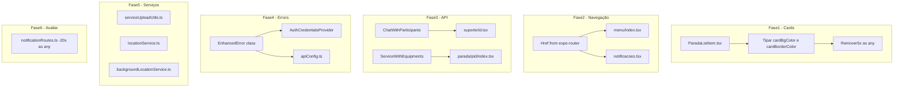

# Plano Atualizado para Remoção de `as any` - Versão2

## 1. Resumo do Estado Atual

### O que já foi feito:

- ✅ [`ParadaCard.tsx`](src/components/ParadaCard/ParadaCard.tsx) - `STATUS_CONFIG` tipado com `ThemeColors`
- ✅ [`RotaCard.tsx`](src/components/RotaCard/RotaCard.tsx) - `STATUS_CONFIG` tipado com `ThemeColors`

### O que ainda precisa ser feito:

**24 ocorrências de `as any` restantes** distribuídas em:

| Arquivo                        | Ocorrências | Prioridade | Complexidade |
| ------------------------------ | ----------- | ---------- | ------------ |
| `ParadaListItem.tsx`           | 5           | Alta       | Baixa        |
| `menu/index.tsx`               | 1           | Média      | Baixa        |
| `notificacoes.tsx`             | 1           | Média      | Baixa        |
| `suporte/[id].tsx`             | 2           | Média      | Média        |
| `parada/[pid]/index.tsx`       | 1           | Média      | Média        |
| `AuthCredentialsProvider.tsx`  | 2           | Baixa      | Baixa        |
| `locationService.ts`           | 1           | Baixa      | Alta         |
| `backgroundLocationService.ts` | 2           | Baixa      | Alta         |
| `serviceUploadUtils.ts`        | 6           | Baixa      | Média        |
| `apiConfig.ts`                 | 2           | Baixa      | Média        |
| `notificationRoutes.ts`        | ~20         | Baixa      | Alta         |

---

## 2. Análise Detalhada por Arquivo

### 2.1 ParadaListItem.tsx (5 ocorrências)

**Problema:** Variáveis `cardBgColor` e `cardBorderColor` são inferidas como `string` ao invés de `ThemeColors`.

```typescript
// Linha 138-139 - Problema atual
const cardBgColor = isProximaParada ? 'primary10' : 'white'  // inferido como string
const cardBorderColor = isProximaParada ? 'primary100' : statusConfig.borderColor

// Uso com as any (linhas 146, 151, 167, 218, 231)
backgroundColor={cardBgColor as any}
borderColor={cardBorderColor as any}
backgroundColor={statusConfig.bgColor as any}
color={statusConfig.textColor as any}
```

**Solução:** Tipar explicitamente as variáveis:

```typescript
const cardBgColor: ThemeColors = isProximaParada ? 'primary10' : 'white';
const cardBorderColor: ThemeColors = isProximaParada
  ? 'primary100'
  : statusConfig.borderColor;
```

---

### 2.2 Navegação - menu/index.tsx e notificacoes.tsx (2 ocorrências)

**Problema:** Rotas dinâmicas não tipadas.

```typescript
// menu/index.tsx:68
router.push(href as any);

// notificacoes.tsx:82
router.push(route as any);
```

**Solução:** Usar `Href` do Expo Router:

```typescript
import {Href} from 'expo-router';

// menu/index.tsx
function handleNavigate(href: string) {
  router.push(href as Href);
}

// notificacoes.tsx
if (route) {
  router.push(route as Href);
}
```

---

### 2.3 suporte/[id].tsx (2 ocorrências)

**Problema:** Tipo `Chat` não inclui `participants`.

```typescript
// Linhas 93-97
const chat = chatResult.result as any;
const participants = (chat.participants as any[]) || [];
```

**Solução:** Estender tipo ou criar interface:

```typescript
interface ChatWithParticipants extends Chat {
  participants: Array<{
    id: string;
    userId: string;
    name?: string;
  }>;
}

const chat = chatResult.result as ChatWithParticipants;
const participants = chat.participants || [];
```

---

### 2.4 parada/[pid]/index.tsx (1 ocorrência)

**Problema:** Tipo `Service` não inclui `equipments`.

```typescript
// Linha 343
<EquipmentList equipments={(service as any).equipments || []} />
```

**Solução:** Estender tipo `Service`:

```typescript
interface ServiceWithEquipments extends Service {
  equipments?: Equipment[];
}

// Usar type guard ou cast seguro
<EquipmentList equipments={(service as ServiceWithEquipments).equipments || []} />
```

---

### 2.5 AuthCredentialsProvider.tsx (2 ocorrências)

**Problema:** Adicionar propriedades customizadas ao Error.

```typescript
// Linhas 125-126
(enhancedError as any).originalError = error;
(enhancedError as any).status = status;
```

**Solução:** Criar classe de erro customizada:

```typescript
// src/utils/errors.ts
interface EnhancedErrorProps {
  originalError?: unknown;
  status?: number;
}

class EnhancedError extends Error {
  originalError?: unknown;
  status?: number;

  constructor(message: string, props?: EnhancedErrorProps) {
    super(message);
    this.originalError = props?.originalError;
    this.status = props?.status;
  }
}

// Uso no Provider
const enhancedError = new EnhancedError(errorMessage, {
  originalError: error,
  status,
});
```

---

### 2.6 notificationRoutes.ts (~20 ocorrências)

**Análise:** Este arquivo usa `as any` extensivamente para navegação. Como são rotas de um sistema legado que pode não existir mais no projeto atual, **recomendo avaliar se este arquivo ainda é necessário**.

**Opções:**

1. **Remover arquivo** se não for mais usado
2. **Manter como está** se funcionar corretamente (baixa prioridade)
3. **Refatorar completamente** criando rotas tipadas

---

### 2.7 serviceUploadUtils.ts (6 ocorrências)

**Problema:** Criação de objetos `FormData` ou similar com tipagem fraca.

**Solução:** Criar interfaces tipadas para os objetos de upload.

---

### 2.8 locationService.ts e backgroundLocationService.ts (3 ocorrências)

**Problema:** Configuração do plugin de geolocalização com tipagem complexa.

**Solução:** Criar interface para configuração do plugin ou usar tipos do próprio plugin.

---

### 2.9 apiConfig.ts (2 ocorrências)

**Problema:** Adicionar propriedades ao erro de resposta.

```typescript
// Linhas 34-35
(responseAdapterError as any).response = {status: error.response?.status};
(responseAdapterError as any).config = error.config;
```

**Solução:** Similar ao AuthCredentialsProvider - criar classe de erro tipada.

---

## 3. Plano de Execução Atualizado

### Fase 1: Cards de Status (Prioridade Alta) ✅ Parcialmente Completo

- [x] `ParadaCard.tsx` - STATUS_CONFIG tipado
- [x] `RotaCard.tsx` - STATUS_CONFIG tipado
- [ ] **1.1** Tipar variáveis `cardBgColor` e `cardBorderColor` em `ParadaListItem.tsx`
- [ ] **1.2** Remover `as any` de `ParadaListItem.tsx`

### Fase 2: Navegação (Prioridade Média)

- [ ] **2.1** Importar `Href` do expo-router em `menu/index.tsx`
- [ ] **2.2** Substituir `as any` por `as Href` em `menu/index.tsx`
- [ ] **2.3** Importar `Href` do expo-router em `notificacoes.tsx`
- [ ] **2.4** Substituir `as any` por `as Href` em `notificacoes.tsx`

### Fase 3: Tipagem de API (Prioridade Média)

- [ ] **3.1** Criar interface `ChatWithParticipants` em `suporte/[id].tsx`
- [ ] **3.2** Substituir `as any` por `as ChatWithParticipants` em `suporte/[id].tsx`
- [ ] **3.3** Criar interface `ServiceWithEquipments` em `parada/[pid]/index.tsx`
- [ ] **3.4** Substituir `as any` por `as ServiceWithEquipments` em `parada/[pid]/index.tsx`

### Fase 4: Error Handling (Prioridade Baixa)

- [ ] **4.1** Criar arquivo `src/utils/errors.ts` com classe `EnhancedError`
- [ ] **4.2** Atualizar `AuthCredentialsProvider.tsx` para usar `EnhancedError`
- [ ] **4.3** Atualizar `apiConfig.ts` para usar `EnhancedError`

### Fase 5: Serviços de Upload e Localização (Prioridade Baixa)

- [ ] **5.1** Avaliar tipagem em `serviceUploadUtils.ts`
- [ ] **5.2** Avaliar tipagem em `locationService.ts`
- [ ] **5.3** Avaliar tipagem em `backgroundLocationService.ts`

### Fase 6: Notification Routes (Avaliar)

- [ ] **6.1** Verificar se `notificationRoutes.ts` ainda é usado
- [ ] **6.2** Se usado, avaliar refatoração; se não, considerar remoção

---

## 4. Diagrama de Dependências



---

## 5. Próximos Passos Imediatos

1. **Fase 1.1-1.2**: Corrigir `ParadaListItem.tsx` - é a mudança mais simples e de maior impacto visual
2. **Fase 2**: Corrigir navegação - mudança simples usando `Href`
3. **Fase 3**: Corrigir tipagem de API - requer entender os tipos existentes

---

## 6. Notas

- O plano original foi parcialmente executado - `ParadaCard.tsx` e `RotaCard.tsx` foram corrigidos
- `ParadaListItem.tsx` tem o `STATUS_CONFIG` tipado mas as variáveis derivadas não
- `notificationRoutes.ts` tem muitas ocorrências mas pode ser código legado não utilizado
