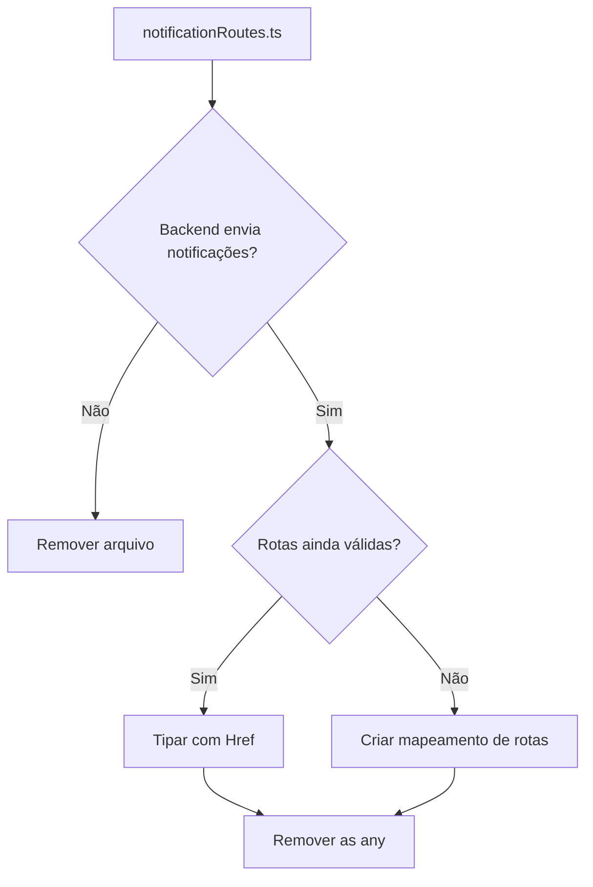

# Plano de Remoção de `as any` - Versão3 (Estado Atual)

## 1. Resumo do Estado Atual

### ✅ O que já foi concluído:

| Fase  | Arquivos                                               | Status      |
| ----- | ------------------------------------------------------ | ----------- |
| Fase1 | `ParadaCard.tsx`, `RotaCard.tsx`, `ParadaListItem.tsx` | ✅ Completo |
| Fase2 | `menu/index.tsx`, `notificacoes.tsx`                   | ✅ Completo |
| Fase3 | `suporte/[id].tsx`, `parada/[pid]/index.tsx`           | ✅ Completo |
| Fase4 | `AuthCredentialsProvider.tsx`, `apiConfig.ts`          | ✅ Completo |
| Fase5 | `serviceUploadUtils.ts`, `locationService.ts`          | ✅ Completo |

### 🔄 O que ainda precisa ser feito:

| Arquivo                        | Ocorrências | Prioridade | Complexidade |
| ------------------------------ | ----------- | ---------- | ------------ |
| `backgroundLocationService.ts` | 1           | Baixa      | Alta         |
| `notificationRoutes.ts`        | ~30         | Baixa      | Alta         |

---

## 2. Análise dos Arquivos Restantes

### 2.1 backgroundLocationService.ts (1 ocorrência)

**Localização:** Linha 442

**Problema:** Configuração do plugin `BackgroundGeolocation.setConfig()` com tipagem incompleta.

```typescript
// Código atual (linha 430-442)
await BackgroundGeolocation.setConfig({
  extras: {
    driver_id: authConfig.driverId,
    app_version: '1.0.0',
    platform: Platform.OS,
  },
  http: {
    headers: {
      Authorization: `Bearer ${authConfig.accessToken}`,
      'x-tenant-id': authConfig.tenantId,
    },
  },
} as any);
```

**Solução:** Importar e usar o tipo correto do plugin:

```typescript
import BackgroundGeolocation, {
  Config,
} from 'react-native-background-geolocation-android';

await BackgroundGeolocation.setConfig({
  extras: {
    driver_id: authConfig.driverId,
    app_version: '1.0.0',
    platform: Platform.OS,
  },
  http: {
    headers: {
      Authorization: `Bearer ${authConfig.accessToken}`,
      'x-tenant-id': authConfig.tenantId,
    },
  },
} as Partial<Config>);
```

---

### 2.2 notificationRoutes.ts (~30 ocorrências)

**Localização:** [`src/services/notification/notificationRoutes.ts`](src/services/notification/notificationRoutes.ts)

**Status:** Este arquivo ainda é usado - é importado em [`NotificationContext.tsx`](src/services/notification/NotificationContext.tsx:22)

**Problema:** Rotas de navegação legadas que não correspondem mais à estrutura atual do Expo Router.

```typescript
// Exemplos das rotas problemáticas:
home: () => router.replace('/(auth)/HomeScreen' as any),
membership: () => router.navigate('/(auth)/Membership/HomeScreenMembership' as any),
shopping: () => router.navigate('/(auth)/Shopping/GiftCard/HomeScreenShopping' as any),
// ... mais ~30 rotas
```

**Opções de Solução:**

#### Opção A: Refatoração Completa (Recomendado se as notificações forem críticas)

1. Mapear todas as rotas antigas para as novas rotas do Expo Router
2. Criar tipos para as rotas válidas
3. Substituir `as any` por `as Href`

#### Opção B: Manter como está (Aceitável para código legado)

- As rotas funcionam com `as any`
- Baixa prioridade pois são notificações push
- Documentar como débito técnico

#### Opção C: Remover funcionalidade (Se não for mais usada)

- Verificar se as notificações push com deep linking ainda são enviadas pelo backend
- Se não, remover o arquivo completamente

---

## 3. Plano de Execução

### Tarefa1: Corrigir backgroundLocationService.ts

- [ ] **1.1** Verificar se o tipo `Config` está disponível no plugin
- [ ] **1.2** Importar o tipo correto ou criar interface parcial
- [ ] **1.3** Substituir `as any` por `as Partial<Config>`

### Tarefa2: Avaliar notificationRoutes.ts

- [ ] **2.1** Verificar se o backend ainda envia notificações com deep links
- [ ] **2.2** Se sim, mapear rotas antigas vs novas rotas do app
- [ ] **2.3** Decidir entre refatorar, manter ou remover

---

## 4. Diagrama de Decisão



---

## 5. Próximos Passos Imediatos

1. **Tarefa1** - Corrigir `backgroundLocationService.ts` - é apenas 1 ocorrência
2. **Tarefa2** - Avaliar se `notificationRoutes.ts` ainda é necessário

---

## 6. Notas

- O plano anterior (v2) estava desatualizado - muitas tarefas marcadas como pendentes já haviam sido concluídas
- A maioria dos `as any` em arquivos `.tsx` foram removidos
- Restam apenas ~31 ocorrências em arquivos `.ts` de serviços
