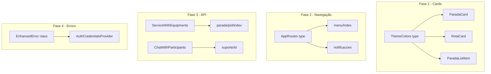

# Plano para Remover Uso de `as any` do Projeto

## 1. Análise do Problema

O projeto possui 15 ocorrências de `as any`, distribuídas em diferentes categorias:

### 1.1 Categorias de Uso

| Categoria                | Arquivos                             | Quantidade | Complexidade |
| ------------------------ | ------------------------------------ | ---------- | ------------ |
| Cores de status em cards | ParadaCard, RotaCard, ParadaListItem | 9          | Média        |
| Navegação                | menu/index, notificacoes             | 2          | Baixa        |
| Tipagem de API           | suporte/[id], parada/[pid]           | 3          | Média        |
| Error handling           | AuthCredentialsProvider              | 1          | Baixa        |

---

## 2. Problemas por Arquivo

### 2.1 Cards de Status - Problema Principal

**Arquivos afetados:**

- [`src/components/ParadaCard/ParadaCard.tsx`](src/components/ParadaCard/ParadaCard.tsx)
- [`src/components/RotaCard/RotaCard.tsx`](src/components/RotaCard/RotaCard.tsx)
- [`src/app/(auth)/(tabs)/rotas-detalhadas/[id]/_components/ParadaListItem.tsx`](<src/app/(auth)/(tabs)/rotas-detalhadas/[id]/_components/ParadaListItem.tsx>)

**Causa raiz:**
O `STATUS_CONFIG` define cores como strings literais simples, mas o Restyle espera que as cores sejam do tipo `ThemeColors`.

```typescript
// Problema - cores como string simples
const STATUS_CONFIG = {
  pending: { label: 'Pendente', bgColor: 'gray100', textColor: 'gray600' },
  // ...
};

// Uso com as any
<Box backgroundColor={statusConfig.bgColor as any}>
```

**Solução:**
Tipar o `STATUS_CONFIG` usando `ThemeColors` do tema:

```typescript
import {ThemeColors} from '@/theme';

const STATUS_CONFIG: Record<
  string,
  {
    label: string;
    bgColor: ThemeColors;
    textColor: ThemeColors;
  }
> = {
  pending: {label: 'Pendente', bgColor: 'gray100', textColor: 'gray600'},
  // ...
};
```

---

### 2.2 Navegação

**Arquivos afetados:**

- [`src/app/(auth)/(tabs)/menu/index.tsx:68`](<src/app/(auth)/(tabs)/menu/index.tsx:68>)
- [`src/app/(auth)/(tabs)/notificacoes.tsx:82`](<src/app/(auth)/(tabs)/notificacoes.tsx:82>)

**Causa:**
Rotas dinâmicas não tipadas corretamente no Expo Router.

**Solução:**
Criar tipo de rotas da aplicação ou usar `Href` do Expo Router:

```typescript
import {Href} from 'expo-router';

function handleNavigate(href: string) {
  router.push(href as Href);
}
```

---

### 2.3 Tipagem de API

**Arquivos afetados:**

- [`src/app/(auth)/(tabs)/rotas-detalhadas/[id]/parada/[pid]/index.tsx:343`](<src/app/(auth)/(tabs)/rotas-detalhadas/[id]/parada/[pid]/index.tsx:343>)
- [`src/app/(auth)/(tabs)/menu/suporte/[id].tsx:93-97`](<src/app/(auth)/(tabs)/menu/suporte/[id].tsx:93>)

**Causa:**
Tipos incompletos para respostas de API.

**Solução:**
Estender os tipos existentes para incluir propriedades faltantes:

```typescript
// Adicionar equipments ao tipo Service
interface ServiceWithEquipments extends Service {
  equipments?: Equipment[];
}
```

---

### 2.4 Error Handling

**Arquivo:**

- [`src/services/authCredentials/Providers/AuthCredentialsProvider.tsx:125-126`](src/services/authCredentials/Providers/AuthCredentialsProvider.tsx:125)

**Causa:**
Adicionar propriedades customizadas ao objeto Error.

**Solução:**
Criar classe de erro customizada:

```typescript
class EnhancedError extends Error {
  originalError?: unknown;
  status?: number;

  constructor(message: string) {
    super(message);
  }
}

// Uso
const enhancedError = new EnhancedError(errorMessage);
enhancedError.originalError = error;
enhancedError.status = status;
```

---

## 3. Plano de Execução

### Fase 1: Cards de Status (Prioridade Alta)

- [ ] **1.1** Criar tipo utilitário para configuração de status em [`src/theme/index.ts`](src/theme/index.ts)
- [ ] **1.2** Atualizar `STATUS_CONFIG` em [`ParadaCard.tsx`](src/components/ParadaCard/ParadaCard.tsx) com tipagem correta
- [ ] **1.3** Atualizar `STATUS_CONFIG` em [`RotaCard.tsx`](src/components/RotaCard/RotaCard.tsx) com tipagem correta
- [ ] **1.4** Atualizar `STATUS_CONFIG` em [`ParadaListItem.tsx`](<src/app/(auth)/(tabs)/rotas-detalhadas/[id]/_components/ParadaListItem.tsx>) com tipagem correta
- [ ] **1.5** Remover `as any` dos três arquivos

### Fase 2: Navegação (Prioridade Média)

- [ ] **2.1** Criar tipo de rotas da aplicação
- [ ] **2.2** Atualizar [`menu/index.tsx`](<src/app/(auth)/(tabs)/menu/index.tsx>) para usar tipo correto
- [ ] **2.3** Atualizar [`notificacoes.tsx`](<src/app/(auth)/(tabs)/notificacoes.tsx>) para usar tipo correto

### Fase 3: Tipagem de API (Prioridade Média)

- [ ] **3.1** Estender tipo `Service` para incluir `equipments`
- [ ] **3.2** Criar tipo `ChatWithParticipants` para suporte
- [ ] **3.3** Atualizar [`parada/[pid]/index.tsx`](<src/app/(auth)/(tabs)/rotas-detalhadas/[id]/parada/[pid]/index.tsx>) com tipo correto
- [ ] **3.4** Atualizar [`suporte/[id].tsx`](<src/app/(auth)/(tabs)/menu/suporte/[id].tsx>) com tipo correto

### Fase 4: Error Handling (Prioridade Baixa)

- [ ] **4.1** Criar classe `EnhancedError` em [`src/utils/errors.ts`](src/utils/errors.ts)
- [ ] **4.2** Atualizar [`AuthCredentialsProvider.tsx`](src/services/authCredentials/Providers/AuthCredentialsProvider.tsx) para usar classe customizada

---

## 4. Diagrama de Dependências



---

## 5. Detalhes de Implementação

### 5.1 Tipo para StatusConfig

```typescript
// src/theme/types.ts
import {ThemeColors} from './theme';

export interface StatusConfigItem {
  label: string;
  bgColor: ThemeColors;
  textColor: ThemeColors;
  borderColor?: ThemeColors;
}

export type StatusConfig<K extends string> = Record<K, StatusConfigItem>;
```

### 5.2 Exemplo de Refatoração - ParadaCard

**Antes:**

```typescript
const STATUS_CONFIG = {
  pending: { label: 'Pendente', bgColor: 'gray100', textColor: 'gray600' },
  inProgress: { label: 'Em andamento', bgColor: 'primary10', textColor: 'primary100' },
  completed: { label: 'Realizado', bgColor: 'tertiary10', textColor: 'tertiary100' },
  canceled: { label: 'Nao realizado', bgColor: 'redError', textColor: 'white' },
};

// Uso
<Box backgroundColor={statusConfig.bgColor as any}>
```

**Depois:**

```typescript
import { ThemeColors } from '@/theme';

type ParadaStatus = 'pending' | 'inProgress' | 'completed' | 'canceled';

const STATUS_CONFIG: Record<ParadaStatus, {
  label: string;
  bgColor: ThemeColors;
  textColor: ThemeColors;
}> = {
  pending: { label: 'Pendente', bgColor: 'gray100', textColor: 'gray600' },
  inProgress: { label: 'Em andamento', bgColor: 'primary10', textColor: 'primary100' },
  completed: { label: 'Realizado', bgColor: 'tertiary10', textColor: 'tertiary100' },
  canceled: { label: 'Nao realizado', bgColor: 'redError', textColor: 'white' },
};

// Uso - sem as any
<Box backgroundColor={statusConfig.bgColor}>
```

---

## 6. Benefícios Esperados

1. **Type Safety**: TypeScript detectará cores inválidas em tempo de compilação
2. **IDE Support**: Autocomplete funcionará para cores do tema
3. **Refatoração Segura**: Mudanças no tema serão propagadas automaticamente
4. **Código Limpo**: Remoção de 15 ocorrências de `as any`

---

## 7. Tarefas Pendentes Adicionais

Durante a análise, também identifiquei:

- [ ] Corrigir texto de debug `"Estou aqui!ggg"` para `"Estou aqui!"` em [`dados-entrega/index.tsx:478`](<src/app/(auth)/(tabs)/rotas-detalhadas/[id]/parada/[pid]/dados-entrega/index.tsx:478>)
