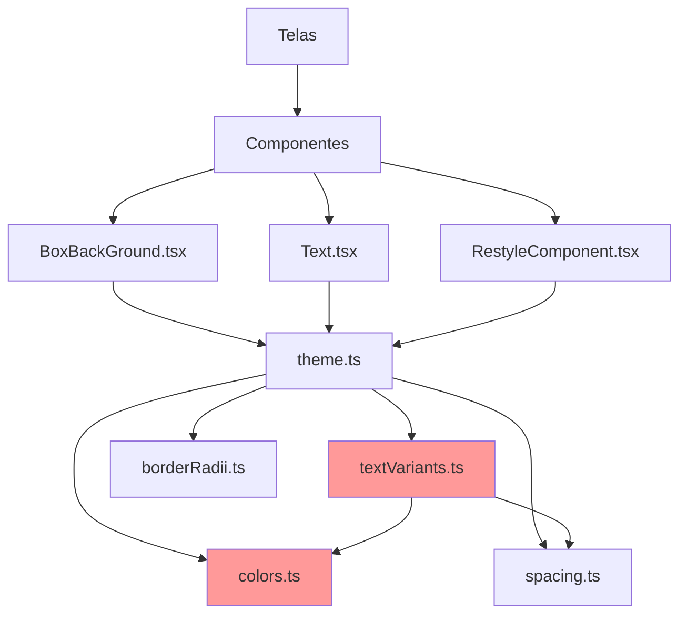

# Análise de Erros do Restyle no Projeto

## 1. Estrutura Atual do Tema

### 1.1 Arquivos do Tema

O tema está localizado em `src/theme/` com a seguinte estrutura:

```
src/theme/
├── index.ts          # Exportações centrais
├── theme.ts          # Definição principal do tema com createTheme
├── colors.ts         # Paleta de cores
├── spacing.ts        # Sistema de espaçamento (measure)
├── textVariants.ts   # Variantes de texto
├── borderRadii.ts    # Raios de borda
└── functions/
    └── Metrics.ts    # Funções de escala (horizontalScale, verticalScale, etc.)
```

### 1.2 Definição do Tema Principal

```typescript
// src/theme/theme.ts
export const theme = createTheme({
  colors,
  spacing: measure,
  borderRadii,
  borderWidths: { ... },
  textVariants: { ... }
});
```

### 1.3 Sistema de Spacing

O spacing é definido através do objeto `measure` que contém:

- **Font sizes (f)**: `f10` a `f40` - usando `fontScale()`
- **Horizontal (x)**: `x0` a `x500` - usando `horizontalScale()`
- **Vertical (y)**: `y0` a `y700` - usando `verticalScale()`
- **Left (l)**: `l0` a `l60` - usando `horizontalScale()`
- **Right (r)**: `r0` a `r60` - usando `horizontalScale()`
- **Top (t)**: `t0` a `t60` - usando `verticalScale()`
- **Bottom (b)**: `b0` a `b60` - usando `verticalScale()`
- **Moderate (m)**: `m0` a `m500` - usando `moderateScale()`

### 1.4 Componentes Restyle Criados

O projeto cria componentes Restyle personalizados em:

- [`src/components/BoxBackGround/BoxBackGround.tsx`](src/components/BoxBackGround/BoxBackGround.tsx) - Componente Box com `createBox`
- [`src/components/Text/Text.tsx`](src/components/Text/Text.tsx) - Componente Text com `createText`
- [`src/components/RestyleComponent/RestyleComponent.tsx`](src/components/RestyleComponent/RestyleComponent.tsx) - Outros componentes com `createRestyleComponent`

---

## 2. Problemas Identificados

### 2.1 **CRÍTICO: Cores Referenciadas em textVariants que Não Existem no Tema**

**Arquivo:** [`src/theme/textVariants.ts`](src/theme/textVariants.ts)

As seguintes variantes de texto referenciam cores que **não existem** no objeto `colors` definido em [`colors.ts`](src/theme/colors.ts):

| Linha | Variante             | Cor Referenciada       | Status        |
| ----- | -------------------- | ---------------------- | ------------- |
| 118   | `textFinePrint`      | `colorTextFinePrint`   | ❌ Não existe |
| 160   | `textPlaceholder`    | `colorTextPlaceHolder` | ❌ Não existe |
| 165   | `textSubTitle`       | `colorTextSubTitle`    | ❌ Não existe |
| 170   | `textSubTitleOrange` | `colorTextOrange`      | ❌ Não existe |

**Problema:** Isso causará erros em tempo de execução quando essas variantes forem usadas, pois o Restyle não encontrará as cores no tema.

**Correção necessária:** Adicionar as cores faltantes ao objeto `colors` em [`colors.ts`](src/theme/colors.ts) ou alterar as referências para cores existentes.

---

### 2.2 **CRÍTICO: Preset de Texto Inexistente**

**Arquivos afetados:**

- [`src/components/ParadaCard/ParadaCard.tsx:120`](src/components/ParadaCard/ParadaCard.tsx:120)
- [`src/components/ParadaCard/ParadaCard.tsx:132`](src/components/ParadaCard/ParadaCard.tsx:132)
- [`src/app/(auth)/(tabs)/menu/suporte/[id].tsx:417`](<src/app/(auth)/(tabs)/menu/suporte/[id].tsx:417>)

**Problema:** O preset `text10` é usado nos componentes mas **não existe** em `TextVariantsPreset`:

```typescript
// Uso incorreto:
<Text preset="text10" fontWeightPreset="bold" color="white">PROXIMA</Text>
```

**Correção necessária:** Adicionar `text10` ao tipo `TextVariantsPreset` e ao objeto `textVariants` em [`textVariants.ts`](src/theme/textVariants.ts).

---

### 2.3 **CRÍTICO: Valor de Spacing Inválido**

**Arquivo:** [`src/components/DocumentCollectionForm/DocumentCollectionForm.tsx:66`](src/components/DocumentCollectionForm/DocumentCollectionForm.tsx:66)

```typescript
// Uso incorreto:
<Text marginBottom="s" ...>
```

**Problema:** O valor `"s"` não existe no sistema de spacing do tema. O spacing usa valores como `y4`, `y8`, `y12`, etc.

**Correção necessária:** Usar um valor válido como `marginBottom="y4"` ou `marginBottom="y8"`.

---

### 2.4 **MÉDIO: Inconsistência entre Fontes do Texto e textVariants**

**Arquivos:**

- [`src/theme/textVariants.ts`](src/theme/textVariants.ts) - Usa `Montserrat_*`
- [`src/components/Text/Text.tsx`](src/components/Text/Text.tsx) - Usa `Ubuntu_*`
- [`src/theme/theme.ts:29`](src/theme/theme.ts:29) - Defaults usam `Ubuntu_400Regular`

**Problema:** As variantes de texto definem `fontFamily: 'Montserrat_400Regular'` mas o componente `Text` usa `FontWeight` mapeando para fontes `Ubuntu_*`:

```typescript
// textVariants.ts
text14: {
  fontFamily: 'Montserrat_400Regular', // Montserrat
}

// Text.tsx
const FontWeight = {
  regular: 'Ubuntu_400Regular', // Ubuntu
  semibold: 'Ubuntu_500Medium',
  bold: 'Ubuntu_700Bold',
}
```

**Correção necessária:** Padronizar para usar apenas uma família de fontes em todo o projeto.

---

### 2.5 **MÉDIO: Erro no Preset text17**

**Arquivo:** [`src/theme/textVariants.ts:69`](src/theme/textVariants.ts:69)

```typescript
text17: {
  color: 'colorTextPrimary',
  fontSize: measure.m18, // ❌ Deveria ser measure.m17
  fontFamily: 'Montserrat_400Regular',
},
```

**Problema:** O preset `text17` usa `measure.m18` em vez de `measure.m17`.

**Correção necessária:** Alterar para `fontSize: measure.m17`.

---

### 2.6 **BAIXO: Uso de `as any` para Type Casting**

**Arquivos:**

- [`src/components/ParadaCard/ParadaCard.tsx:84`](src/components/ParadaCard/ParadaCard.tsx:84)
- [`src/components/ParadaCard/ParadaCard.tsx:132`](src/components/ParadaCard/ParadaCard.tsx:132)

```typescript
// Uso de type casting para contornar erros de tipo
<Text preset="text10" fontWeightPreset="semibold" color={statusConfig.textColor as any}>
```

**Problema:** O uso de `as any` mascara erros de tipo em vez de corrigir a causa raiz.

**Correção necessária:** Adicionar as cores corretas ao tema e remover os type casts.

---

## 3. Guia de Uso Correto do Restyle

### 3.1 Princípios Básicos

O Restyle é uma biblioteca que permite criar componentes estilizados de forma type-safe usando um tema centralizado.

#### Componentes Principais

1. **createTheme** - Define o tema com cores, espaçamentos, etc.
2. **createBox** - Cria um componente View com props de estilo
3. **createText** - Cria um componente Text com variantes
4. **createRestyleComponent** - Cria componentes customizados com props de estilo

### 3.2 Uso Correto do Spacing

```typescript
// ✅ Correto - usando valores do tema
<Box marginTop="y12" paddingHorizontal="x16" padding="y12">

// ❌ Incorreto - usando valores que não existem
<Box marginTop="s" padding="16">
```

### 3.3 Uso Correto de Cores

```typescript
// ✅ Correto - usando cores do tema
<Text color="primary100">
<Box backgroundColor="white">

// ❌ Incorreto - usando cores que não existem
<Text color="colorTextFinePrint"> // Não existe no tema
```

### 3.4 Uso Correto de TextVariants

```typescript
// ✅ Correto - usando variante existente
<Text preset="text14" color="colorTextPrimary">

// ❌ Incorreto - usando variante inexistente
<Text preset="text10"> // Não existe em TextVariantsPreset
```

### 3.5 Criando Novos Componentes Restyle

```typescript
import {
  createRestyleComponent,
  layout,
  LayoutProps,
  spacing,
  SpacingProps,
} from '@shopify/restyle';
import {Theme} from '@/theme';

type MyComponentProps = LayoutProps<Theme> &
  SpacingProps<Theme> & {
    children: React.ReactNode;
  };

export const MyComponent = createRestyleComponent<MyComponentProps, Theme>(
  [layout, spacing],
  View
);
```

---

## 4. Lista de Arquivos que Precisam de Correção

### 4.1 Arquivos do Tema (Prioridade Alta)

| Arquivo                                                  | Problema                         | Ação                                                                                           |
| -------------------------------------------------------- | -------------------------------- | ---------------------------------------------------------------------------------------------- |
| [`src/theme/textVariants.ts`](src/theme/textVariants.ts) | Cores inexistentes referenciadas | Adicionar cores ou corrigir referências                                                        |
| [`src/theme/textVariants.ts`](src/theme/textVariants.ts) | Preset `text10` faltando         | Adicionar preset                                                                               |
| [`src/theme/textVariants.ts`](src/theme/textVariants.ts) | `text17` usa `m18`               | Corrigir para `m17`                                                                            |
| [`src/theme/colors.ts`](src/theme/colors.ts)             | Cores faltantes                  | Adicionar `colorTextFinePrint`, `colorTextPlaceHolder`, `colorTextSubTitle`, `colorTextOrange` |

### 4.2 Componentes (Prioridade Média)

| Arquivo                                                                                                                                | Problema                      | Ação                               |
| -------------------------------------------------------------------------------------------------------------------------------------- | ----------------------------- | ---------------------------------- |
| [`src/components/DocumentCollectionForm/DocumentCollectionForm.tsx`](src/components/DocumentCollectionForm/DocumentCollectionForm.tsx) | `marginBottom="s"` inválido   | Usar valor válido como `y4`        |
| [`src/components/ParadaCard/ParadaCard.tsx`](src/components/ParadaCard/ParadaCard.tsx)                                                 | `preset="text10"` inexistente | Adicionar preset ou usar existente |
| [`src/components/Text/Text.tsx`](src/components/Text/Text.tsx)                                                                         | Inconsistência de fontes      | Padronizar com textVariants        |

### 4.3 Telas (Prioridade Baixa)

| Arquivo                                                                                        | Problema                      | Ação                               |
| ---------------------------------------------------------------------------------------------- | ----------------------------- | ---------------------------------- |
| [`src/app/(auth)/(tabs)/menu/suporte/[id].tsx`](<src/app/(auth)/(tabs)/menu/suporte/[id].tsx>) | `preset="text10"` inexistente | Adicionar preset ou usar existente |

---

## 5. Resumo de Ações Necessárias

### Ações Imediatas (Críticas)

1. **Adicionar cores faltantes ao tema** em [`colors.ts`](src/theme/colors.ts):

   ```typescript
   colorTextFinePrint: palette.gray500,
   colorTextPlaceHolder: palette.gray400,
   colorTextSubTitle: palette.gray600,
   colorTextOrange: palette.secondary100,
   ```

2. **Adicionar preset text10** em [`textVariants.ts`](src/theme/textVariants.ts):

   ```typescript
   text10: {
     color: 'colorTextPrimary',
     fontSize: measure.m10,
     fontFamily: 'Montserrat_400Regular',
   },
   ```

3. **Corrigir spacing inválido** em [`DocumentCollectionForm.tsx`](src/components/DocumentCollectionForm/DocumentCollectionForm.tsx):
   ```typescript
   // De: marginBottom="s"
   // Para: marginBottom="y4"
   ```

### Ações de Médio Prazo

4. **Padronizar fontes** entre `textVariants.ts` e `Text.tsx`

5. **Corrigir preset text17** para usar `measure.m17`

6. **Remover type casts** (`as any`) após correções do tema

---

## 6. Diagrama de Dependências



**Legenda:**

- Vermelho: Arquivos com problemas identificados
- Setas: Dependências entre arquivos

---

## 7. Conclusão

O projeto possui uma estrutura de tema bem organizada, mas existem inconsistências importantes que precisam ser corrigidas:

1. **Cores referenciadas em textVariants que não existem** - Isso causará crashes em produção
2. **Presets de texto faltando** - Pode causar erros de TypeScript e comportamento inesperado
3. **Valores de spacing inválidos** - Não funcionarão como esperado
4. **Inconsistência de fontes** - Pode causar problemas visuais

A correção desses problemas garantirá que o sistema de temas funcione corretamente e que o TypeScript possa validar o uso correto das props de estilo.
