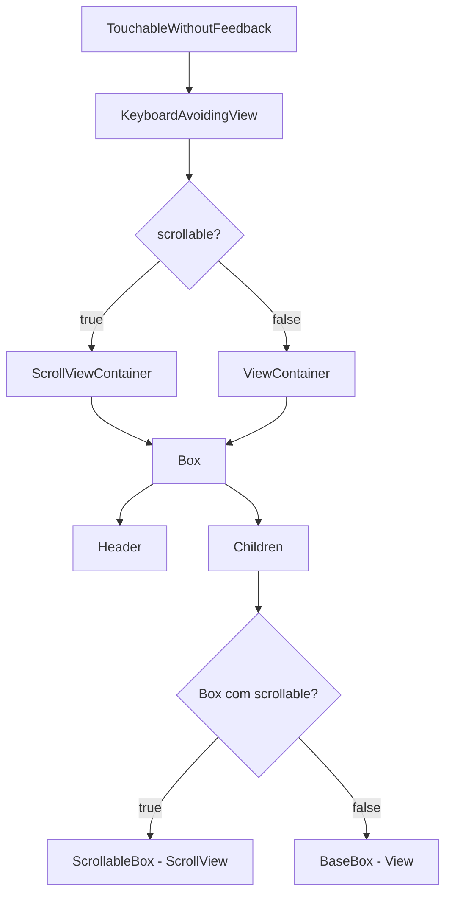
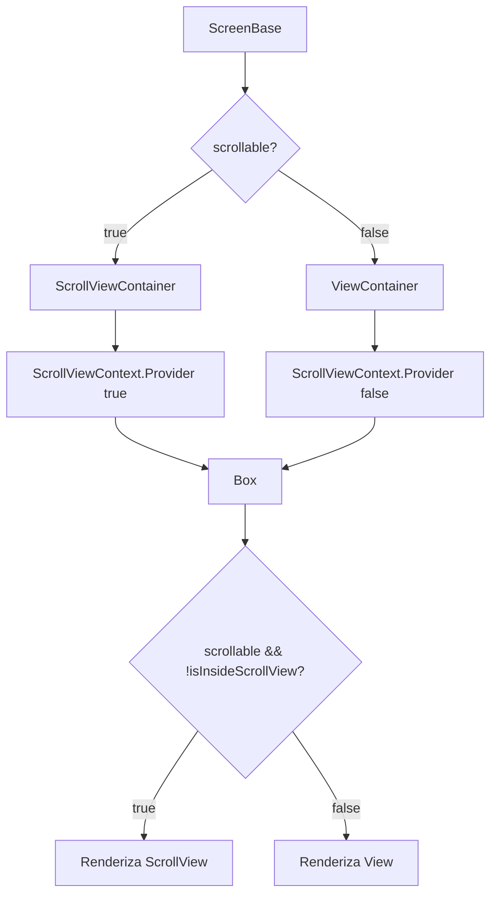

# Análise de Performance de Scroll - ScreenBase e Box

## Sumário Executivo

O problema de scroll com delay e comportamento irregular é causado por múltiplos fatores arquiteturais no componente `ScreenBase` e sua interação com o componente `Box`. A análise identificou **5 causas principais** que contribuem para o problema.

---

## 1. Estrutura Atual dos Componentes

### 1.1 Hierarquia de Componentes



### 1.2 Fluxo de Renderização

```mermaid
sequenceDiagram
    participant User
    participant TWF as TouchableWithoutFeedback
    participant KAV as KeyboardAvoidingView
    participant SVC as ScrollViewContainer
    participant Box as Box
    participant Child as Children

    User->>TWF: Touch/Scroll
    TWF->>KAV: Propaga evento
    KAV->>SVC: Propaga evento
    SVC->>Box: Propaga evento
    Box->>Child: Propaga evento
    Note over User,Child: Delay causado por múltiplas camadas
```

---

## 2. Causas Identificadas do Problema

### 2.1 Nested ScrollViews - CRÍTICO

**Descrição:** Quando `ScreenBase` tem `scrollable=true` e o conteúdo interno usa `Box` com `scrollable=true`, ocorre o aninhamento de ScrollViews.

**Estrutura problemática:**

```
ScreenBase scrollable=true
└── ScrollViewContainer (ScrollView)
    └── Box
        └── Children
            └── Box scrollable=true
                └── ScrollableBox (ScrollView) ← NESTED!
```

**Impacto:**

- Android: Scroll travado ou irregular
- iOS: Scroll com delay e gesture conflicts
- Performance degradation significativa

**Localização no código:**

- [`ScreenContainer.tsx:14-21`](src/components/ScreenContainer/ScreenContainer.tsx:14) - ScrollViewContainer
- [`BoxBackGround.tsx:9`](src/components/BoxBackGround/BoxBackGround.tsx:9) - ScrollableBox

### 2.2 TouchableWithoutFeedback Interferindo no Scroll - ALTO

**Descrição:** O `TouchableWithoutFeedback` envolve toda a árvore de componentes para dismiss do teclado, capturando eventos de touch.

**Código problemático em** [`ScreenBase.tsx:40`](src/components/ScreensBase/ScreenBase.tsx:40):

```tsx
<TouchableWithoutFeedback onPress={Keyboard.dismiss}>
  <KeyboardAvoidingView ...>
    <Container ...>
      {/* conteúdo scrollável */}
    </Container>
  </KeyboardAvoidingView>
</TouchableWithoutFeedback>
```

**Impacto:**

- Intercepta gestures de scroll antes de chegarem ao ScrollView
- Cria delay na resposta do scroll
- Comportamento irregular em gestures rápidos

### 2.3 KeyboardAvoidingView com Configuração Subótima - MÉDIO

**Descrição:** Configuração do `KeyboardAvoidingView` pode causar re-layouts frequentes.

**Código em** [`ScreenBase.tsx:41-45`](src/components/ScreensBase/ScreenBase.tsx:41):

```tsx
<KeyboardAvoidingView
  style={{ flex: 1 }}
  behavior={Platform.OS === 'ios' ? 'padding' : undefined}
  keyboardVerticalOffset={Platform.OS === 'ios' ? 0 : 0}
>
```

**Problemas:**

- `behavior="undefined"` no Android pode causar problemas
- `keyboardVerticalOffset={0}` pode não ser ideal para todas as telas
- Re-layouts durante animação do teclado afetam scroll

### 2.4 ScrollViewContainer sem Otimizações - MÉDIO

**Descrição:** O `ScrollViewContainer` não possui otimizações de performance.

**Código em** [`ScreenContainer.tsx:14-21`](src/components/ScreenContainer/ScreenContainer.tsx:14):

```tsx
<ScrollView
  keyboardShouldPersistTaps="handled"
  keyboardDismissMode="interactive"
  automaticallyAdjustKeyboardInsets={Platform.OS === 'ios'}
  contentContainerStyle={{ flexGrow: 1 }}
  style={{ backgroundColor, flex: 1 }}
>
```

**Propriedades faltantes:**

- `nestedScrollEnabled={true}` - essencial para Android
- `showsVerticalScrollIndicator` - controle visual
- `removeClippedSubviews={true}` - otimização de memória
- `scrollEventThrottle={16}` - performance iOS

### 2.5 ScrollableBox sem Configuração Adequada - MÉDIO

**Descrição:** O `ScrollableBox` não recebe props de otimização.

**Código em** [`BoxBackGround.tsx:22`](src/components/BoxBackGround/BoxBackGround.tsx:22):

```tsx
const RNBox = scrollable ? ScrollableBox : BaseBox;
// ...
<RNBox {...rest} ref={ref}>
```

**Problemas:**

- Não há `nestedScrollEnabled` quando usado dentro de outro ScrollView
- Props de ScrollView são passadas via spread sem validação
- Sem tratamento para conflitos de gesture

---

## 3. Cenários de Problema

### Cenário A: ScreenBase scrollable + Box scrollable

```
[ScreenBase scrollable=true]
  └── [ScrollViewContainer]
      └── [Box]
          └── [Box scrollable=true] ← PROBLEMA: Nested ScrollView
              └── conteúdo
```

### Cenário B: ScreenBase não scrollable + ScrollView interna

```
[ScreenBase scrollable=false]
  └── [ViewContainer]
      └── [Box]
          └── [ScrollView customizada] ← Pode funcionar, mas...
              └── TouchableWithoutFeedback interfere
```

### Cenário C: Lista dentro de ScreenBase scrollable

```
[ScreenBase scrollable=true]
  └── [ScrollViewContainer]
      └── [Box]
          └── [FlatList/SectionList] ← PROBLEMA: Lista dentro de ScrollView
```

---

## 4. Soluções Propostas

### 4.1 Solução 1: Eliminar Nested ScrollViews - RECOMENDADA

**Abordagem:** Garantir que apenas um nível de scroll exista por tela.

**Alterações:**

1. **ScreenBase** - Adicionar prop para desabilitar scroll do container:

```tsx
interface ScreenBaseProps {
  scrollable?: boolean;
  disableContainerScroll?: boolean; // NOVO
  // ...
}
```

2. **Box** - Adicionar validação de contexto:

```tsx
// Criar contexto para detectar ScrollView pai
const ScrollViewContext = createContext(false);

// No Box
const isInsideScrollView = useContext(ScrollViewContext);
const shouldScroll = scrollable && !isInsideScrollView;
```

**Diagrama da solução:**



### 4.2 Solução 2: Substituir TouchableWithoutFeedback - ALTERNATIVA

**Abordagem:** Usar `ScrollView` com `keyboardDismissMode` em vez de `TouchableWithoutFeedback`.

**Alterações:**

1. Remover `TouchableWithoutFeedback`:

```tsx
// ANTES
<TouchableWithoutFeedback onPress={Keyboard.dismiss}>
  <KeyboardAvoidingView>
    <Container>...</Container>
  </KeyboardAvoidingView>
</TouchableWithoutFeedback>

// DEPOIS
<KeyboardAvoidingView>
  <Container keyboardDismissMode="on-drag">...</Container>
</KeyboardAvoidingView>
```

2. Usar `Keyboard.dismiss()` em gestures específicos se necessário.

### 4.3 Solução 3: Otimizar ScrollViews - COMPLEMENTAR

**Abordagem:** Adicionar props de otimização em todas as ScrollViews.

**Para ScrollViewContainer:**

```tsx
<ScrollView
  keyboardShouldPersistTaps="handled"
  keyboardDismissMode="interactive"
  automaticallyAdjustKeyboardInsets={Platform.OS === 'ios'}
  contentContainerStyle={{ flexGrow: 1 }}
  style={{ backgroundColor, flex: 1 }}
  nestedScrollEnabled={true} // NOVO
  showsVerticalScrollIndicator={true} // NOVO
  removeClippedSubviews={true} // NOVO - Android
  scrollEventThrottle={16} // NOVO - iOS
>
```

**Para ScrollableBox:**

```tsx
const ScrollableBox = createBox<Theme, ScrollViewProps>(ScrollView);

// Adicionar props padrão
const defaultScrollViewProps = {
  nestedScrollEnabled: true,
  showsVerticalScrollIndicator: true,
  scrollEventThrottle: 16,
};
```

### 4.4 Solução 4: Arquitetura de Container Único - LONGO PRAZO

**Abordagem:** Refatorar para usar um padrão de container único com composição.

**Nova estrutura:**

```tsx
// ScreenBaseNova.tsx
interface ScreenBaseProps {
  scrollBehavior?: 'none' | 'screen' | 'content';
  // ...
}

// Uso:
<ScreenBase scrollBehavior="screen">
  {/* Conteúdo sem scroll próprio */}
</ScreenBase>

<ScreenBase scrollBehavior="none">
  <Box scrollable> {/* Scroll no conteúdo */}
    {/* conteúdo */}
  </Box>
</ScreenBase>
```

---

## 5. Plano de Implementação Recomendado

### Fase 1: Quick Fixes - Imediato

1. Adicionar `nestedScrollEnabled={true}` no `ScrollViewContainer`
2. Adicionar `scrollEventThrottle={16}` no `ScrollViewContainer`
3. Documentar anti-pattern de nested ScrollViews

### Fase 2: Correção Arquitetural - Curto Prazo

1. Implementar `ScrollViewContext` para detectar aninhamento
2. Adicionar warning em desenvolvimento para nested ScrollViews
3. Substituir `TouchableWithoutFeedback` por `keyboardDismissMode`

### Fase 3: Refatoração - Médio Prazo

1. Revisar todas as telas que usam `ScreenBase` + `Box scrollable`
2. Migrar para padrão de container único
3. Criar linter rule para detectar nested ScrollViews

---

## 6. Checklist de Verificação

Use este checklist para identificar problemas em telas específicas:

- [ ] A tela usa `ScreenBase` com `scrollable=true`?
- [ ] O conteúdo interno tem `Box` com `scrollable=true`?
- [ ] Há `FlatList` ou `SectionList` dentro de `ScreenBase scrollable`?
- [ ] O problema ocorre em Android, iOS ou ambos?
- [ ] O delay acontece ao iniciar o scroll ou durante?
- [ ] O teclado está aberto quando o problema ocorre?

---

## 7. Referências

- [React Native Nested ScrollView](https://reactnative.dev/docs/scrollview#nestedscrollenabled-android)
- [Performance Optimization for React Native](https://reactnative.dev/docs/performance)
- [KeyboardAvoidingView Best Practices](https://reactnative.dev/docs/keyboardavoidingview)

---

## 8. Conclusão

O problema de scroll com delay é multifatorial, sendo a causa principal o **aninhamento de ScrollViews** quando `ScreenBase scrollable=true` é combinado com `Box scrollable=true`. A **Solção 1** (Eliminar Nested ScrollViews) é a mais recomendada por atacar a causa raiz, enquanto as **Soluções 2 e 3** são complementares para melhorar a experiência geral.

A implementação deve seguir a abordagem em fases, começando pelos quick fixes para alívio imediato dos sintomas, seguido pela correção arquitetural para resolver definitivamente o problema.
